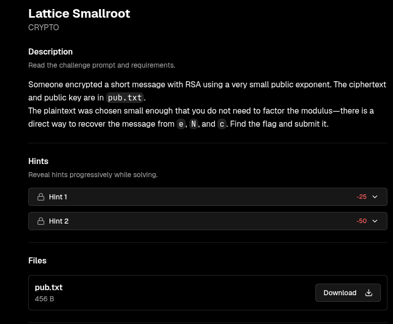
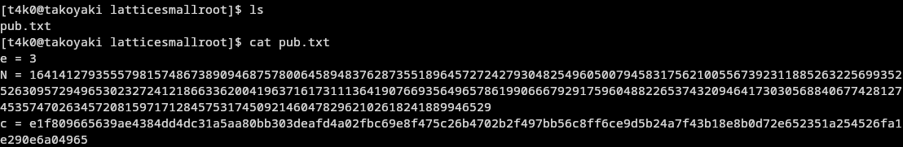
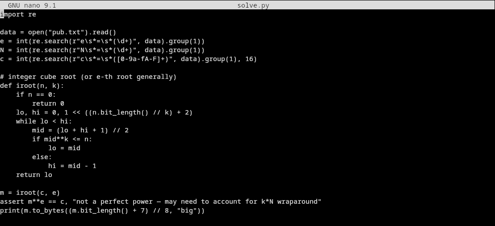
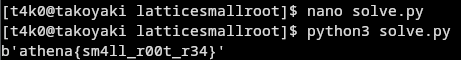

the script I used:
```py
import re

data = open("pub.txt").read()
e = int(re.search(r"e\s*=\s*(\d+)", data).group(1))
N = int(re.search(r"N\s*=\s*(\d+)", data).group(1))
c = int(re.search(r"c\s*=\s*([0-9a-fA-F]+)", data).group(1), 16)

# integer cube root (or e-th root generally)
def iroot(n, k):
    if n == 0:
        return 0
    lo, hi = 0, 1 << ((n.bit_length() // k) + 2)
    while lo < hi:
        mid = (lo + hi + 1) // 2
        if mid**k <= n:
            lo = mid
        else:
            hi = mid - 1
    return lo

m = iroot(c, e)
assert m**e == c, "not a perfect power — may need to account for k*N wraparound"
print(m.to_bytes((m.bit_length() + 7) // 8, "big"))
```


Flag:
```
athena{sm4ll_r00t_r34}
```