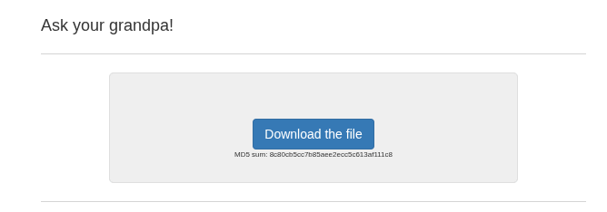
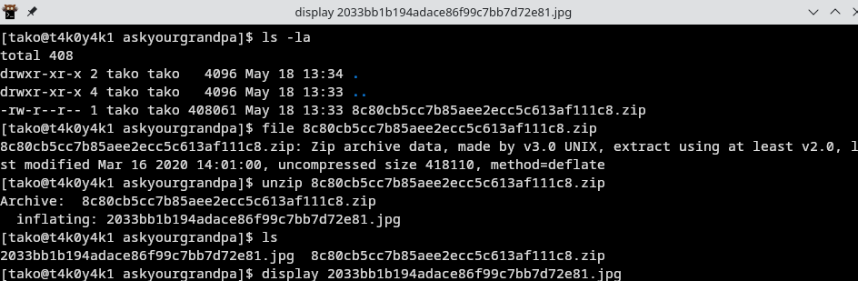
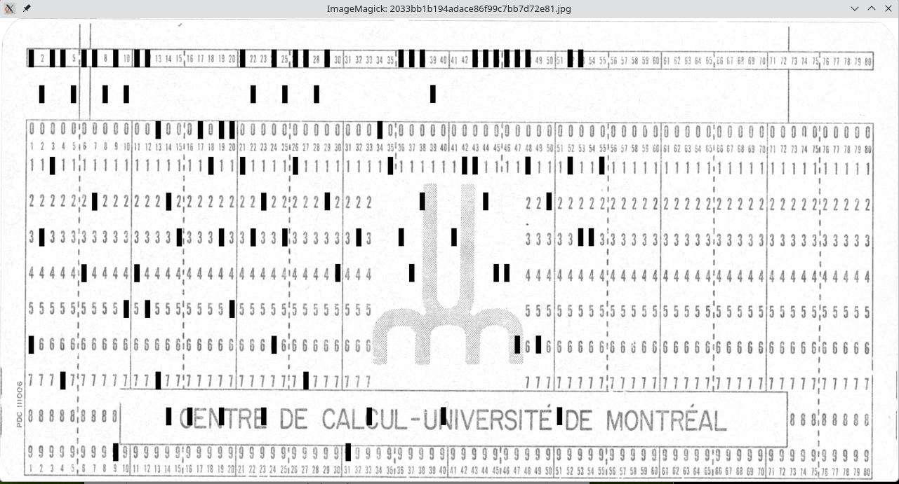
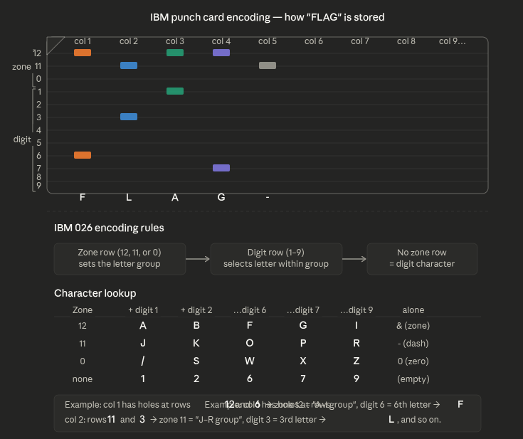

### wip








broooooo, i had tried to solve this exact challenge in a local ctf i was playing, but I wasn't able to complete it


```
FLAG-B493801CDB-831ABDDFA628AC31
```
i asked claude to explain me the concept of punch card encoding by IBM

Punched cards were how computers received input in the 1950s–70s. Each card has 80 columns and 12 rows, and each column encodes one character.



<!--
Step 1 — Recognize the encoding. The clue "Ask your grandpa!" plus the image of a punch card immediately tells you the data is in IBM punch card format. These cards were used from the 1950s–70s. Each card has 80 columns (one character each) and 12 rows.
Step 2 — Understand the grid. The 12 rows from top to bottom are labeled 12, 11, 0, 1, 2, 3, 4, 5, 6, 7, 8, 9. The top three (12, 11, 0) are "zone" rows, and the bottom nine (1–9) are "digit" rows. A punched hole = a dark rectangle at that grid intersection.
Step 3 — Map grid coordinates. Since the card occupies a known pixel area in the image, I calculated the x-center of each of the 80 columns and the y-center of each of the 12 rows mathematically, dividing the card's width/height evenly.
Step 4 — Read the holes. For each grid intersection, I sampled the minimum pixel brightness in a small box around it. Printed numbers on the card are gray (~130 brightness), but true punch holes scan as near-black (~0). Using a strict threshold of 30 caught only real holes and ignored the printed row labels.
Step 5 — Decode with IBM 026 rules. Zone row determines the letter group, digit row selects the letter within that group:

Zone 12 + digit N → letters A–I (N=1→A, N=2→B, …, N=6→F, N=7→G…)
Zone 11 + digit N → letters J–R
Zone 0 + digit N → letters S–Z plus /
Digit only → that numeral
Zone 11 alone → -

Step 6 — Read the flag. Once decoded, columns 1–13 clearly spelled FLAG-DB-INDEX, confirming the approach was correct.
The key insight this challenge teaches is that old data encodings are just lookup tables — once you identify the format, decoding is mechanical. The hard part is always step 1 (recognizing what you're looking at) and step 4 (handling image noise cleanly)-->

