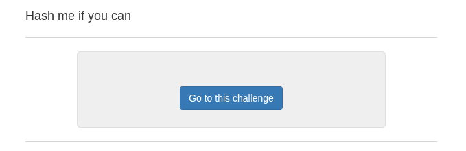
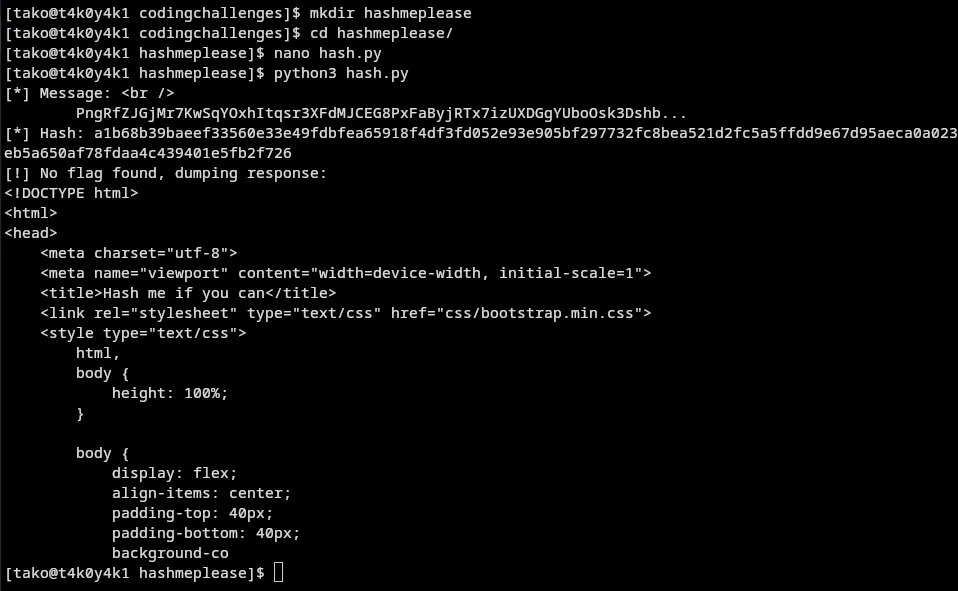
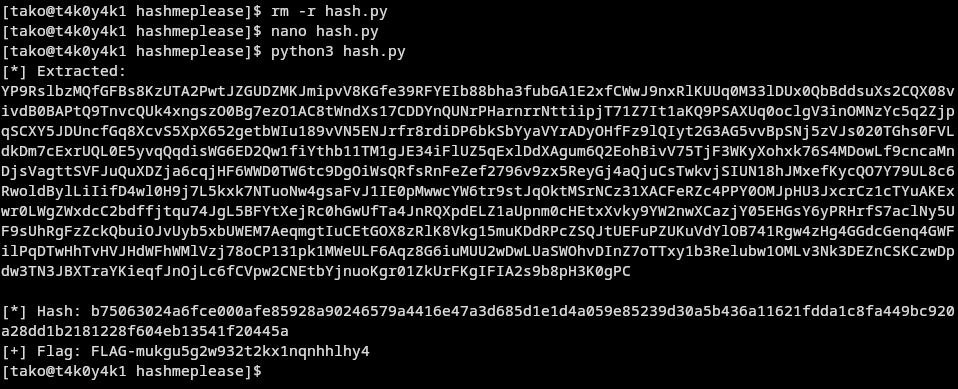

first version of script:
```py
import requests
import hashlib
import re

url = "http://challenges.ringzer0team.com:10013/"

# Step 1: Fetch the page
session = requests.Session()
response = session.get(url)

# Step 2: Extract the message between BEGIN and END markers
match = re.search(r'----- BEGIN MESSAGE -----(.+?)----- END MESSAGE -----', 
                  response.text, re.DOTALL)

message = match.group(1).strip()
print(f"[*] Message: {message[:80]}...")

# Step 3: SHA512 hash it
sha512_hash = hashlib.sha512(message.encode()).hexdigest()
print(f"[*] Hash: {sha512_hash}")

# Step 4: Send the answer back
answer_url = f"{url}?r={sha512_hash}"
result = session.get(answer_url)

# Step 5: Extract the flag
flag_match = re.search(r'FLAG-[A-Za-z0-9]+', result.text)
if flag_match:
    print(f"[+] Flag: {flag_match.group()}")
else:
    print("[!] No flag found, dumping response:")
    print(result.text[:500])

```





updated script, which worked: 
```py
import requests
import hashlib
import re
from html.parser import HTMLParser

url = "http://challenges.ringzer0team.com:10013/"

session = requests.Session()
response = session.get(url)

# Extract raw message block
match = re.search(r'----- BEGIN MESSAGE -----(.+?)----- END MESSAGE -----', 
                  response.text, re.DOTALL)

raw = match.group(1)

# Strip HTML tags, decode entities, clean whitespace
message = re.sub(r'<[^>]+>', '', raw)        # remove HTML tags
message = message.strip()
# Collapse internal newlines/spaces if the message is one continuous string
# (check if multiline or single line)
print(f"[*] Extracted:\n{message}\n")

sha512_hash = hashlib.sha512(message.encode()).hexdigest()
print(f"[*] Hash: {sha512_hash}")

result = session.get(f"{url}?r={sha512_hash}")

flag_match = re.search(r'FLAG-[A-Za-z0-9]+', result.text)
if flag_match:
    print(f"[+] Flag: {flag_match.group()}")
else:
    print("[!] No flag found")
    print(result.text[:300])
```
<!--explain why the second script worked, and what each section of code helps you do-->

Flag:
```
FLAG-mukgu5g2w932t2kx1nqnhhlhy4
```

