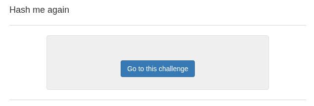
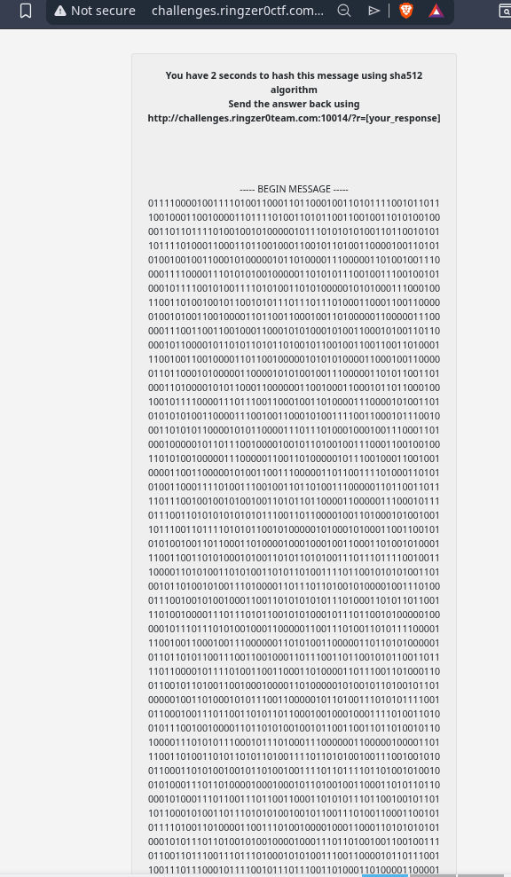

the binary keeps going further down

input script, hash.py: 
```py
import requests
import hashlib
import re
from bs4 import BeautifulSoup

# Put your RingZer0 session cookie here
SESSION_COOKIE = {"PHPSESSID": "your_session_cookie_here"}

CHALLENGE_URL = "http://challenges.ringzer0team.com:10014/"

session = requests.Session()
session.cookies.update(SESSION_COOKIE)

# Step 1: Fetch the challenge page
r = session.get(CHALLENGE_URL)
soup = BeautifulSoup(r.text, "html.parser")

# Step 2: Extract the binary message between BEGIN/END MESSAGE markers
text = soup.get_text()
match = re.search(r"----- BEGIN MESSAGE -----(.+?)----- END MESSAGE -----", text, re.DOTALL)
if not match:
    print("[-] Could not find message")
    exit()

binary_str = match.group(1).strip().replace("\n", "").replace(" ", "")
print(f"[*] Binary length: {len(binary_str)} bits")

# Step 3: Convert binary string to bytes
n = int(binary_str, 2)
byte_length = (len(binary_str) + 7) // 8
message_bytes = n.to_bytes(byte_length, byteorder='big')

# Step 4: SHA512 hash
sha512_hash = hashlib.sha512(message_bytes).hexdigest()
print(f"[*] SHA512: {sha512_hash}")

# Step 5: Send back
response_url = f"{CHALLENGE_URL}?r={sha512_hash}"
result = session.get(response_url)
print(f"[*] Response:\n{result.text}")
```


this is the output I got:
```sh
[tako@t4k0y4k1 codingchallenges]$ cd hashmeplease/
[tako@t4k0y4k1 hashmeplease]$ nano hash.py
[tako@t4k0y4k1 hashmeplease]$ python3 hash.py
[*] Message: <br />
        PngRfZJGjMr7KwSqYOxhItqsr3XFdMJCEG8PxFaByjRTx7izUXDGgYUboOsk3Dshb...
[*] Hash: a1b68b39baeef33560e33e49fdbfea65918f4df3fd052e93e905bf297732fc8bea521d2fc5a5ffdd9e67d95aeca0a023eb5a650af78fdaa4c439401e5fb2f726
[!] No flag found, dumping response:
<!DOCTYPE html>
<html>
<head>
    <meta charset="utf-8">
    <meta name="viewport" content="width=device-width, initial-scale=1">
    <title>Hash me if you can</title>
    <link rel="stylesheet" type="text/css" href="css/bootstrap.min.css">
    <style type="text/css">
        html,
        body {
            height: 100%;
        }

        body {
            display: flex;
[tako@t4k0y4k1 hashmeagain]$ nano hash.py
[tako@t4k0y4k1 hashmeagain]$ python3 hash.py
[*] Binary length: 8192 bits
[*] SHA512: 87a2082a9d57a1f08213ab4425eb47a40e757647387b9637b12a6cdda220c8f7a2224dd1183298b9dd4186d0656b19ee1c5cce8a4ae61608dd826a5738fe1730
[*] Response:
<!DOCTYPE html>
<html>
<head>
    <meta charset="utf-8">
    <meta name="viewport" content="width=device-width, initial-scale=1">
    <title>Hash me again</title>
    <link rel="stylesheet" type="text/css" href="css/bootstrap.min.css">
    <style type="text/css">
        html,
        body {
            height: 100%;
        }

        body {
            display: flex;
            align-items: center;
            padding-top: 40px;
            padding-bottom: 40px;
            background-color: #f5f5f5;
        }
        .challenge-wrapper {
            width: 550px;
            margin: auto;
            border-radius: 5px;
            background-color: #efefef;
            padding: 25px;
            word-wrap: break-word;
            border: 1px solid #dfdfdf;
        }
    </style>
    <script type="text/javascript" src="js/bootstrap.min.js"></script>
</head>
<body class="text-center">
    <main class="challenge-wrapper">
        <div class="alert alert-info">FLAG-jz145p93ei75buh1kpx9bul9xl</div>        <strong>You have 2 seconds to hash this message using sha512 algorithm</strong><br />
        <strong>Send the answer back using http://challenges.ringzer0team.com:10014/?r=[your_response]</strong>
        <br /><br /><br /><br /><br />
        <div class="message">
        ----- BEGIN MESSAGE -----<br />
        01101001001110000100110101001110010000010101100001001000010101000101100101100101010101000101100101100110010110100101000001000110011001000100010101110011011000110110000101010001011000010111010100110000010001000100011101111010011110100111011000111001011010010111011101000001001110000101010101101001001101100110001101000100010000110101010101010100010101000101011001111001010011010101011101110111010101110110011001001010010110010100001100110111001100110101000100110111001100000100100101010110010011010111010000110100010011010100000101101101010011000101001001100111001100100110001001001011001100100111011101000100010000010110111101011000010110100110100000110011010001000100111001000001011001110101011001101001010010010111100001011000010001010011100001110101010001010110110001100111011001010111001101000001011101100110000101110100011011010101000101000110010010010101011101110101011101000011011001010011010001000110010001010110011110010110001001100110010000100111000101000100011101100111011001101111011011010110111101100011010010100011010101001000010100010100110101110100010010100111011100110111011011000100111101110001011001010110011101101010011010010011001101010111011011000111000101101011011011000100001001100010010001000110111001000011001100110100111100110010011101110011100001101000001110000101010101110001011100000110000101100100011110000011000100110001001100110110001101110010011011010111100001101100010011100100101001111010010001100101100100110111010000100011000001100011010100000100011001101010010011110110010001101110011001100110111000111001011100000100111001110100001100110111010101001111011110100111001101101001011000100100011001011010011001000100011001100110010110100110011101101101011100110100111101001010011101100111010101111001011101010011010001001010010001010110101001000101011001100111001101001001010010100111101001101101011011010011100001100001010010000100010101110011010101110111001100110001011010010111001100110001011001110111000101010010010100100110101101101001010010110100101001101101010000100011100101100100011011110110010100110010001110000101000001000011001100100110010001010111011010010100100001101011010010000101010101100111001101110101101001101000011101100101011100110011010100110101011101111010010001010011001101110110001100100101001101000001011101100011100101111010011011110111011101000101011011100110001101001001011010110111010100110101010001100100011101010100010010010100100101001001001100110100010001101001011100000111100001110101011010100011010001001001010100000011100101100111010000110011000101001101011100100101011101101111011101100100010001010111001110010110101001100111011101010111011100110010010101100011011101110100011110010100010001010011011110010100101001101011011100010111010001101001010001010100011000110100001101000111100000110001010000110110010001101001010101000111100001010111010100010110010001101000011101000110111001001011001110000110001001111010010001000100001101100101010000100110101001100011011011100111001101110010011101110111011101100111001100000111011101010011011000010110111001001010001101100111001000110011011000100100101100111001011100010100110001000100001100100100010001001001011010110100011001011010011011000011000001011001010110010111011101010100011001000100000101100001011000110110110001100111010001010100010101101100011001100011011001111001010010010101001100111000011011000100001100110001010010000100011001000101010101000100100101100101001100010011010001010001011000010100101101100010011011000110110000110001010001000011000000111001011000110111011101110001010101100100011001010110011001100101000001001110001101000110110001001110011110010111011000110111011100110011011101100111010011000111010101001011010010110110110001101101010100100100010100111000001101010100100101110110010010010011000001010111010010010110010101010110011000010100001001100110011001100100001000110010010000110011010001100101001101100100010100110010001110000101010001100110010110010100110001101101010011110101001001011010011010110011011001000101010100000101001101011001011100000101000100110110001100010011010101000110011001110110000101110101011101010101011001010001010100010110000101110111011011000100010000111001011001110100000101100101010010010100010000110100011001110110111101011010001110000110011100110110010011010011000001001000011011110111100001001010010010100110011101101010010100000100110101000100001100000011100001100101011001100101101001010111001101100110001001011000010100110011010100110111011001100111001001101101011100100100010101101111010110000111101000110011011001010011011101011000011100100110111001001010001101010101100101101000011011000011011101000010011000100111001001110000011110010111001001001000010011010100110101110011011010100011011001001110011011110110111001110001011110100101010101010011011010100011001001000100010001000101011101111010011011000111001001110111010100100101000101010110011010110100110001100010001100110100011101100001010101110100011001001011001110010110011101010010011101000100101101000101010010000101100000110111010011010011001101011010001110000100010001100111010100100100100001001111011000110100111101110011011010010011100101111010010000110111100101000100011000100100111001101010011110000100111000110001001100110111000001100110011011000110010001000101010000100110000101000011010110100100101001010100011011110110111001100011011000100101010000110100011000100011001101101101011110100111000001111001010010110111100100110111001100010011000001011000010100100111010101010011010001100100100101000011011010100111010001001110001100110011100001010101010101010111011101011000010100100111100001000001010011110110010100110111011100010101010100110011011100100101010101011010010110000011100001101110010011010100010001000100011000010100001101000101011000100111001001000010001110000101000001110110001101010101001100110011001110010011100101101010010110010100011001001111010001000011000101010000011010010100010001000010011010110100101001001101010011110111000001100100010001110110101100110000010011010101010101001111010000100110010001110010001101110111100100110111011010010111010001011010011001110011100001011000010001100100111101100001011011110100111001001010010100000100101100110101010100100111011000110001001100010100100101010000001100110100111101010011010101100011000000110011011010110100010100110000010100010100111101000101010110000011011001110101010101100111011101100101010001100100001000110111010010000101100001110000011100010011000000110101001101000110101101000100001100000101001101100011010110010101100001010011010011010111000101110101011100110110100000110101010011110011100001010000011001010111011001100111001100010110010001100110001101100101000001010011001100110011010101111000011011010111101001101101001100000110100101110000010101110111001101001001001101110011001000110111011001000100110001001100010010010011001100111001011110010100101001001110010101100111101001010000011011000011001001110101010100100101011101111000011110000110000101010101010001010100100100110011001101100100010101110101011000110100010101101010010010100100001000111000010001010110000101101111010001010110011101111010010001000110110101100111010011010100100101001000001110000110000101100010001100100110010001101000011011000101000001110011010000110110000101110111010010000101100001100010011100100110001001100110011101110110010001000010010001110101001001110000011101100011001101000011011100010111001001001100010010010101100001110001010000100011011001010010001110010110000101111001011011100110001000110001011101110111000101001001001110000011100100110110010001000011010001101111010101100011001101100110010011010110000101100011011001000111011000110011010001000110101001110110010101100011010101001001010010100101101001111000011010000011001001010101010101110110111001111001010110100110001001110000010000100100100001010010001101010110010100110001011100010011000000110110011011000110111001010110011101000111010101101110011001110111001101110111011000010100110000110111011001100110101001110010011010010101001101101011001100010110101001110001010110100100110001101011010000100110001100110111011011000011000101101011001110000110100101011010010101000100100001110000011100000101100101110011010100010011011100110101001100110101100001101101001101000011000001100010011010100011011001110001<br />
        ----- END MESSAGE -----<br />
        </div>  
    </main>
</body>
</html>
[tako@t4k0y4k1 hashmeagain]$ 
```


```<div class="alert alert-info">FLAG-jz145p93ei75buh1kpx9bul9xl</div>```

Flag:
```
FLAG-jz145p93ei75buh1kpx9bul9xl
```

