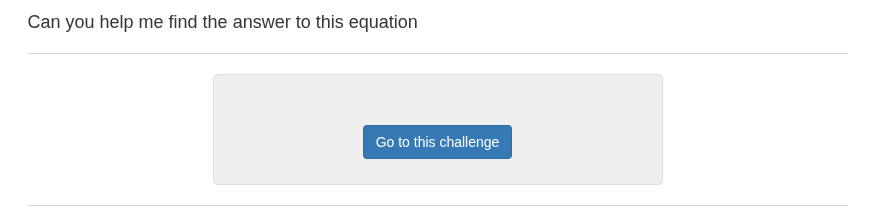
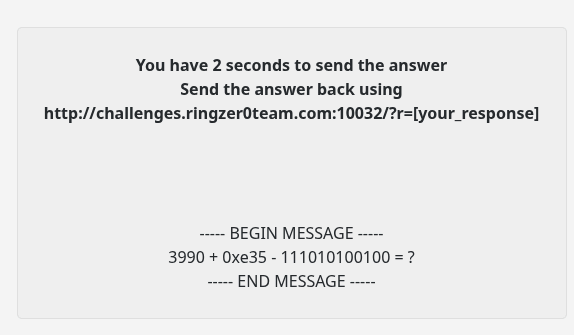
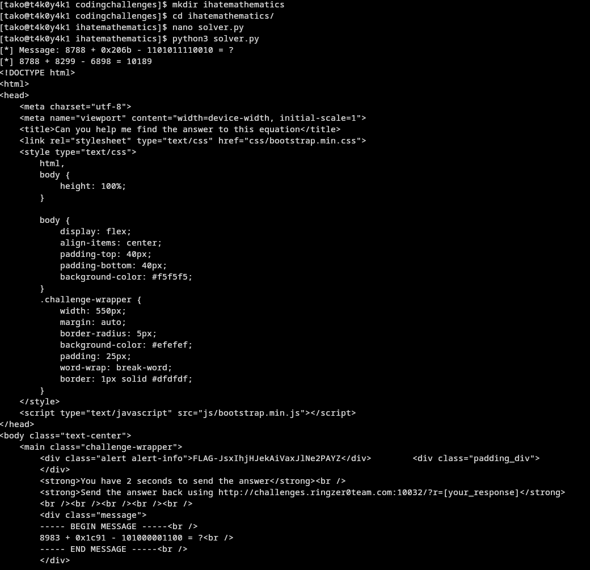
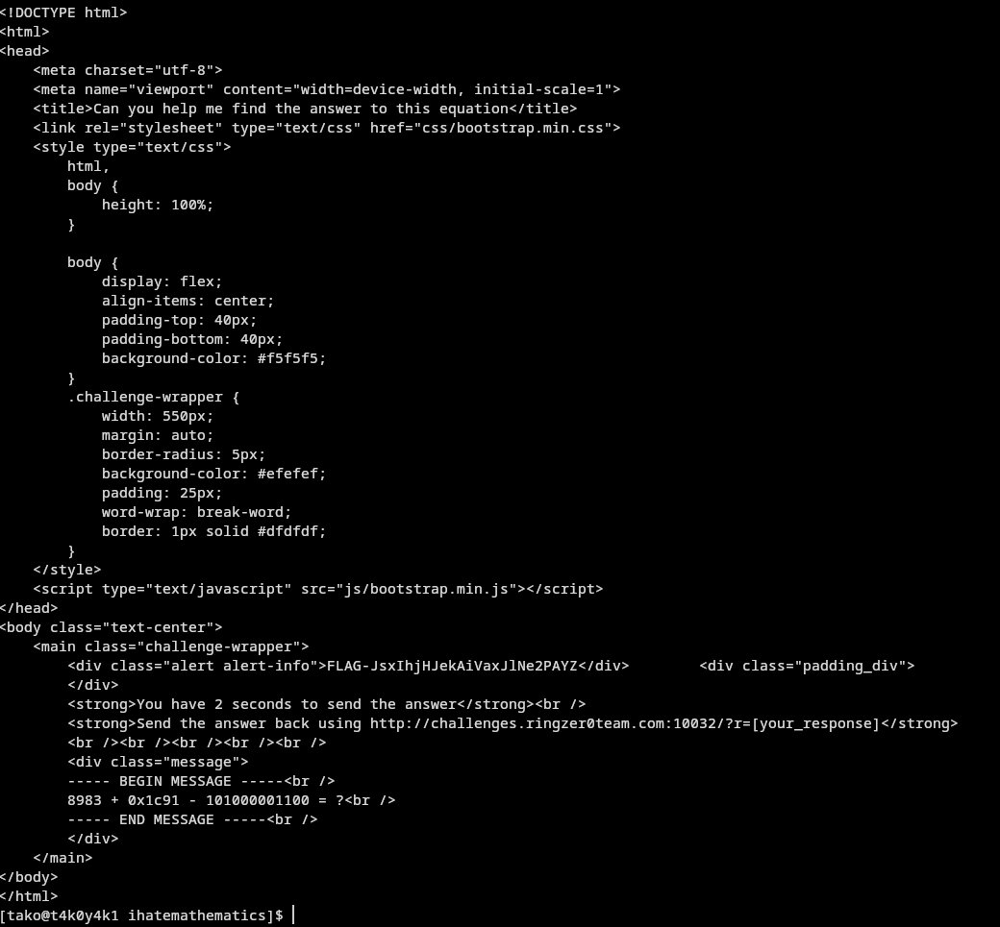

```py
input script solver.py:
import requests
import re
from bs4 import BeautifulSoup

SESSION_COOKIE = {"PHPSESSID": "your_session_cookie_here"}
CHALLENGE_URL = "http://challenges.ringzer0team.com:10032/"

session = requests.Session()
session.cookies.update(SESSION_COOKIE)

r = session.get(CHALLENGE_URL)
soup = BeautifulSoup(r.text, "html.parser")
text = soup.get_text()

match = re.search(r"----- BEGIN MESSAGE -----(.+?)----- END MESSAGE -----", text, re.DOTALL)
msg = match.group(1).strip()
print(f"[*] Message: {msg}")

# Parse: decimal + hex - binary = ?
m = re.match(r"(\d+)\s*\+\s*(0x[0-9a-fA-F]+)\s*-\s*([01]+)\s*=", msg)
dec = int(m.group(1))
hex_val = int(m.group(2), 16)
bin_val = int(m.group(3), 2)

answer = dec + hex_val - bin_val
print(f"[*] {dec} + {hex_val} - {bin_val} = {answer}")

resp = session.get(f"{CHALLENGE_URL}?r={answer}")
print(resp.text)
```

```bash
[tako@t4k0y4k1 codingchallenges]$ mkdir ihatemathematics
[tako@t4k0y4k1 codingchallenges]$ cd ihatemathematics/
[tako@t4k0y4k1 ihatemathematics]$ nano solver.py
[tako@t4k0y4k1 ihatemathematics]$ python3 solver.py
[*] Message: 8788 + 0x206b - 1101011110010 = ?
[*] 8788 + 8299 - 6898 = 10189
<!DOCTYPE html>
<html>
<head>
    <meta charset="utf-8">
    <meta name="viewport" content="width=device-width, initial-scale=1">
    <title>Can you help me find the answer to this equation</title>
    <link rel="stylesheet" type="text/css" href="css/bootstrap.min.css">
    <style type="text/css">
        html,
        body {
            height: 100%;
        }

        body {
            display: flex;
            align-items: center;
            padding-top: 40px;
            padding-bottom: 40px;
            background-color: #f5f5f5;
        }
        .challenge-wrapper {
            width: 550px;
            margin: auto;
            border-radius: 5px;
            background-color: #efefef;
            padding: 25px;
            word-wrap: break-word;
            border: 1px solid #dfdfdf;
        }
    </style>
    <script type="text/javascript" src="js/bootstrap.min.js"></script>
</head>
<body class="text-center">
    <main class="challenge-wrapper">
        <div class="alert alert-info">FLAG-JsxIhjHJekAiVaxJlNe2PAYZ</div>        <div class="padding_div">
        </div>
        <strong>You have 2 seconds to send the answer</strong><br />
        <strong>Send the answer back using http://challenges.ringzer0team.com:10032/?r=[your_response]</strong>
        <br /><br /><br /><br /><br />
        <div class="message">
        ----- BEGIN MESSAGE -----<br />
        8983 + 0x1c91 - 101000001100 = ?<br />
        ----- END MESSAGE -----<br />
        </div>
    </main>
</body>
</html>
[tako@t4k0y4k1 ihatemathematics]$ 
```

Flag:
```
FLAG-JsxIhjHJekAiVaxJlNe2PAYZ 
```