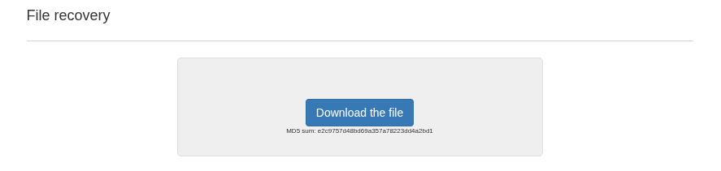
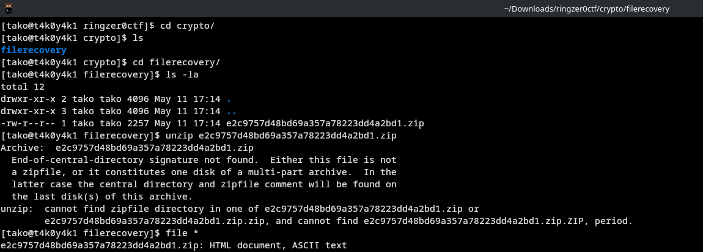
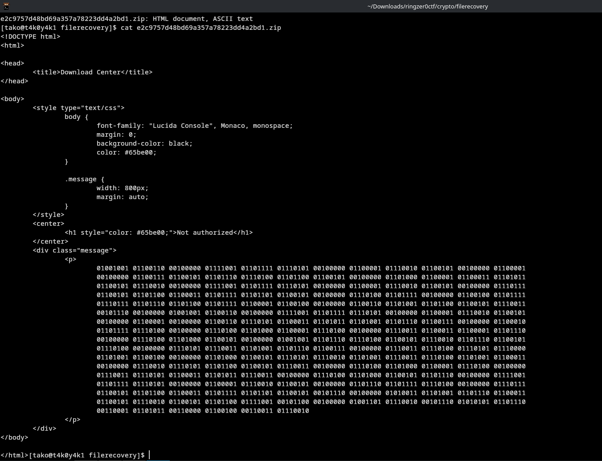
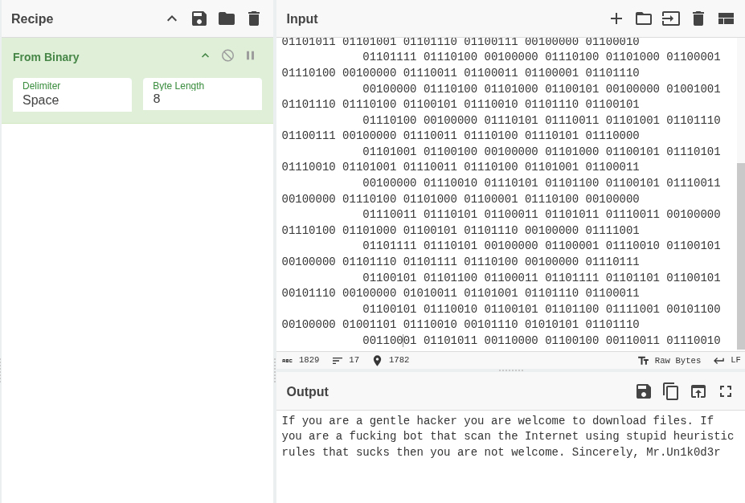
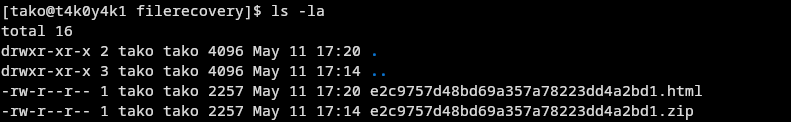
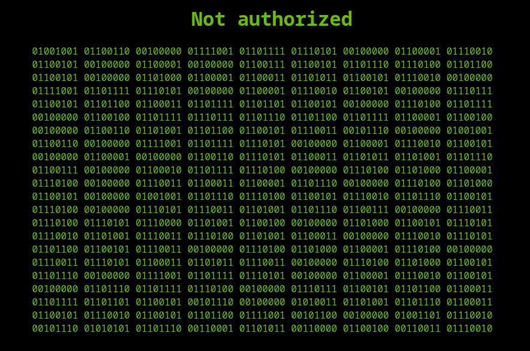
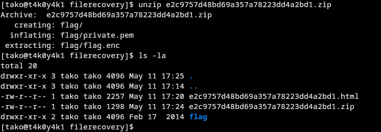
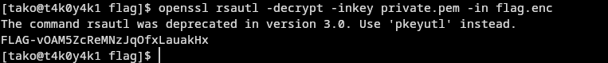
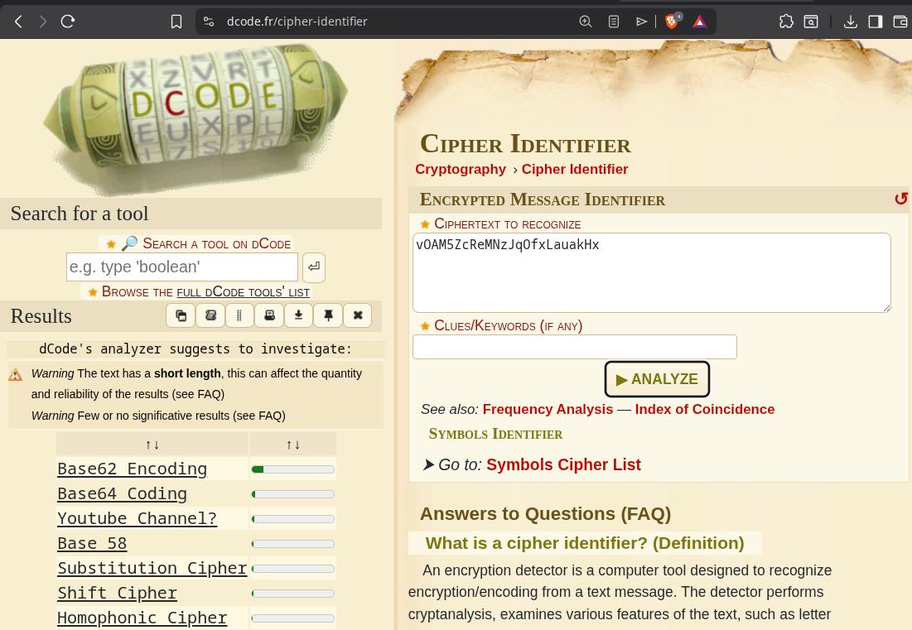

ayoooooooooo, why so aggro?

this is what the html file looks like

i downloaded the file again and tried unzipping it 

I must've made a mistake when installing using wget

vOAM5ZcReMNzJqOfxLauakHx

Decrypting it:

BRO THE FINAL FLAG WAS LITERALLY 'Flag-vOAM5ZcReMNzJqOfxLauakHx'

i kept trying vOAM5ZcReMNzJqOfxLauakHx