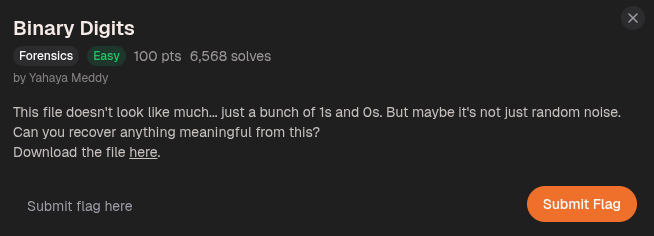
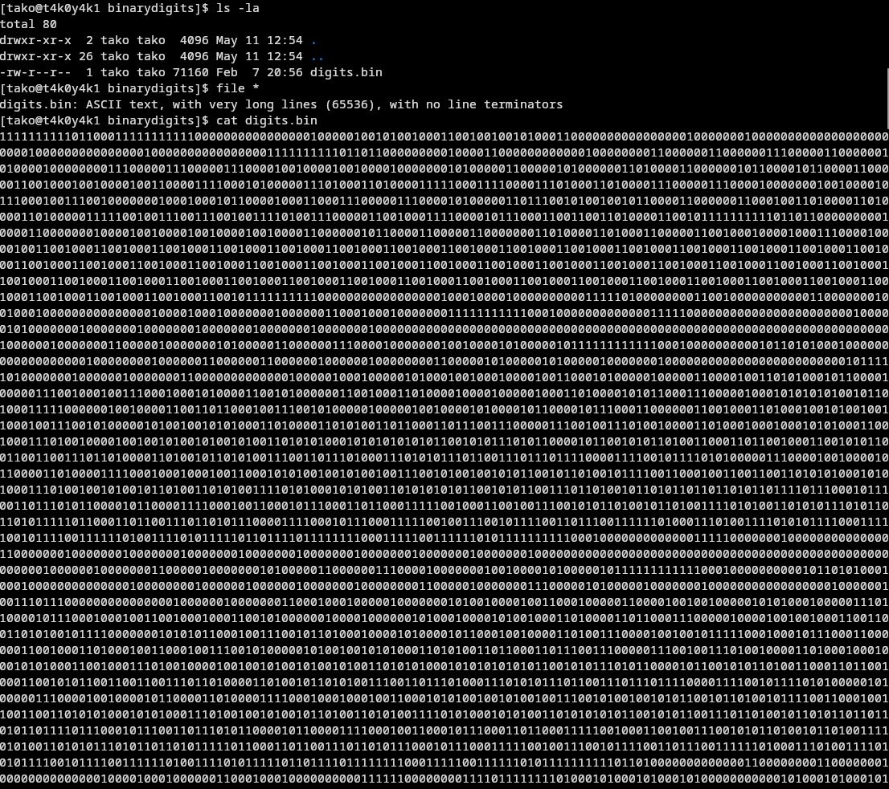
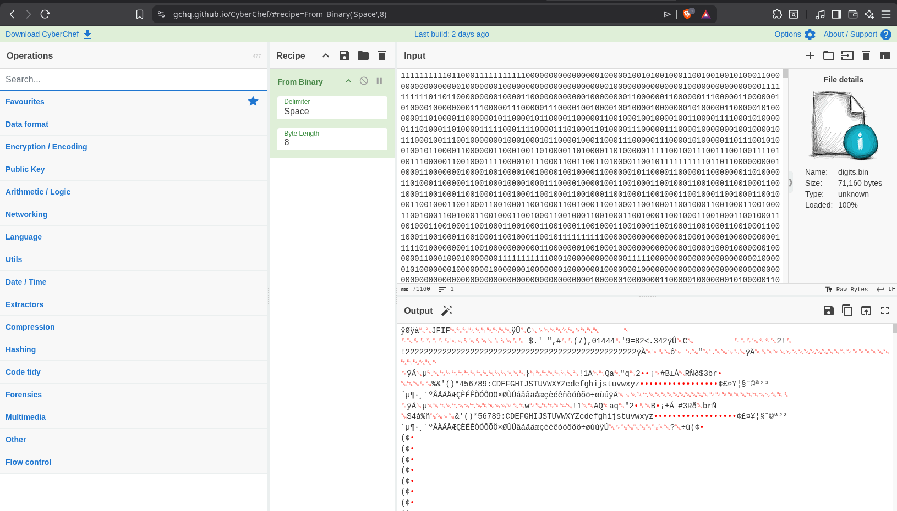
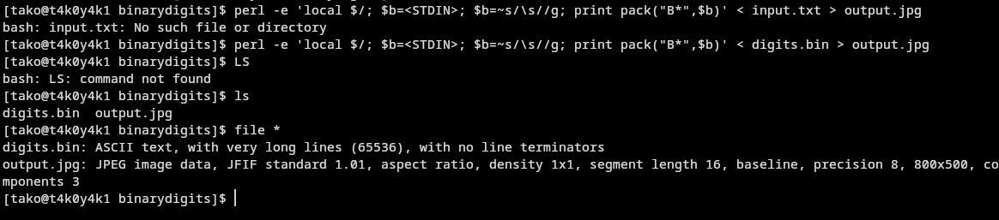
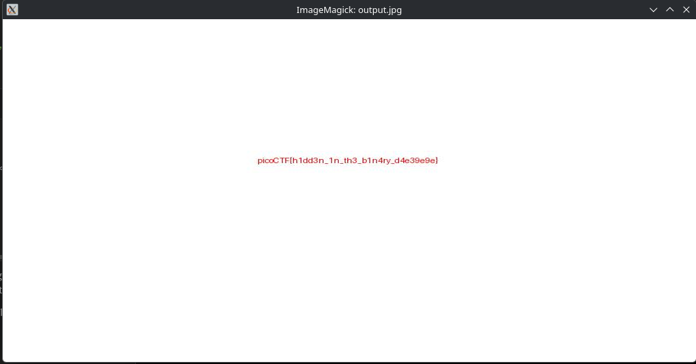

you will get a longggggggggg file

when you input it in cyberchef you can see that JFIF header which indicates it is a JPEG image. 

you can use perl 

you can try other methods too
Flag: picoCTF{h1dd3n_1n_th3_b1n4ry_d4e39e9e}

