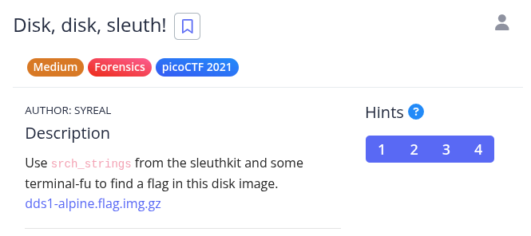
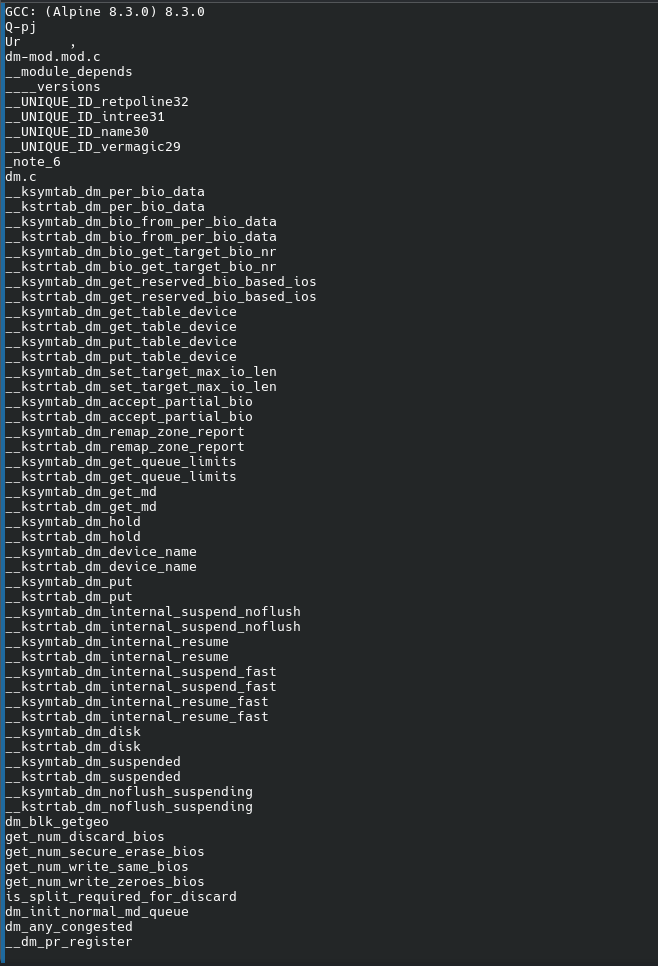
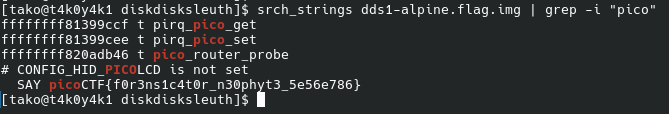

Hint 1: Have you ever used file to determine what a file was?

Hint 2: Relevant terminal-fu in picoGym: https://play.picoctf.org/practice/challenge/85

Hint 3: Mastering this terminal-fu would enable you to find the flag in a single command: https://play.picoctf.org/practice/challenge/48

Hint 4: Using your own computer, you could use qemu to boot from this disk!

unzip the file 

after running the command:

 srch_strings dds1-alpine.flag.img

 |explain how srch_strings works|
 
 

 I got a buncha strings, but I don't know where the flag might be 

 but as basics say, if you have a lotta strings, try out grep first.

 

 ez

 Flag: picoCTF{f0r3ns1c4t0r_n30phyt3_5e56e786}
