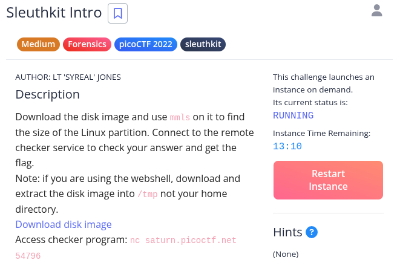
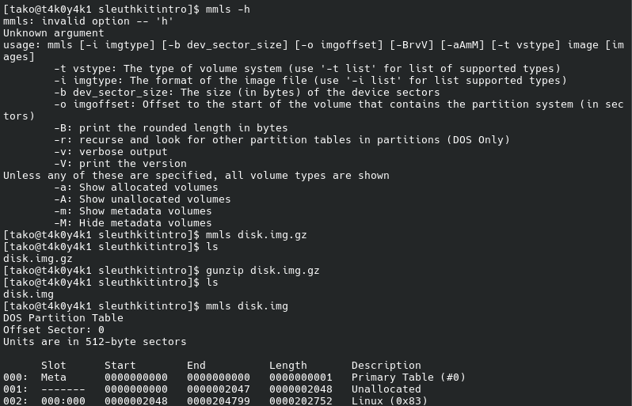
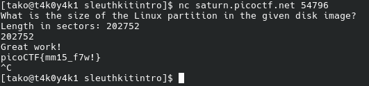

The mmls command is part of The Sleuth Kit (TSK) and is used to display the partition layout of a volume system, including partition tables and disk labels.  It identifies the type of each partition, its starting and ending sectors, and its length, which is essential for forensic analysis to locate allocated, unallocated, and metadata volumes. 

Key features and usage include:

Partition Identification: It reveals gaps in the disk layout (unallocated space) that may contain hidden data, similar to fdisk -lu but with sector-based output suitable for tools like dd

Flag: picoCTF{mm15_f7w!}
