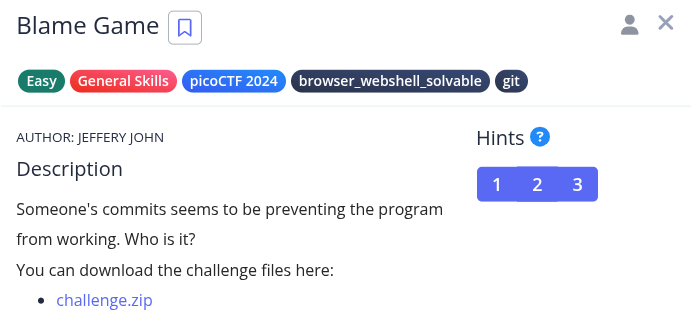
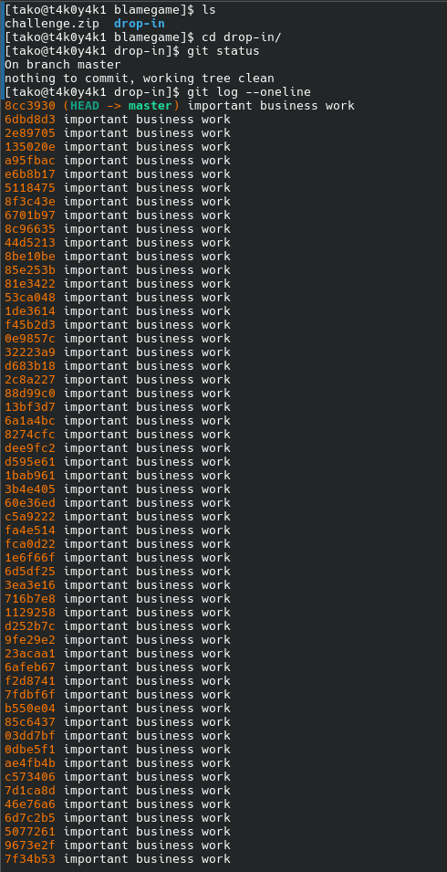
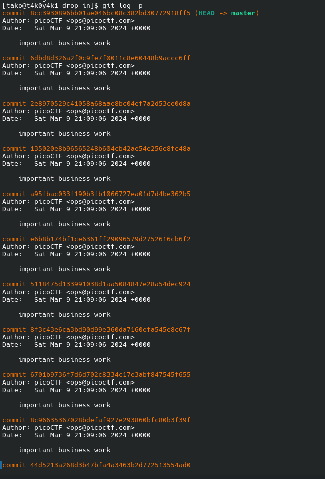
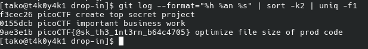

Hint 1: In collaborative projects, many users can make many changes. How can you see the changes within one file?
Hint 2: Read the chapter on Git from the picoPrimer here. https://primer.picoctf.org/#_git_version_control
Hint 3: You can use python3 <file>.py to try running the code, though you won't need to for this challenge.

Flag: picoCTF{@sk_th3_1nt3rn_b64c4705}