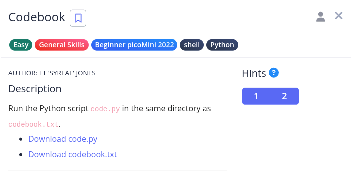
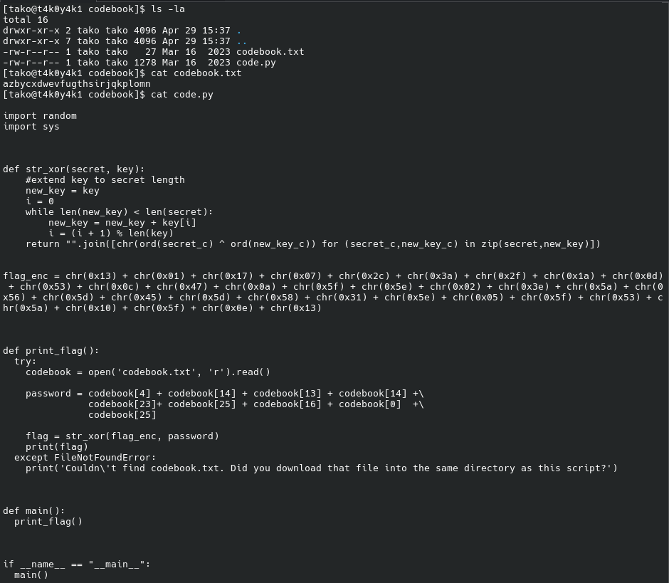
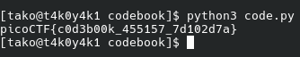

Hint 1: On the webshell, use ls to see if both files are in the directory you are in

Hint 2: The str_xor function does not need to be reverse engineered for this challenge.

Flag: picoCTF{c0d3b00k_455157_7d102d7a}