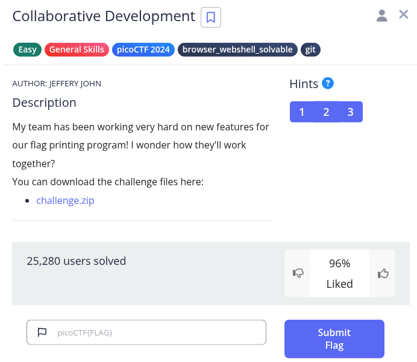
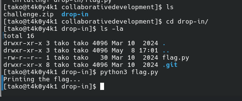
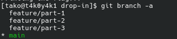
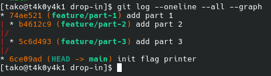
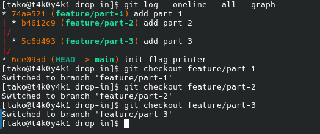
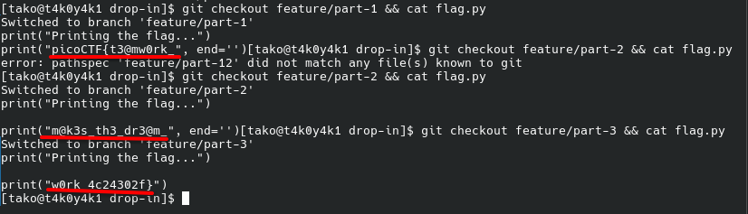

Hint 1: git branch -a will let you see available branches
Hint 2: How can file 'diffs' be brought to the main branch? Don't forget to git config!
Hint 3: Merge conflicts can be tricky! Try a text editor like nano, emacs, or vim.

after unzipping the file:

Flag: picoCTF{t3@mw0rk_m@k3s_th3_dr3@m_w0rk_4c24302f}

### What was happening
The flag.py on main only printed "Printing the flag..." — incomplete because the team was working on separate branches and hadn't merged yet.
Each developer added their piece on their own branch:

feature/part-1 → first chunk of the flag
feature/part-2 → middle chunk
feature/part-3 → last chunk

### Why python3 flag.py on main didn't work
The main branch only had the skeleton of the program (the init flag printer commit). The actual flag content was added in separate commits on separate branches, never merged back to main.
How we solved it
Instead of merging, we just directly checked out each branch and read the file — bypassing the need to merge at all. Each flag.py had a hardcoded string with its portion of the flag.
Real world analogy
Think of it like Google Docs — main is the "published" doc, but three teammates each have their own draft with edits. The published version is incomplete until someone merges all the drafts in.

