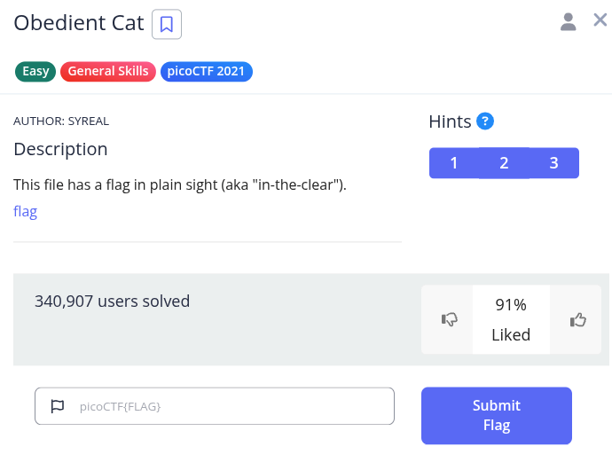
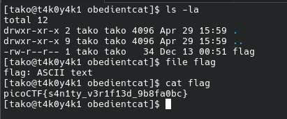

Hint 1: Any hints about entering a command into the Terminal (such as the next one), will start with a '$'... everything after the dollar sign will be typed (or copy and pasted) into your Terminal.

Hint 2: To get the file accessible in your shell, enter the following in the Terminal prompt: $ wget and a link to the flag. The link can be copied from the details section.

Hint 3: $ man cat

Flag: picoCTF{s4n1ty_v3r1f13d_9b8fa0bc}
