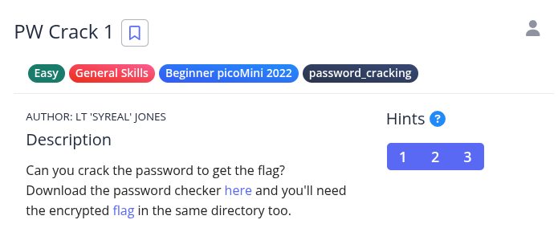
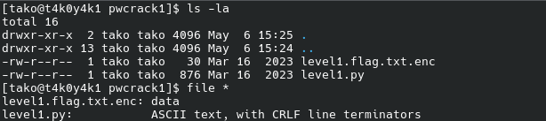
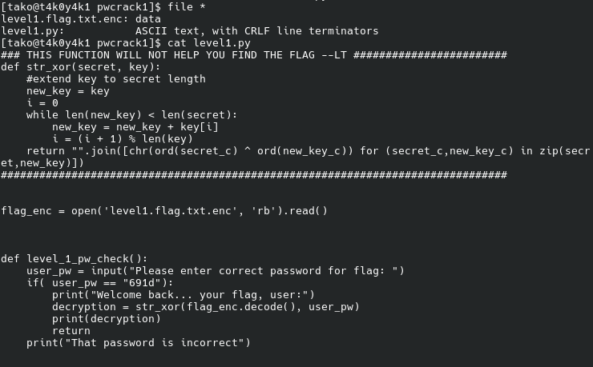
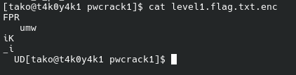
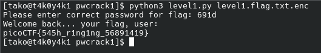

Hint 1: To view the file in the webshell, do: $ nano level1.py
Hint 2: To exit nano, press Ctrl and x and follow the on-screen prompts.
Hint 3: The str_xor function does not need to be reverse engineered for this challenge.

key is given already:

if( user_pw == "691d"): 

Flag: picoCTF{545h_r1ng1ng_56891419}
