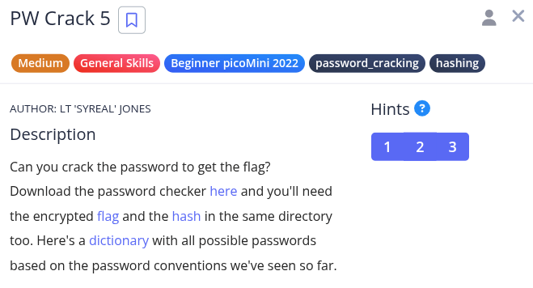
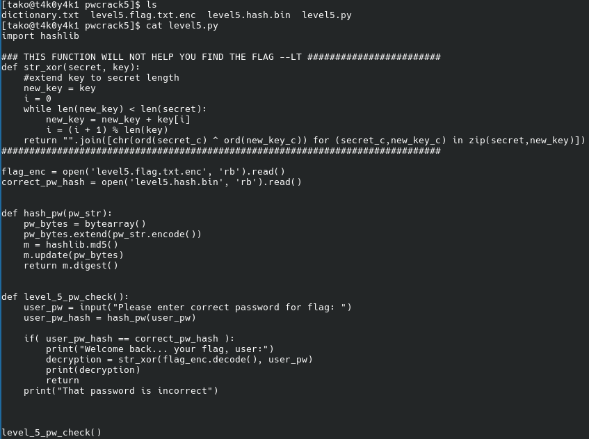
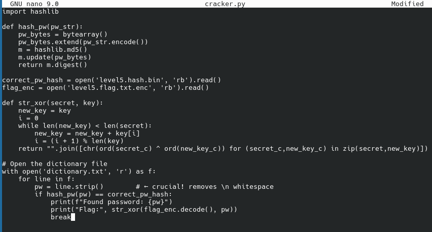
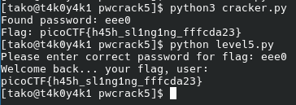

Hint 1: Opening a file in Python is crucial to using the provided dictionary.
Hint 2: You may need to trim the whitespace from the dictionary word before hashing. Look up the Python string function, strip
Hint 3: The str_xor function does not need to be reverse engineered for this challenge.

probs I have to do a dictionary attack
following the pattern of this series

making cracker script
import hashlib

def hash_pw(pw_str):
    pw_bytes = bytearray()
    pw_bytes.extend(pw_str.encode())
    m = hashlib.md5()
    m.update(pw_bytes)
    return m.digest()

correct_pw_hash = open('level5.hash.bin', 'rb').read()
flag_enc = open('level5.flag.txt.enc', 'rb').read()

def str_xor(secret, key):
    new_key = key
    i = 0
    while len(new_key) < len(secret):
        new_key = new_key + key[i]
        i = (i + 1) % len(key)
    return "".join([chr(ord(secret_c) ^ ord(new_key_c)) for (secret_c,new_key_c) in zip(secret,new_key)])

#Open the dictionary file
with open('dictionary.txt', 'r') as f:
    for line in f:
        pw = line.strip()        # ← crucial! removes \n whitespace
        if hash_pw(pw) == correct_pw_hash:
            print(f"Found password: {pw}")
            print("Flag:", str_xor(flag_enc.decode(), pw))
            break

Flag: picoCTF{h45h_sl1ng1ng_fffcda23}
