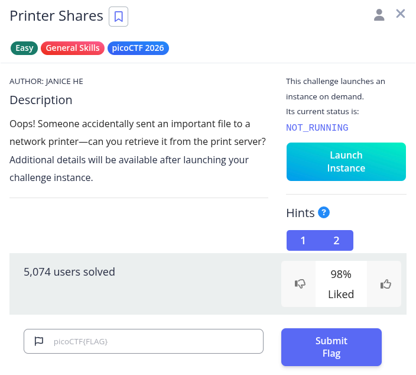
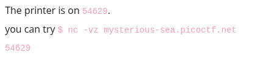

# work in progress!!!! please come back later :D

Hint 1: knowing how SMB protocol works would be helpful!
Hint 2: smbclient and smbutil are good tools

note: explain what smbclient and smbutil is and add the diagram we found earlier
note: explain how the smb protocol works
note: explain how and why files are stored on the printer server

