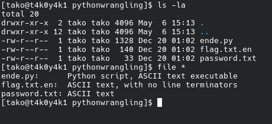
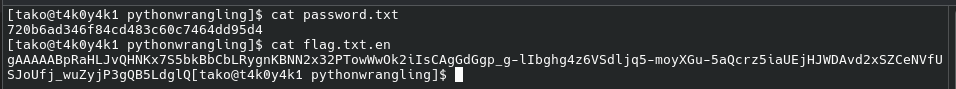
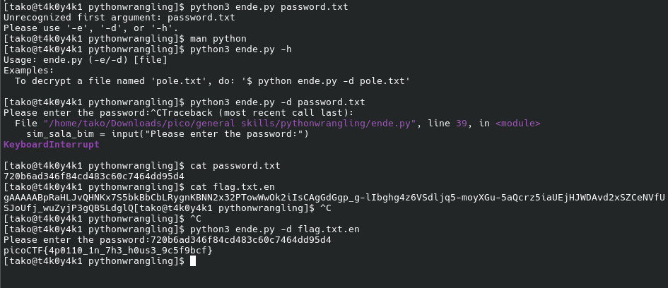

Hint 1: Get the Python script accessible in your shell by entering the following command in the Terminal prompt: $ wget followed by a link to the script. The link can be copied from the details section.
Hint 2: $ man python

Flag: picoCTF{4p0110_1n_7h3_h0us3_9c5f9bcf}
