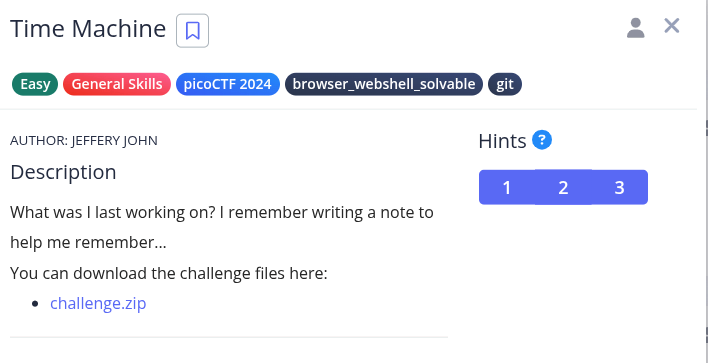
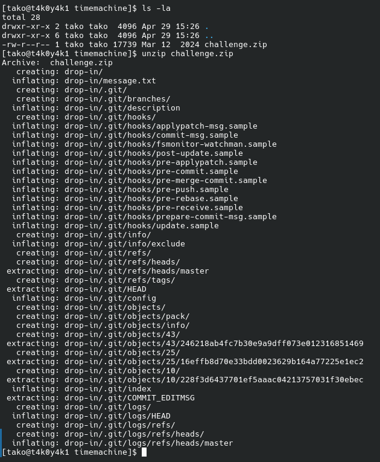
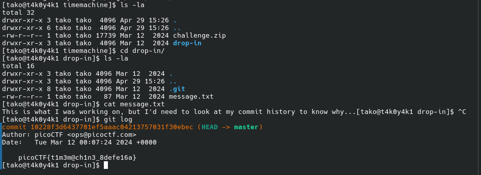

Hint 1: The cat command will let you read a file, but that won't help you here!

Hint 2: Read the chapter on Git from the picoPrimer here. - https://primer.picoctf.org/#_git_version_control

Hint 3: When committing a file with git, a message can (and should) be included

Flag: picoCTF{t1m3m@ch1n3_8defe16a}
