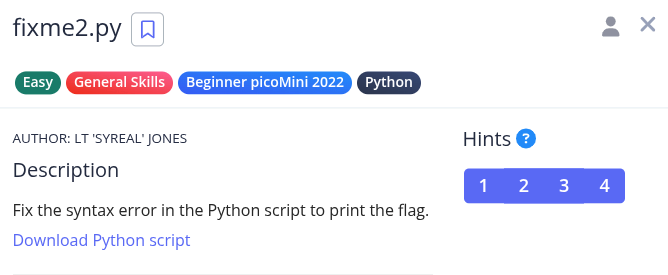
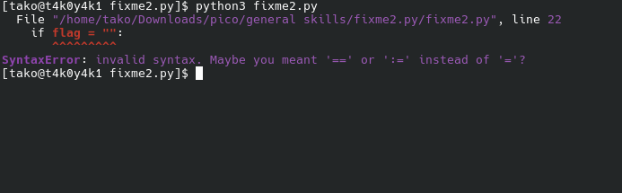
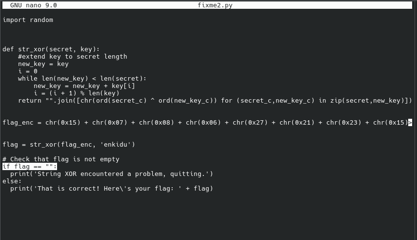
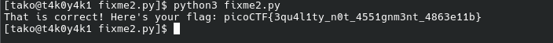

Hint 1: Are equality and assignment the same symbol?
Hint 2: To view the file in the webshell, do: $ nano fixme2.py
Hint 3: To exit nano, press Ctrl and x and follow the on-screen prompts.
Hint 4: The str_xor function does not need to be reverse engineered for this challenge.

this already gave us a hint

fixed:

Flag: picoCTF{3qu4l1ty_n0t_4551gnm3nt_4863e11b}
