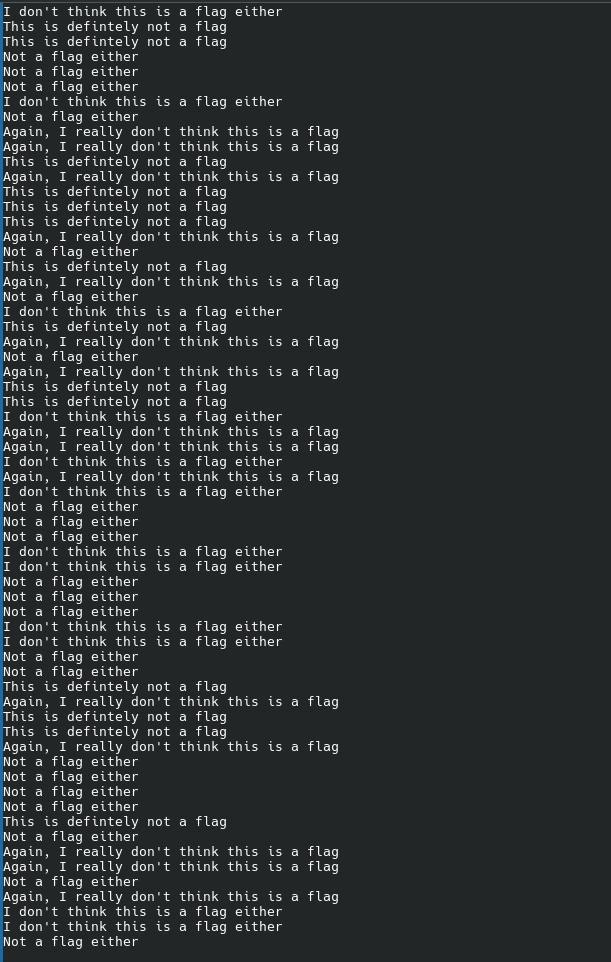
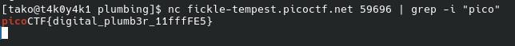

Hint 1: Remember the flag format is picoCTF{XXXX}
Hint 2: What's a pipe? No not that kind of pipe... This kind

after connecting with nc fickle-tempest.picoctf.net 59696, this is what I get 

ez

Flag: picoCTF{digital_plumb3r_11fffFE5}
