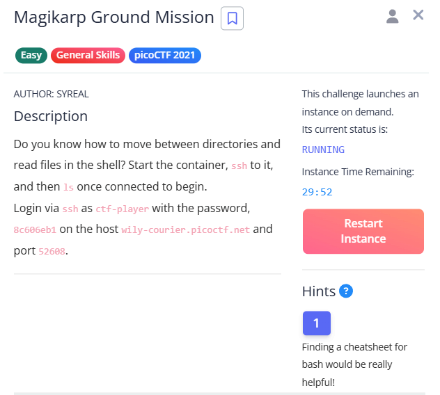
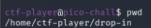

Challenge:

Do you know how to move between directories and read files in the shell? Start the container, ssh to it, and then ls once connected to begin.
Login via ssh as ctf-player with the password 8c606eb1 on the host wily-courier.picoctf.net and port 52608.

Hint: Finding a cheatsheet for bash would be really helpful!

Classic "learn the shell" warmup. The flag is split into 3 pieces scattered across different directories, and we have to follow breadcrumbs to stitch it back together.

# Solution

## Step 1: SSH in 

ssh ctf-player@wily-courier.picoctf.net -p "portno."

Pretty standard SSH. 

Enter the password provided once the you have started the challenge instance.

## Step 2 — Figure out where we landed

pwd

"print working directory." First thing I always do when I land somewhere new — I want to know exactly where the shell dropped me before I touch anything.

So we're in a drop-in folder inside the player's home. Cute.

## Step 3 — Look around

ls 

ls lists the files in the current directory. 

[add img here]

Two files: the first piece of the flag, and a note telling us where the next one is.

## Step 4 — Grab piece 1 and read the breadcrumb

[add img here]

cat dumps a file's contents to the terminal — perfect for tiny text files like these.

[add img here]

So piece 1 is picoCTF{xxsh_ and the hint is pointing at / (the root of the filesystem). Noted — but I went up one level first to see what was around.

## Step 5 — Step up a directory (and stumble onto piece 3)

[add img here] 

cd .. moves up one directory (the .. is shorthand for "parent directory"). Landed in /home/ctf-player, and ls showed:

Wait — 3of3? That's the last piece, not the next one. The challenge isn't strictly linear, the pieces are just scattered around. Took it anyway:

[add img referring to cat 30f3.flag.txt]

Got 0b24fc4f} — the closing piece with the }.

## Head to root like the hint said

I went up step by step (/home/ctf-player → /home → /) just to see the structure on the way. cd / is the direct shortcut — the leading / means "absolute path starting from root," so it jumps straight there regardless of where you are.

At / we get the full Linux root layout (bin, boot, etc, home, usr, etc.) and tucked in there:

[add img where you can see 2of3.flag.txt    instructions-to-3of3.txt files]

## Step 7 — Grab the middle piece

[add img of cat 2of3.flag.txt]

## Putting it together
### Stitching all three pieces in order:

- picoCTF{xxsh_ (piece 1)
- 0ut_0f_//4t3r_ (piece 2)
- 0b24fc4f} (piece 3)

## Flag
picoCTF{xxsh_0ut_0f_//4t3r_0b24fc4f}