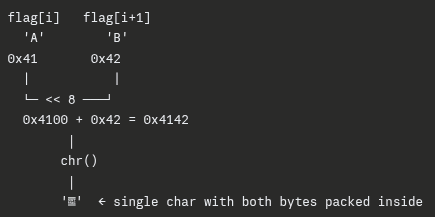
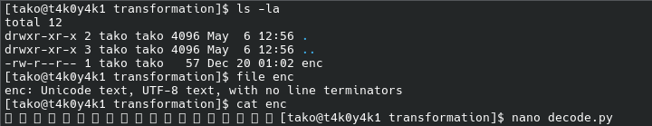
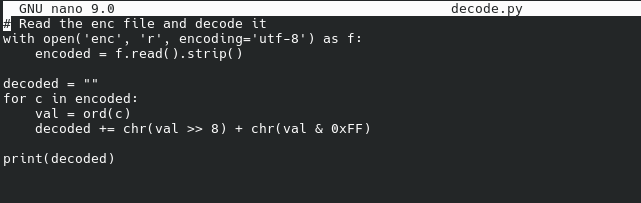
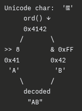
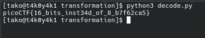

Logic of the python script -
.join([chr((ord(flag[i]) << 8) + ord(flag[i + 1])) for i in range(0, len(flag), 2)])

1. range(0, len(flag), 2) - Iterates with step 2 → takes every pair of characters:

flag = "ABCD"
i = 0, 2   → pairs: (A,B), (C,D)

2. ord(flag[i]) and ord(flag[i+1])
Converts each character to its ASCII integer value:

ord('A') = 65  (0x41)
ord('B') = 66  (0x42)

3. ord(flag[i]) << 8
Left-shifts the first char's value by 8 bits (multiplies by 256):

65 << 8 = 16640  (0x4100)

4. + ord(flag[i+1])
Adds the second char's value into the lower 8 bits:

0x4100 + 0x42 = 0x4142

5. chr(...)
Converts the combined value back to a single Unicode character:

chr(0x4142) = '䅂'   ← one Unicode char encoding both A and B

So, to summarize:

It merges two ASCII characters into one Unicode character by treating the first as the high byte and the second as the low byte — essentially packing 2 bytes into a 2-byte Unicode codepoint.

The logic of this script:

### 1. Reading the file
with open('enc', 'r', encoding='utf-8') as f:
    encoded = f.read().strip()

- Opens enc file as UTF-8 (important — the file has Unicode chars)
- .read() loads entire content as a string
- .strip() removes trailing newline/whitespace

### 2. Loop through each Unicode character

decoded = ""
for c in encoded:
    val = ord(c)

- encoded is a string of Unicode chars like '䅂缶...'
- Each iteration, c is one Unicode character
- ord(c) converts it to its integer value

c = '䅂'
ord('䅂') = 0x4142 = 16706

### 3. Split the integer into 2 bytes

decoded += chr(val >> 8) + chr(val & 0xFF)

Two operations happening here:

1. 
Operation: val >> 8
What it does: Right shift 8 bits → extracts high byte
Example: 0x4142 >> 8 = 0x41 = 65 = 'A'

2. 
Operation: val & 0xFF
What it does: AND with 255 → extracts low byte
Example: 0x4142 & 0xFF = 0x42 = 66 = 'B'

Flag: picoCTF{16_bits_inst34d_of_8_b7f62ca5}

