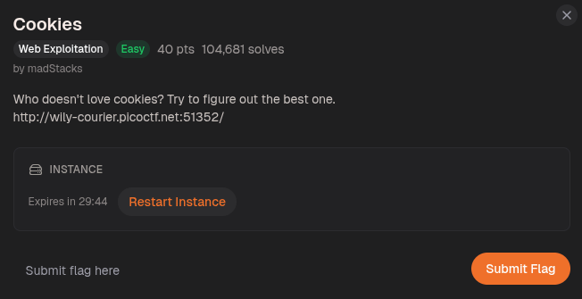
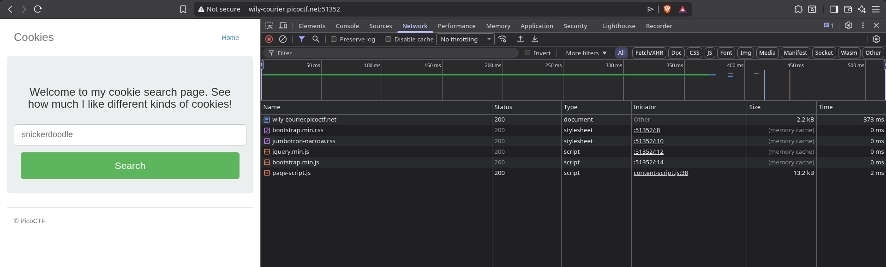
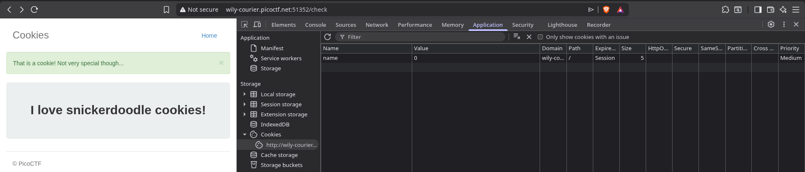
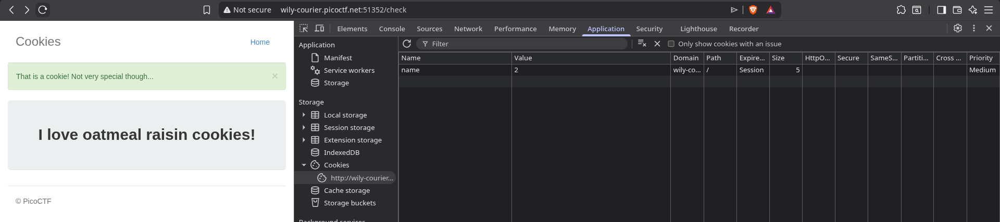
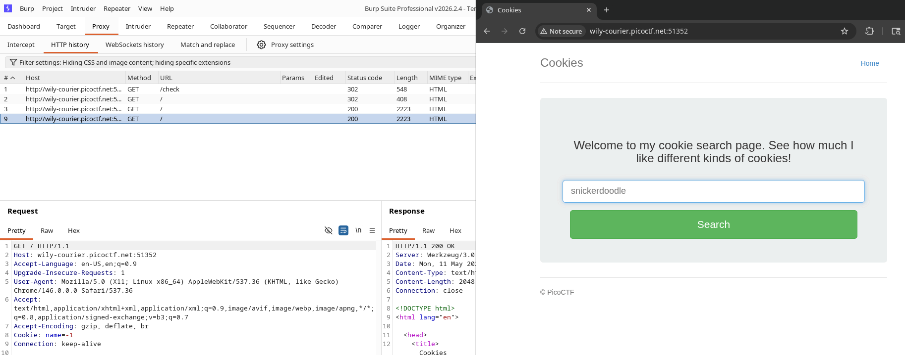
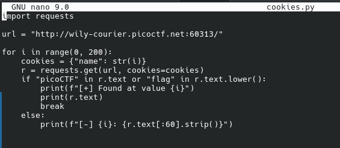
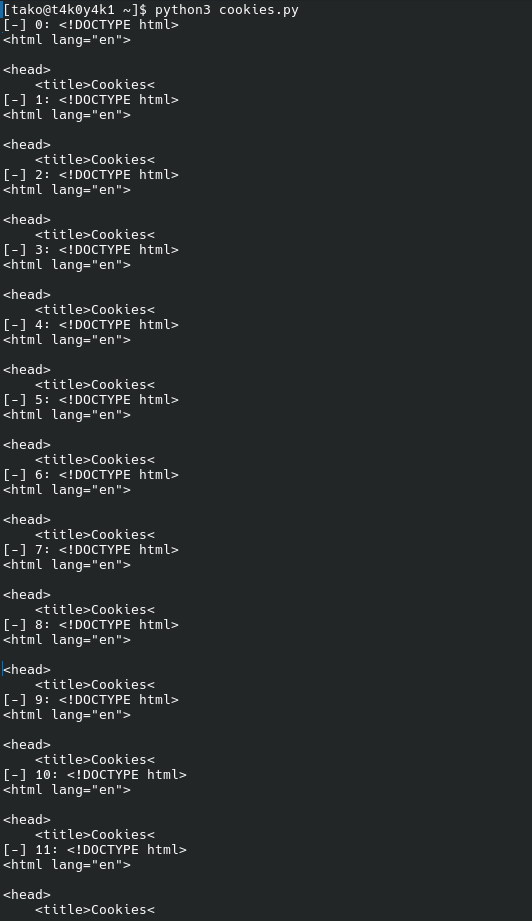
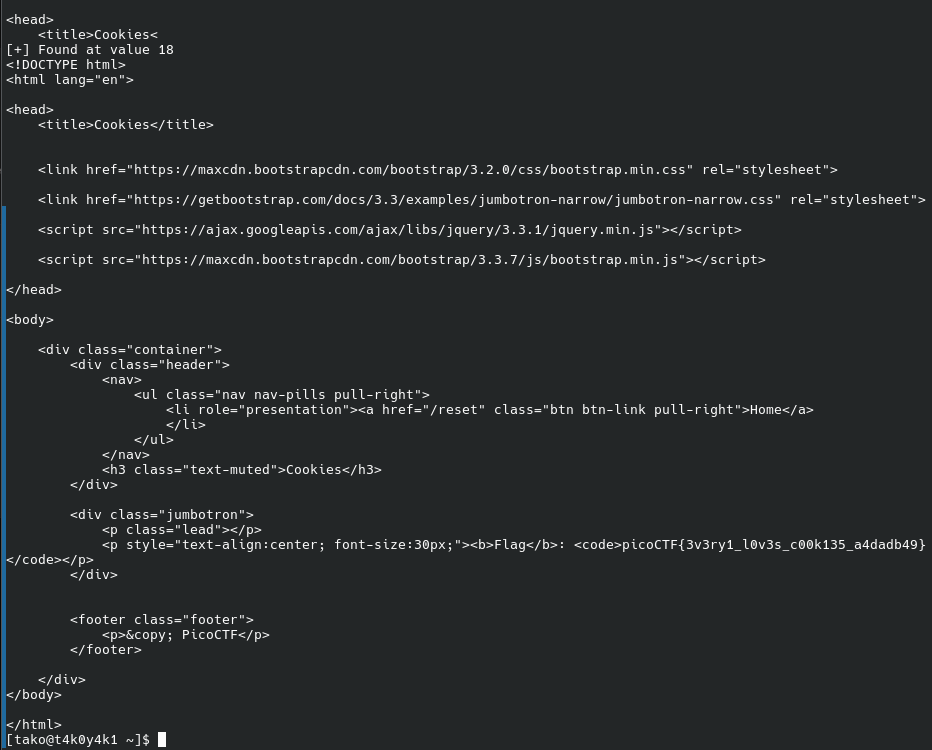
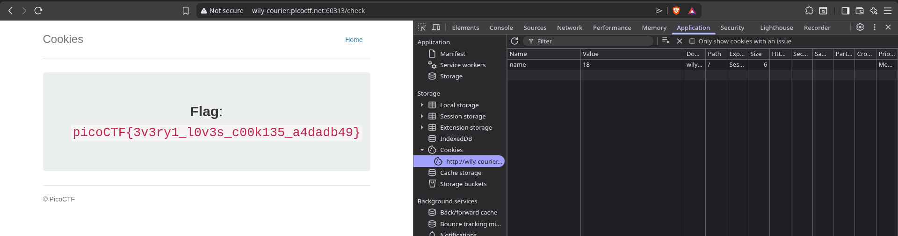

from the name of the challenge, it seems the challenge is related to cookies or cookie manipulation

i reconnected the instance, so the port number is different, don't get confused

Flag: picoCTF{3v3ry1_l0v3s_c00k135_a4dadb49}