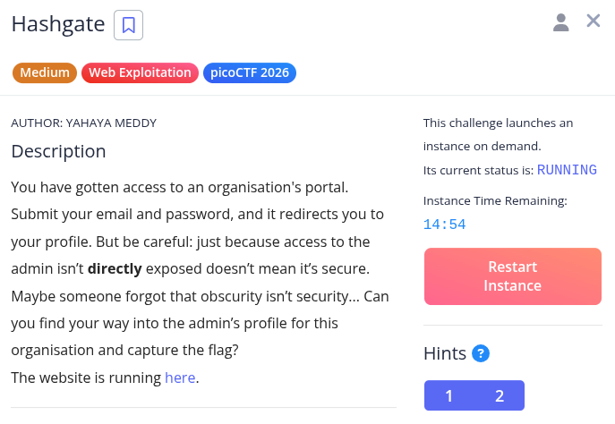

Hint 1: Notice anything about how the ID is being checked? It’s not plain text… maybe a one-way function is involved.
Hint 2: There are about 20 employees in this organisation.

WIP!!!

tried logging in with creds admin@gmail.com:test, following is the output
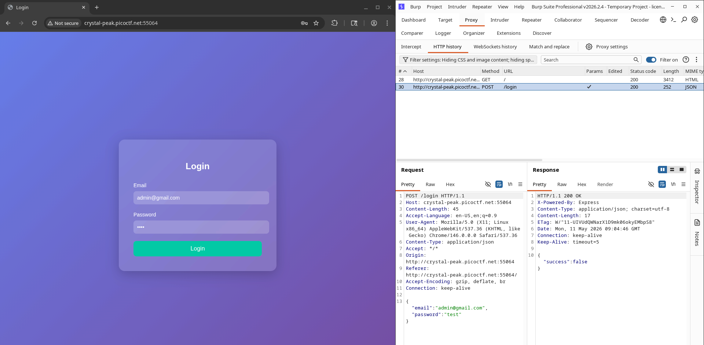

then i tried to read the page source, and whaaaaaaaaaaat, creds out in the open?!

after I loggen in using the credentials guest@picoctf.com:guest, the following can be seen
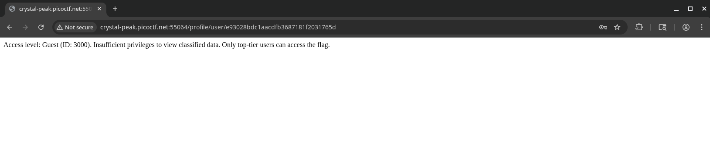

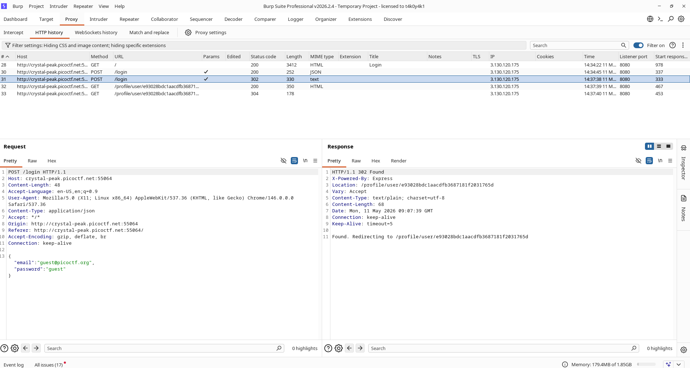

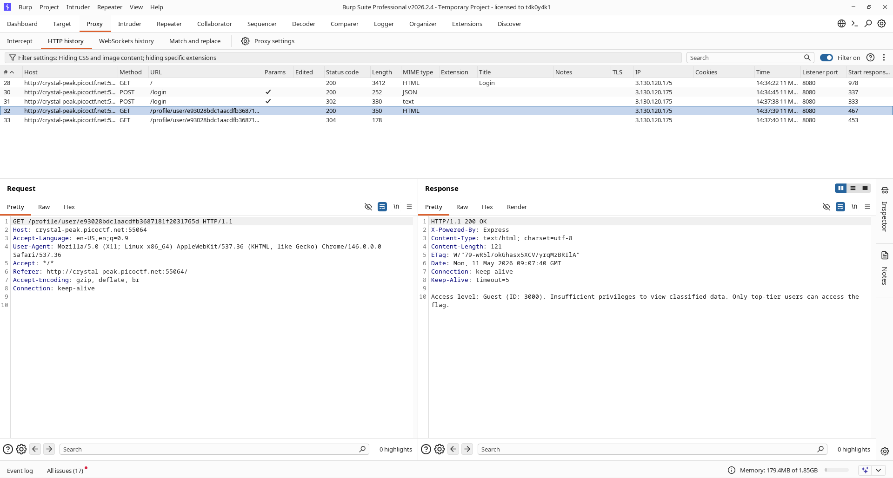

it looks like some kinda hash, let's try to decode it...

this is what I get

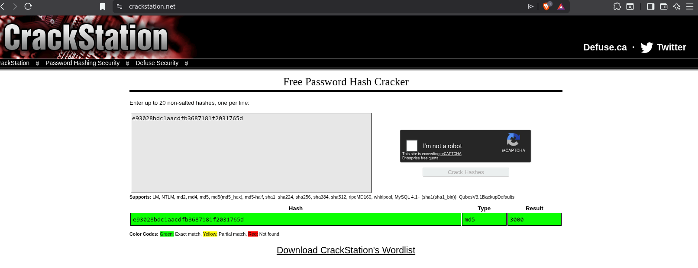

not the response we got previously says there are 20 employees in the organization 

so let's say that 

'guest@picoctf.com' is the first user, the id's of other employees can be (including guest):

3000,3001,3002,3003,3004,3005,3006,3007,3008,3009,
3010,3011,3012,3013,3014,3015,3016,3017,3018,3019,
3020

let's create md5 hash for each id

we can use online tools, but I was feeling lazy so I used a cli script to make it faster

import hashlib

for num in range(3000, 3021):
    h = hashlib.md5(str(num).encode()).hexdigest()
    print(f"{num} -> {h}")

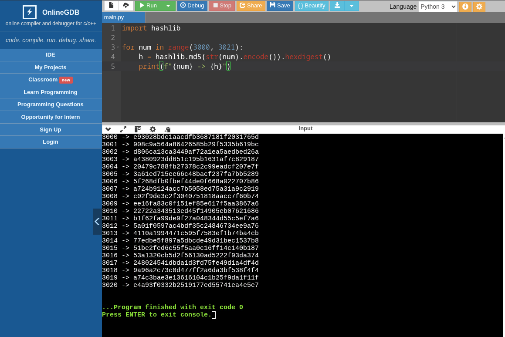

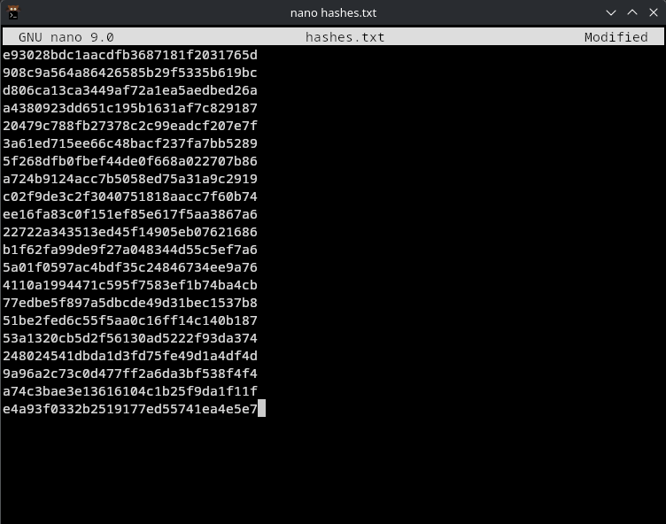

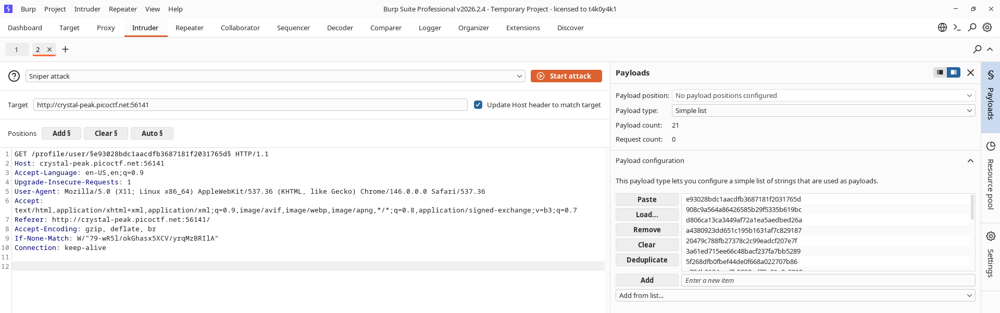

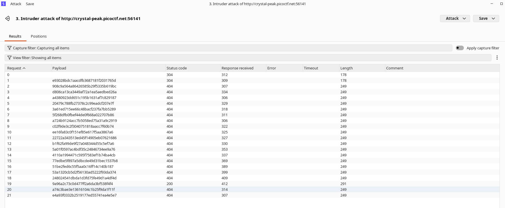

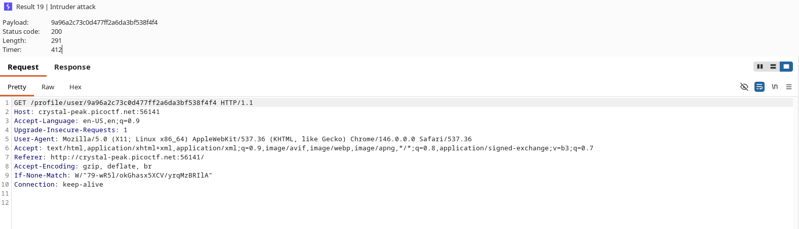

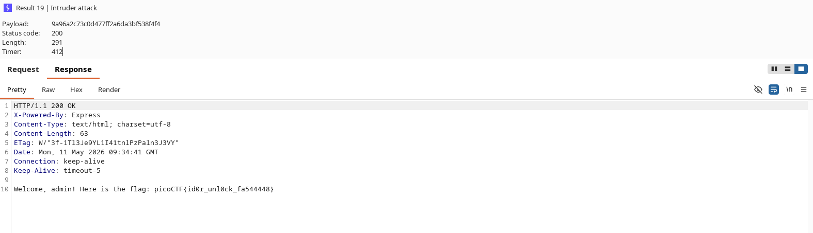

Flag: picoCTF{id0r_unl0ck_fa544448}