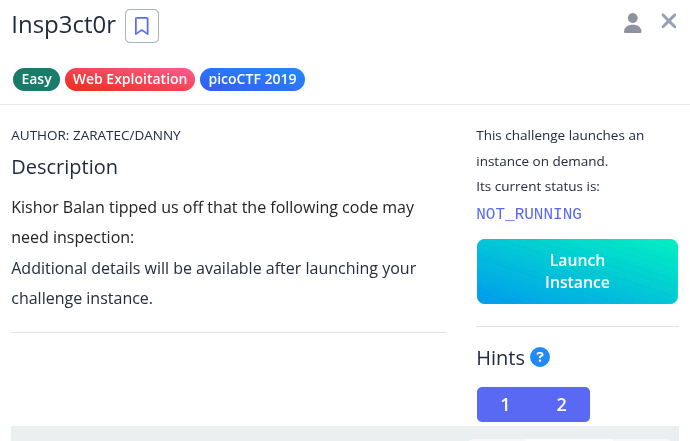
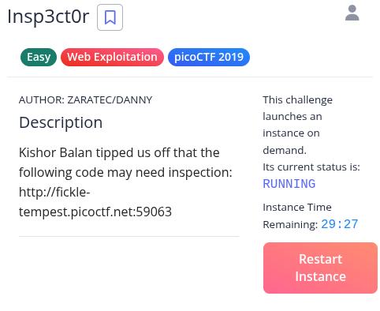
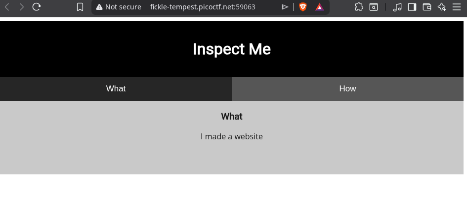
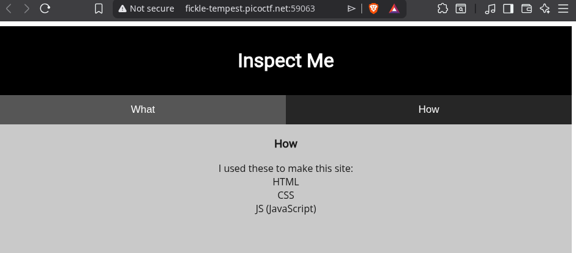
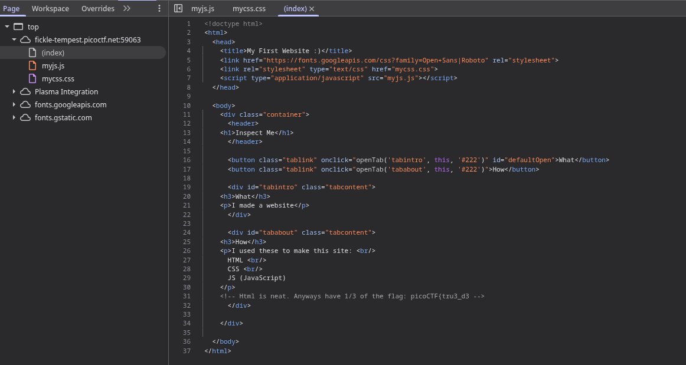
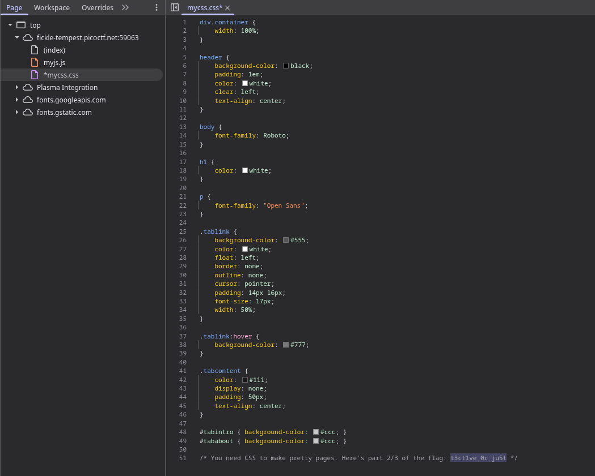
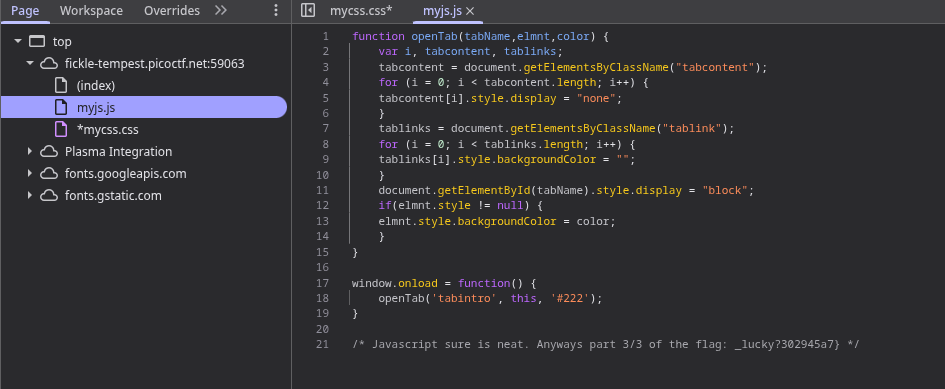

Hint 1: How do you inspect web code on a browser?
Hint 2: There's 3 parts

Anyways have 1/3 of the flag: picoCTF{tru3_d3

Here's part 2/3 of the flag: t3ct1ve_0r_ju5t

Anyways part 3/3 of the flag: _lucky?302945a7}

Flag: picoCTF{tru3_d3t3ct1ve_0r_ju5t_lucky?302945a7}