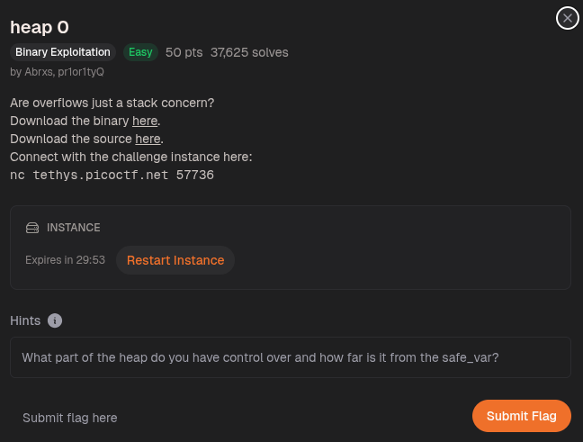
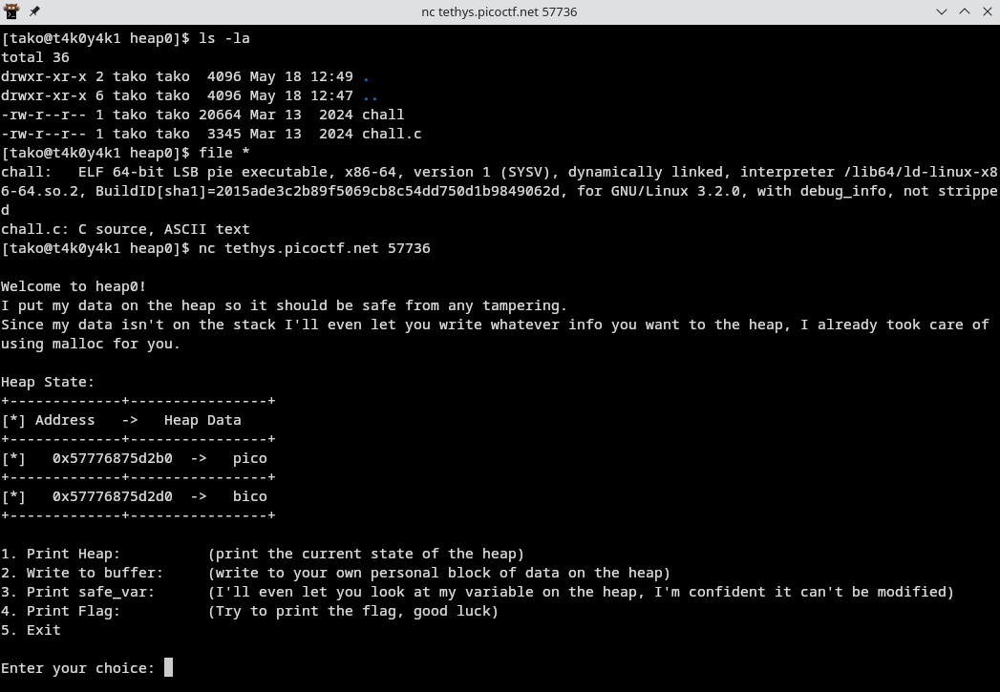
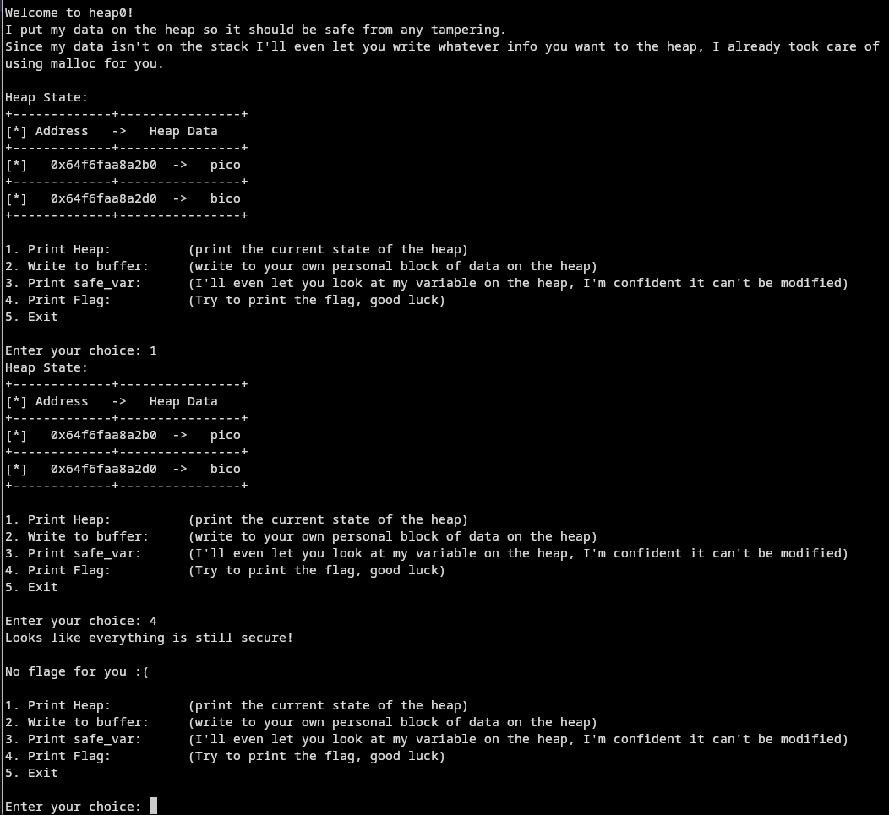
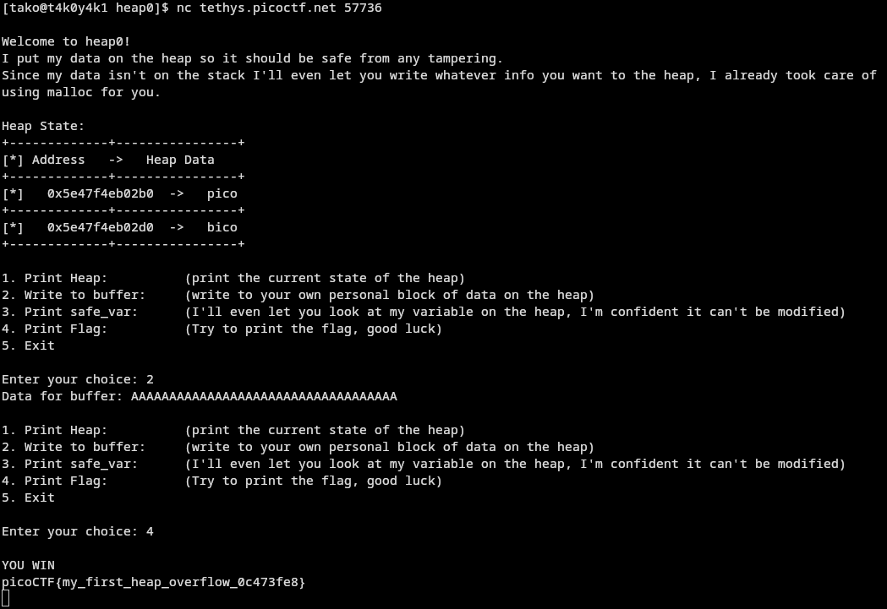

heap 0 — Analysis
The hint says it all: "What part of the heap do you have control over and how far is it from the safe_var?"
What's happening
From the heap state output, you can see two allocations side-by-side:
0x...d2b0  ->  pico    ← your writable buffer (option 2)
0x...d2d0  ->  bico    ← safe_var (this needs to change)
The addresses differ by 0x20 = 32 bytes. So safe_var is stored 32 bytes after your buffer on the heap.
Option 4 (Print Flag) checks if safe_var still equals "bico". If it does → "No flags for you". You need to overflow your buffer into safe_var and overwrite it with something else.
The Exploit
Option 2 lets you write to your buffer. There's no bounds check — classic heap overflow. You just need to write more than 32 bytes so your input spills into the safe_var chunk and overwrites "bico".


Or even simpler — just do it manually in nc:

Connect: nc tethys.picoctf.net 57736
Choose 2 (Write to buffer)
Enter: AAAAAAAAAAAAAAAAAAAAAAAAAAAAAAAAAAAAA (35+ A's)
Choose 4 (Print Flag)




Flag:
```
picoCTF{my_first_heap_overflow_0c473fe8}
```