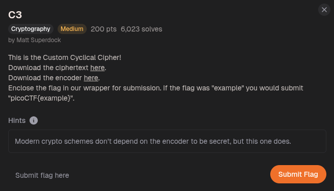
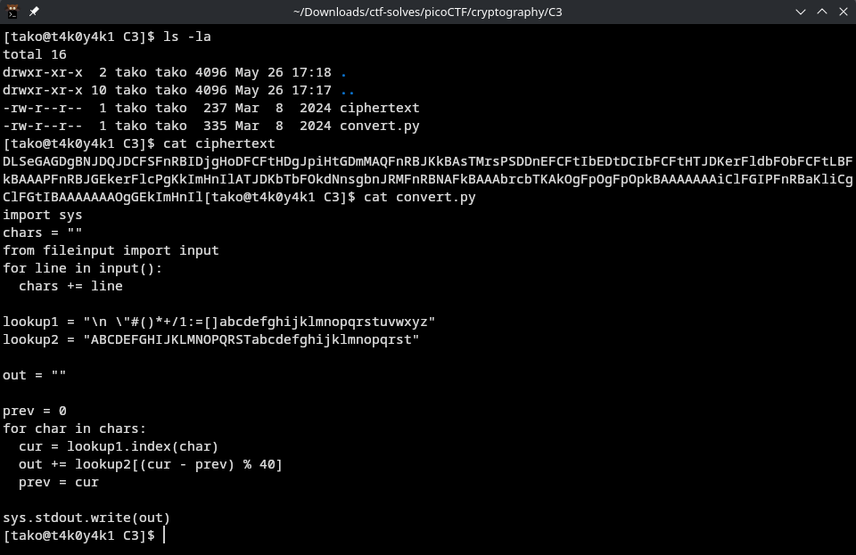
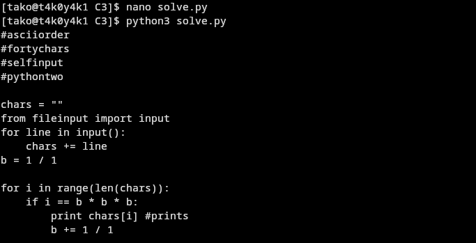
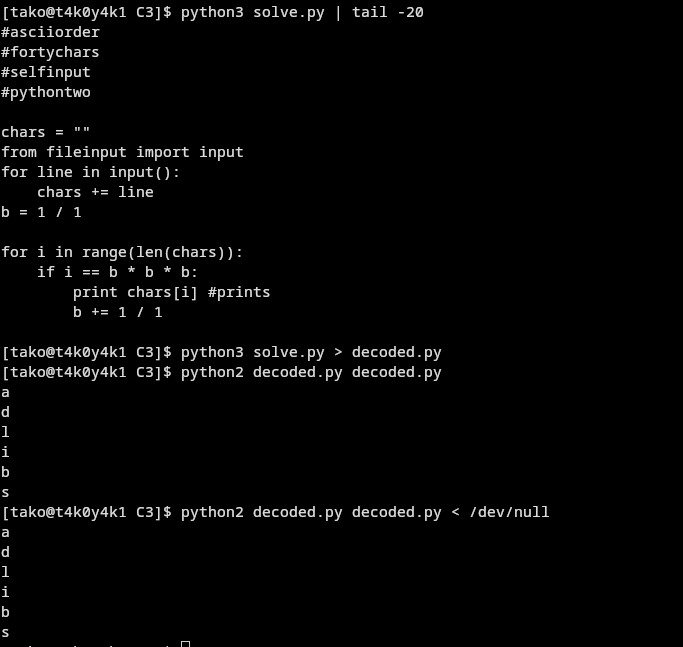

1. ciphertext given:
```txt
DLSeGAGDgBNJDQJDCFSFnRBIDjgHoDFCFtHDgJpiHtGDmMAQFnRBJKkBAsTMrsPSDDnEFCFtIbEDtDCIbFCFtHTJDKerFldbFObFCFtLBFkBAAAPFnRBJGEkerFlcPgKkImHnIlATJDKbTbFOkdNnsgbnJRMFnRBNAFkBAAAbrcbTKAkOgFpOgFpOpkBAAAAAAAiClFGIPFnRBaKliCgClFGtIBAAAAAAAOgGEkImHnIl
```

2. the python encoder script given:
```py
import sys
chars = ""
from fileinput import input
for line in input():
  chars += line

lookup1 = "\n \"#()*+/1:=[]abcdefghijklmnopqrstuvwxyz"
lookup2 = "ABCDEFGHIJKLMNOPQRSTabcdefghijklmnopqrst"

out = ""

prev = 0
for char in chars:
  cur = lookup1.index(char)
  out += lookup2[(cur - prev) % 40]
  prev = cur

sys.stdout.write(out)
```

my python solver script: 
```py
lookup1 = "\n \"#()*+/1:=[]abcdefghijklmnopqrstuvwxyz"
lookup2 = "ABCDEFGHIJKLMNOPQRSTabcdefghijklmnopqrst"

with open('ciphertext') as f:
    ct = f.read()

out = ""
prev = 0
for char in ct:
    diff = lookup2.index(char)
    cur = (diff + prev) % 40
    out += lookup1[cur]
    prev = cur

print(out)
```



```txt
#asciiorder
#fortychars
#selfinput
#pythontwo
```



Flag: picoCTF{adlibs}
