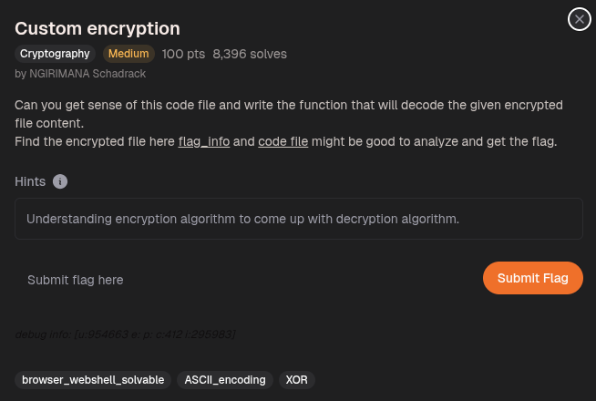
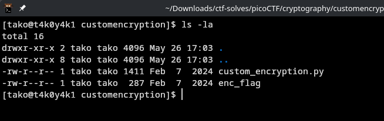
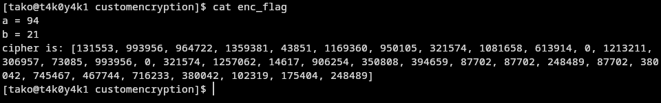
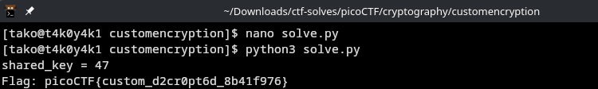

we are provided with 2 file
1. flag_info which is enc_flag

```txt
a = 94
b = 21
cipher is: [131553, 993956, 964722, 1359381, 43851, 1169360, 950105, 321574, 1081658, 613914, 0, 1213211, 306957, 73085, 993956, 0, 321574, 1257062, 14617, 906254, 350808, 394659, 87702, 87702, 248489, 87702, 380042, 745467, 467744, 716233, 380042, 102319, 175404, 248489]
```

and 

2. code file which is custom_encryption.py
```py
from random import randint
import sys


def generator(g, x, p):
    return pow(g, x) % p


def encrypt(plaintext, key):
    cipher = []
    for char in plaintext:
        cipher.append(((ord(char) * key*311)))
    return cipher


def is_prime(p):
    v = 0
    for i in range(2, p + 1):
        if p % i == 0:
            v = v + 1
    if v > 1:
        return False
[tako@t4k0y4k1 customencryption]$ cat custom_encryption.py 
from random import randint
import sys


def generator(g, x, p):
    return pow(g, x) % p


def encrypt(plaintext, key):
    cipher = []
    for char in plaintext:
        cipher.append(((ord(char) * key*311)))
    return cipher


def is_prime(p):
[tako@t4k0y4k1 customencryption]$ cat custom_encryption.py 
from random import randint
import sys


def generator(g, x, p):
    return pow(g, x) % p


def encrypt(plaintext, key):
    cipher = []
    for char in plaintext:
        cipher.append(((ord(char) * key*311)))
    return cipher


def is_prime(p):
    v = 0
    for i in range(2, p + 1):
        if p % i == 0:
            v = v + 1
    if v > 1:
        return False
    else:
        return True


def dynamic_xor_encrypt(plaintext, text_key):
    cipher_text = ""
    key_length = len(text_key)
    for i, char in enumerate(plaintext[::-1]):
        key_char = text_key[i % key_length]
        encrypted_char = chr(ord(char) ^ ord(key_char))
        cipher_text += encrypted_char
    return cipher_text


def test(plain_text, text_key):
    p = 97
    g = 31
    if not is_prime(p) and not is_prime(g):
        print("Enter prime numbers")
        return
    a = randint(p-10, p)
    b = randint(g-10, g)
    print(f"a = {a}")
    print(f"b = {b}")
    u = generator(g, a, p)
    v = generator(g, b, p)
    key = generator(v, a, p)
    b_key = generator(u, b, p)
    shared_key = None
    if key == b_key:
        shared_key = key
    else:
        print("Invalid key")
        return
    semi_cipher = dynamic_xor_encrypt(plain_text, text_key)
    cipher = encrypt(semi_cipher, shared_key)
    print(f'cipher is: {cipher}')


if __name__ == "__main__":
    message = sys.argv[1]
    test(message, "trudeau")
```

the script I asked claude to make after reverse engineering the script given: 
```py
p, g = 97, 31
a, b = 94, 21
cipher = [131553, 993956, 964722, 1359381, 43851, 1169360, 950105, 321574, 1081658, 613914, 0, 1213211, 306957, 73085, 993956, 0, 321574, 1257062, 14617, 906254, 350808, 394659, 87702, 87702, 248489, 87702, 380042, 745467, 467744, 716233, 380042, 102319, 175404, 248489]

# Recompute shared_key
shared_key = pow(pow(g, b) % p, a) % p
print(f"shared_key = {shared_key}")

# Undo the multiplication
semi_cipher = ''.join(chr(c // (shared_key * 311)) for c in cipher)

# Undo XOR with "trudeau"
text_key = "trudeau"
plaintext_reversed = ''
for i, ch in enumerate(semi_cipher):
    plaintext_reversed += chr(ord(ch) ^ ord(text_key[i % len(text_key)]))

# The original loop iterates over plaintext[::-1], so reverse back
flag = plaintext_reversed[::-1]
print(f"Flag: {flag}")
```



Flag: picoCTF{custom_d2cr0pt6d_8b41f976}