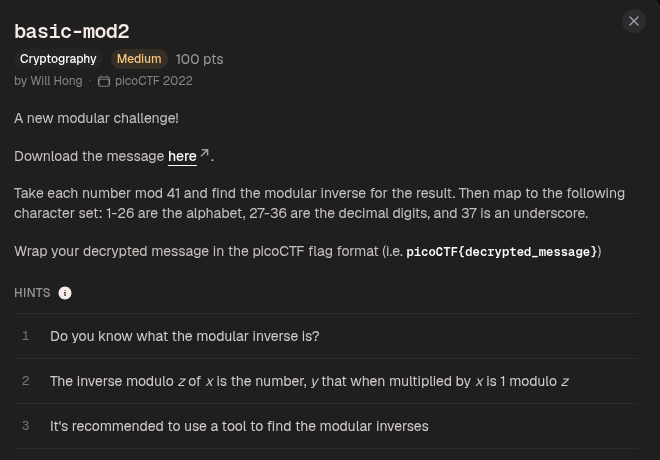
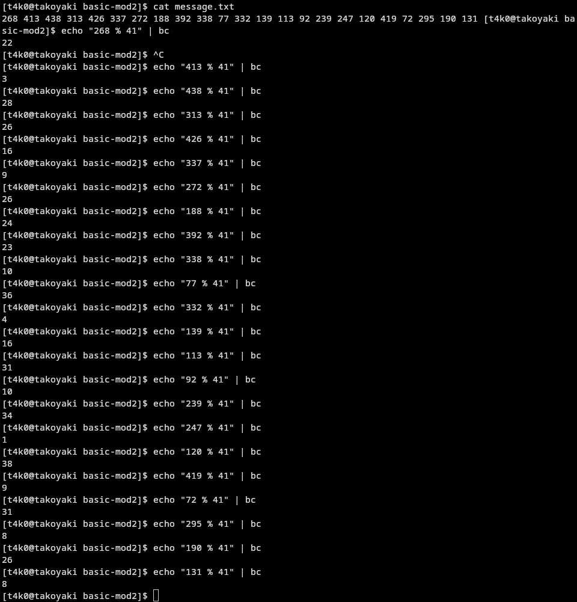
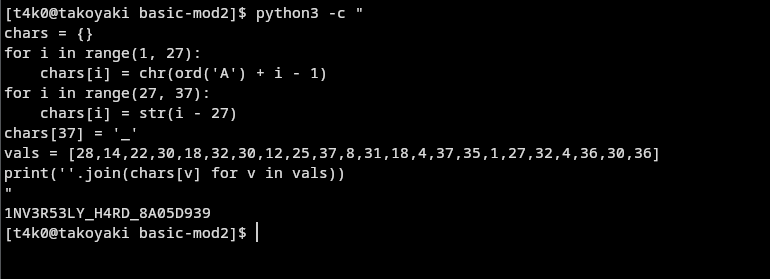

268 413 438 313 426 337 272 188 392 338 77 332 139 113 92 239 247 120 419 72 295 190 131





22 3 28 26 16 9 26 24 23 10 36 4 16 31 10 34 1 38 9 31 8 26 8


modular inverse command:
```
for m in 22 3 28 26 16 9 26 24 23 10 36 4 16 31 10 34 1 38 9 31 8 26 8; do
  for y in $(seq 1 40); do
    if [ $(( (m*y) % 41 )) -eq 1 ]; then echo -n "$y "; fi
  done
done
echo
```
```
28 14 22 30 18 32 30 12 25 37 8 31 18 4 37 35 1 27 32 4 36 30 36 
```

character set being:
Here's the character set for this challenge (note it's shifted by 1 from the previous one — starts at 1 instead of 0):

| Value | Char |
|---|---|
| 1 | A |
| 2 | B |
| 3 | C |
| 4 | D |
| 5 | E |
| 6 | F |
| 7 | G |
| 8 | H |
| 9 | I |
| 10 | J |
| 11 | K |
| 12 | L |
| 13 | M |
| 14 | N |
| 15 | O |
| 16 | P |
| 17 | Q |
| 18 | R |
| 19 | S |
| 20 | T |
| 21 | U |
| 22 | V |
| 23 | W |
| 24 | X |
| 25 | Y |
| 26 | Z |
| 27 | 0 |
| 28 | 1 |
| 29 | 2 |
| 30 | 3 |
| 31 | 4 |
| 32 | 5 |
| 33 | 6 |
| 34 | 7 |
| 35 | 8 |
| 36 | 9 |
| 37 | _ |

and mapping the modular inverse output to this character set we get:
```
1NV3R53LY_H4RD_8A05D939
```

Flag:
```
picoCTF{1NV3R53LY_H4RD_8A05D939}
```

#### i mapped manually, but you can use tbe following script to automate it

```
python3 -c "
chars = {}
for i in range(1, 27):
    chars[i] = chr(ord('A') + i - 1)
for i in range(27, 37):
    chars[i] = str(i - 27)
chars[37] = '_'
vals = [28,14,22,30,18,32,30,12,25,37,8,31,18,4,37,35,1,27,32,4,36,30,36]
print(''.join(chars[v] for v in vals))
"
```

