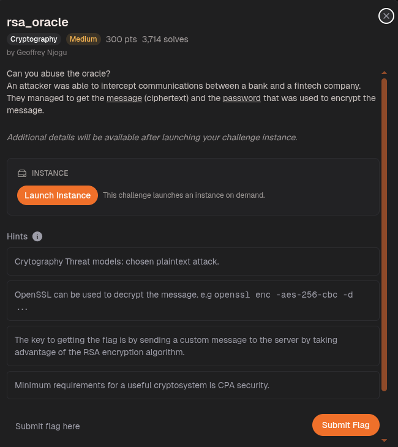
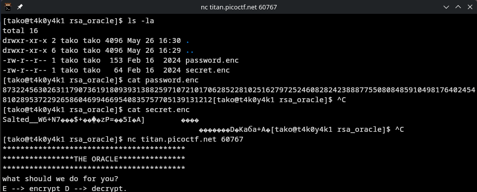
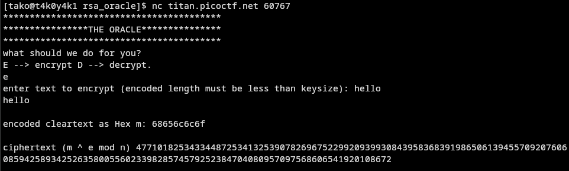
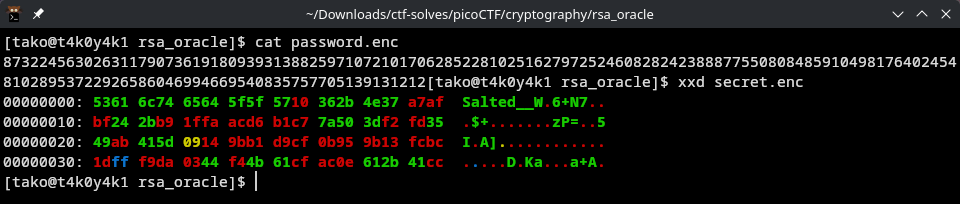
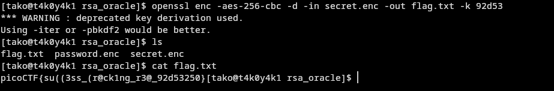

You see that you have to choose either E (encrypt) or D (decrypt). For encryption, it takes the hex of your input and returns m^e mod n.



Step 3: Get Encrypt(2)

We want c2 = 2^e mod n. But the oracle takes string-based input, so we need to send the raw byte 0x02 (not the string "02"). This is easy to do with pwntools.

Step 4: Build the blinded ciphertext
pythonblinded = c_pass × c2
# This is equivalent to: Encrypt(password × 2)
Step 5: Send the blinded ciphertext to the oracle for decryption
The oracle sees this as a completely new ciphertext → it happily returns 2 × password.

Step 6: Divide by 2 to recover the password
pythonpassword = (2 × password) // 2
There was a twist here: the oracle UTF-8 encoded the result, which represented the byte 0xC8 as 0xC3 0x88. That's why we got 6 bytes instead of 5, and the correct value was 0x7264c86a66 (not 0x7264c3886a66).




complete attack in a line:
```
password = Decrypt_oracle(c_pass × 2^e mod n) ÷ 2
```

Flag: picoCTF{su((3ss_(r@ck1ng_r3@_92d53250}
