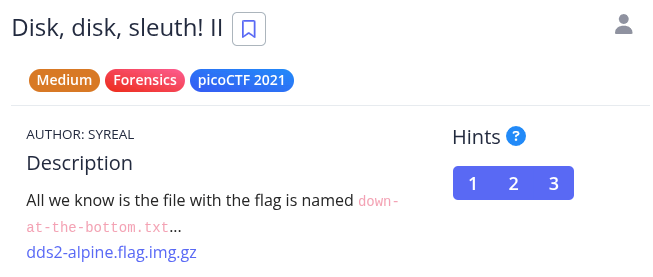
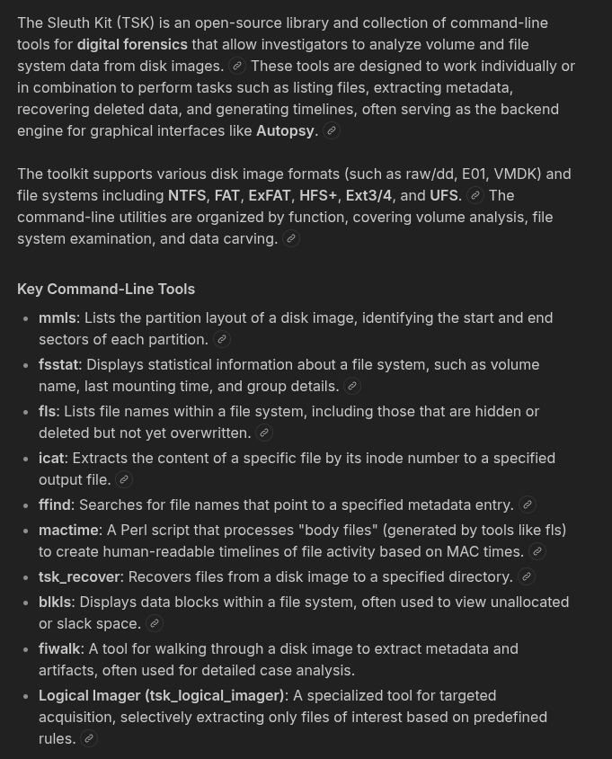
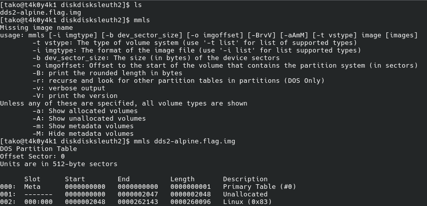
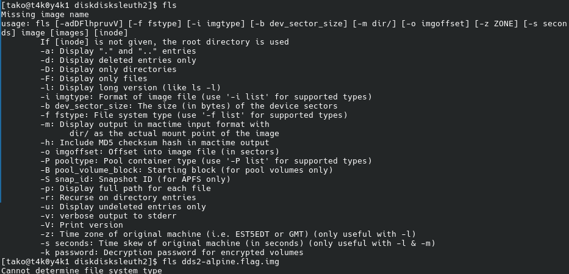
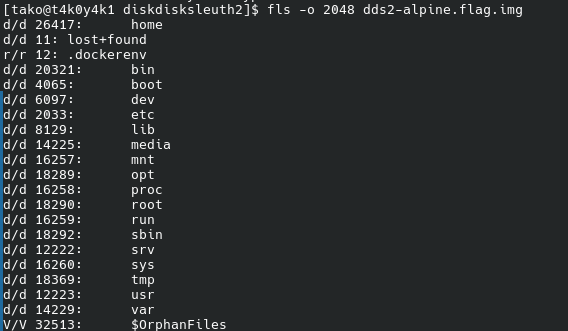
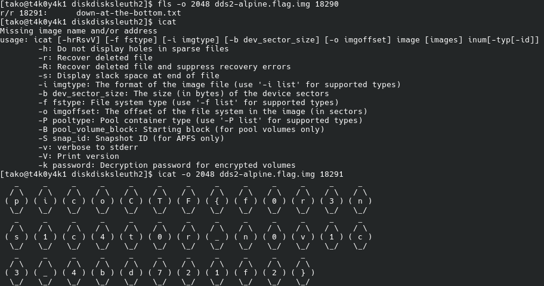

Hint 1: The sleuthkit has some great tools for this challenge as well.
Hint 2: Sleuthkit docs here are so helpful: TSK Tool Overview
Hint 3: This disk can also be booted with qemu!











### Flag: 
```
picoCTF{f0r3ns1c4t0r_n0v1c3_4bd721f2}
```