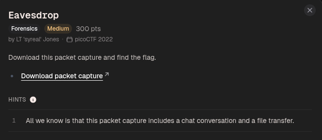
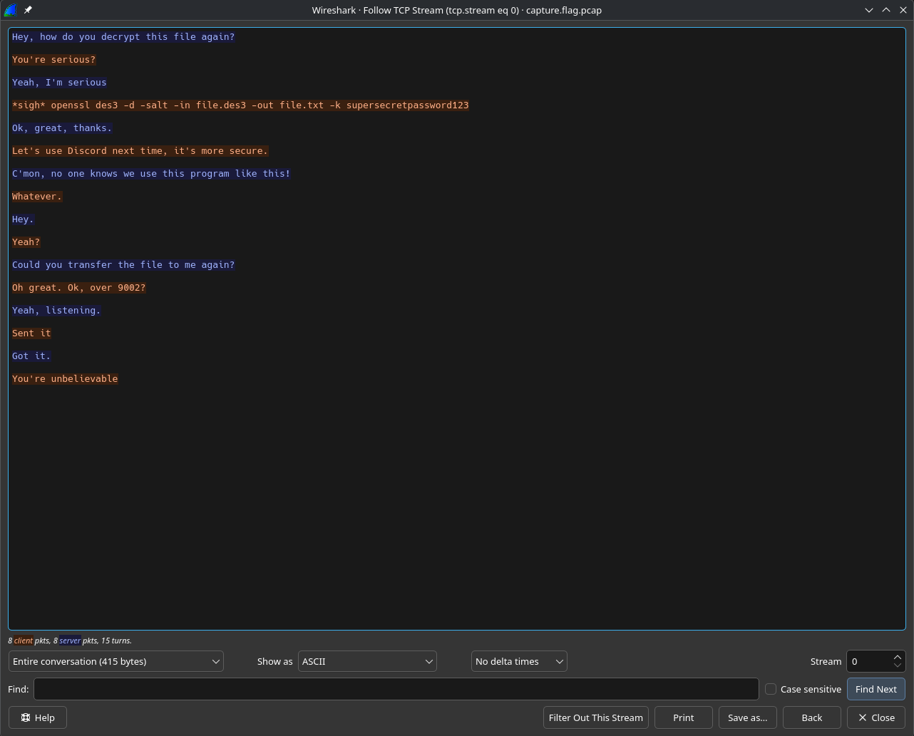
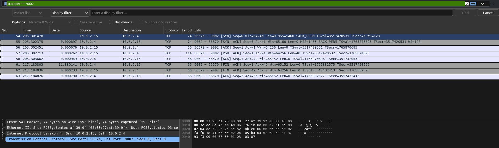
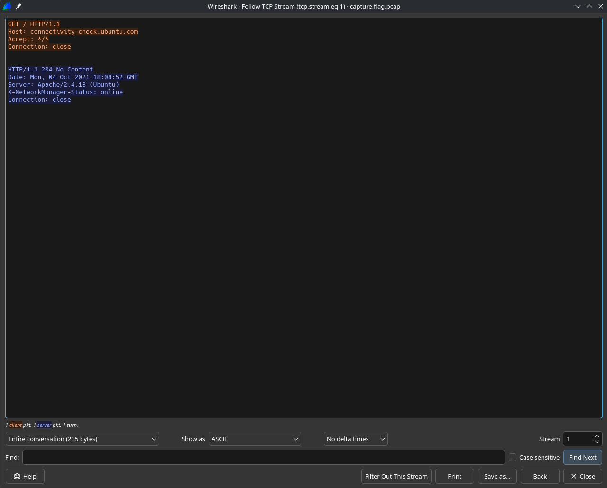
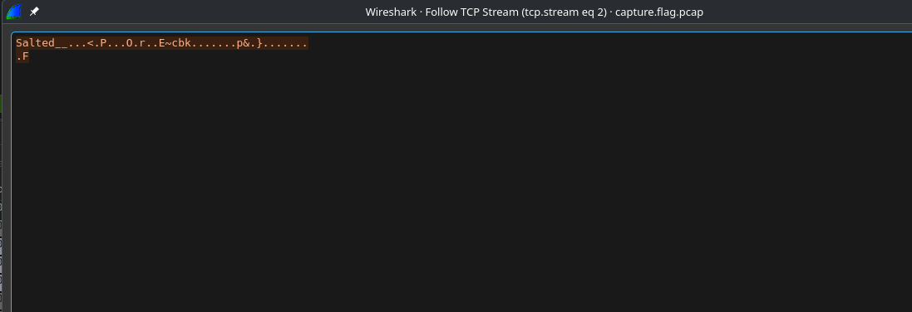
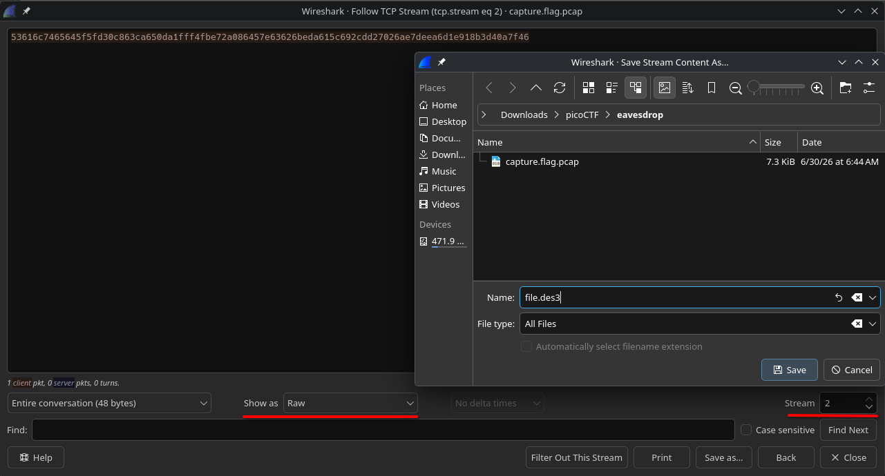
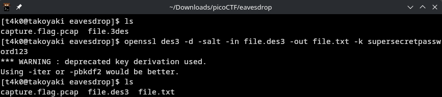
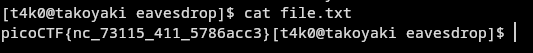

```sh
[t4k0@takoyaki eavesdrop]$ strings capture.flag.pcap 
!()*w
focal-VirtualBox
B[a/
#)X#3
#)X#3
Ei>%
B[aH
B[ad
B[axJ	
i>d@
EHey, how do you decrypt this file again?
B[a=2
#)X#3
i>d@
#)X#3
ci>d@You're serious?
B[af
cYeah, I'm serious
#)X#3
#)X#3
*sigh* openssl des3 -d -salt -in file.des3 -out file.txt -k supersecretpassword123
B[a3
"X#45
B[al0
B[a$
"X#45
Ok, great, thanks.
B[aD
#)X#45s
#)X#45s
NJi?
Let's use Discord next time, it's more secure.
5X#4d
5X#4d
NJC'mon, no one knows we use this program like this!
C[aY
#)X#4ds
#)X#4ds
xWhatever.
C[aRG
hX#4n
C[af
hX#4n
Hey.
#)X#4ns
Fi@"
$C[ab`
#)X#4ns
gi@"
Yeah?
$C[a
mX#4t
g1C[a
mX#4t
gCould you transfer the file to me again?
1C[a6P
#)X#4ts
si@g
3C[a
3C[a(
3C[aZ
3C[aY
GET / HTTP/1.1
Host: connectivity-check.ubuntu.com
Accept: */*
Connection: close
3C[a
4C[a
HTTP/1.1 204 No Content
Date: Mon, 04 Oct 2021 18:08:52 GMT
Server: Apache/2.4.18 (Ubuntu)
X-NetworkManager-Status: online
Connection: close
4C[a
4C[a
4C[a
4C[a
DC[a
#)X#4ts
Oh great. Ok, over 9002?
DC[aa
IC[a$
IC[aC
TC[a
Yeah, listening.
TC[a4
#)X#4
w5i@
[C[a)
2#*^
[C[a
2@_Tl^
[C[a
2#*^
@_Tm
g[C[a
2#*^
@_Tm
gSalted__
E~cbk
F[C[a
2@_Tm^
bC[a6
#)X#4
Sent it
bC[a
iA'9
gC[a~8
2@_Tm^
gC[ag9
2#*^
@_Tn
]iA:
gC[a}<
2@_Tn^
]qC[a
iAa+
Got it.
qC[aCz
#)X#4
iAa+rC[a
connectivity-check
ubuntu
rC[aY
connectivity-check
ubuntu
rC[a`
connectivity-check
ubuntu
rC[a
connectivity-check
ubuntu
wC[a
wC[a
}C[a
#)X#4
4iAa+You're unbelievable
}C[a
C[a8|
```

lmao look at the conversation they be having XD



out of this funny conversation, we get something useful;
```
openssl des3 -d -salt -in file.des3 -out file.txt -k supersecretpassword123
```

another thing, bro 1 asks bro 2 to transfer the file again, and bro 2 transfers the file over port 9002:

```
Could you transfer the file to me again?
Oh great. Ok, over 9002?
```

so we go back to wireshark and analyze the packets involving port 9002







changed it to show as raw bits and saved it as `file.des3`







Flag:
```
picoCTF{nc_73115_411_5786acc3}
```