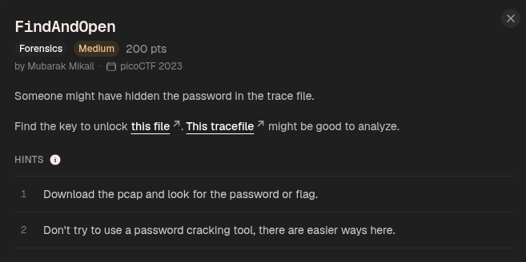

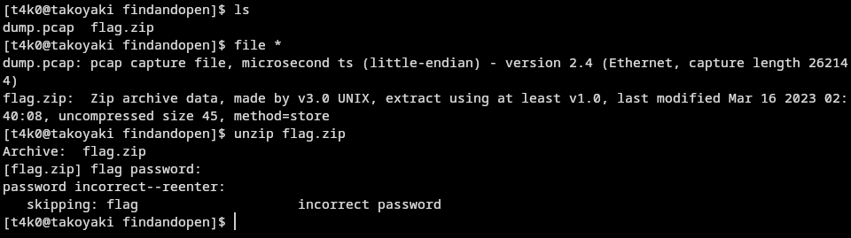

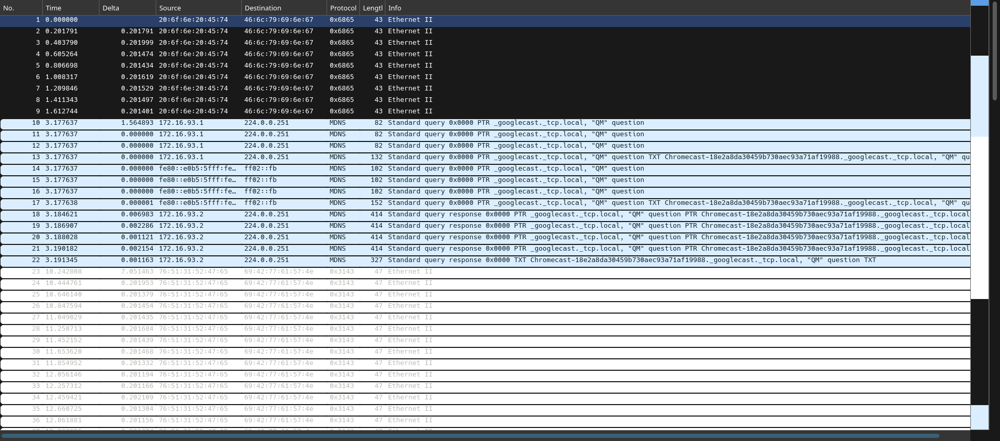

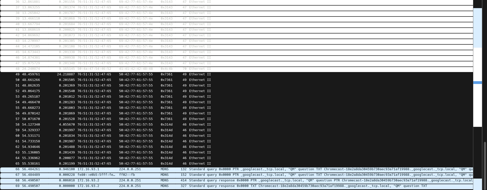

filtering out the ethernet packets:
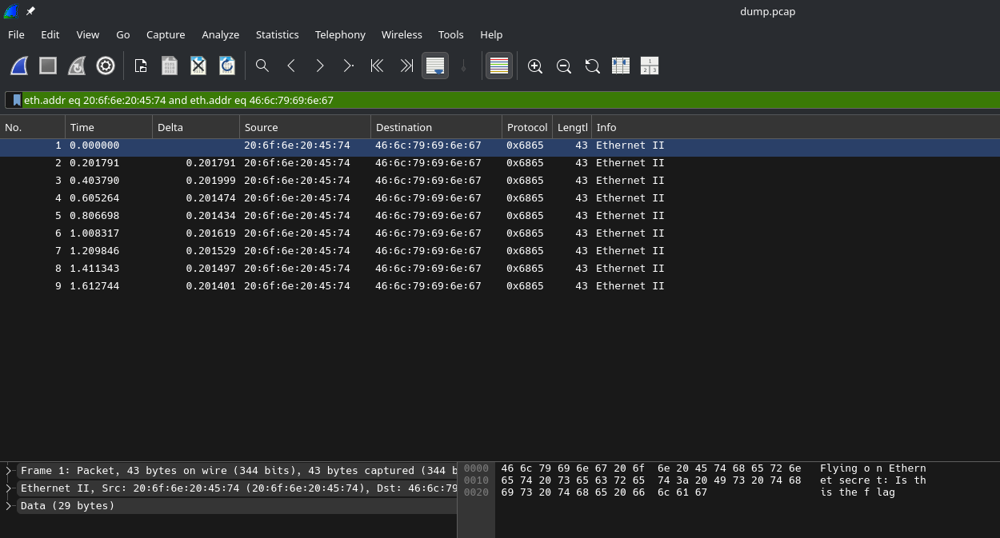

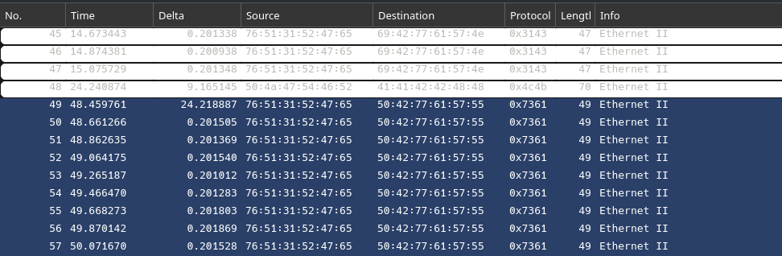

from packet 49 to 57, on protocol the following message has been transmitted:

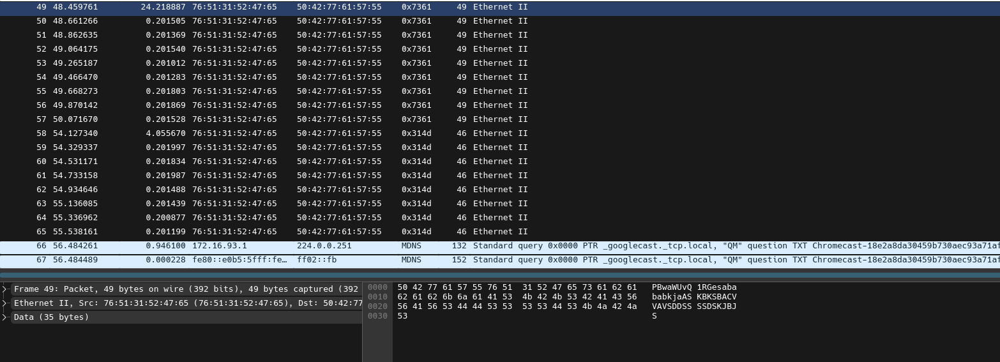

```
PBwaWUvQ1RGesabababkjaASKBKSBACVVAVSDDSSSSDSKJBJS
```

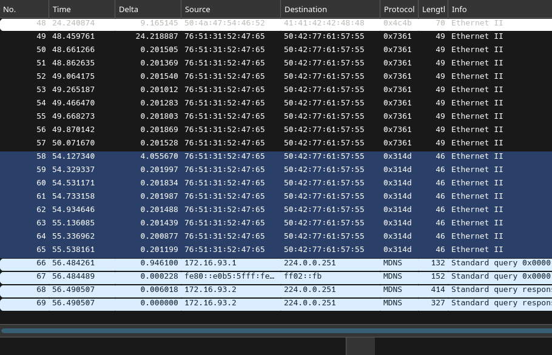

from packet 58 to 65, on protocol 46, the following message was transmitted:
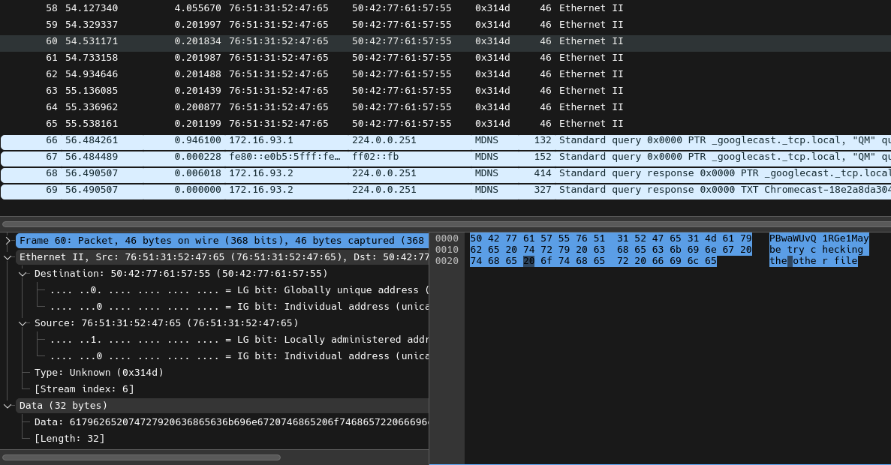

```
PBwaWUvQ1RGe1 Maybe try checking the other file
```


### re-approached the challenge:

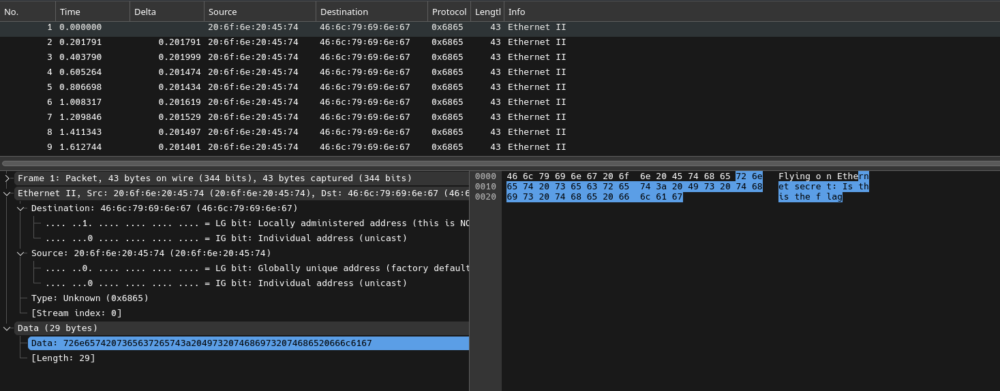

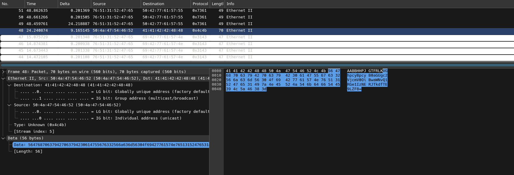

this packet is the only with a different protocol, so let's analyze it:
the highlighted text:
```
VGhpcyBpcyB0aGUgc2VjcmV0OiBwaWNvQ1RGe1IzNERJTkdfTE9LZF8=
```

decoding the message gives us:
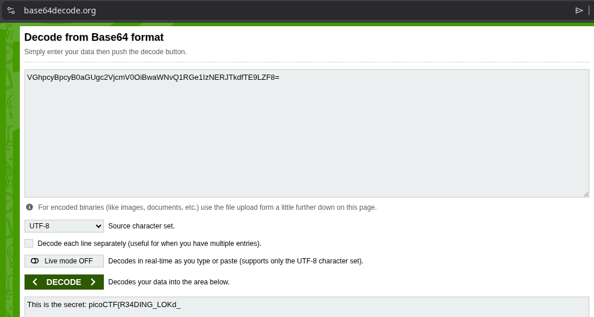

```
This is the secret: picoCTF{R34DING_LOKd_
```

in one of the packets, it hinted the flag has been split, so let's assume the other part of this flag is somewhere in the zip file.


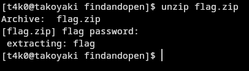
so the secret pass to unlock this zip file was `picoCTF{R34DING_LOKd_`

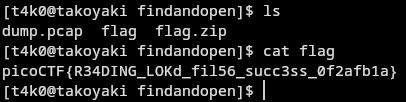

Flag:
```
picoCTF{R34DING_LOKd_fil56_succ3ss_0f2afb1a}
```

ezzzz

