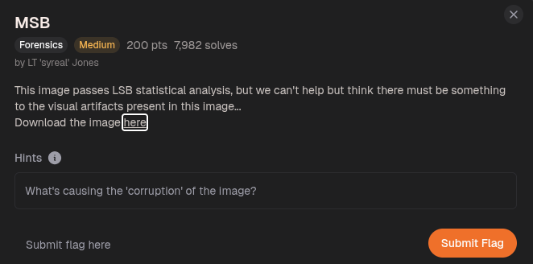

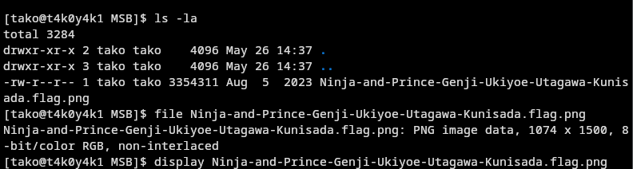

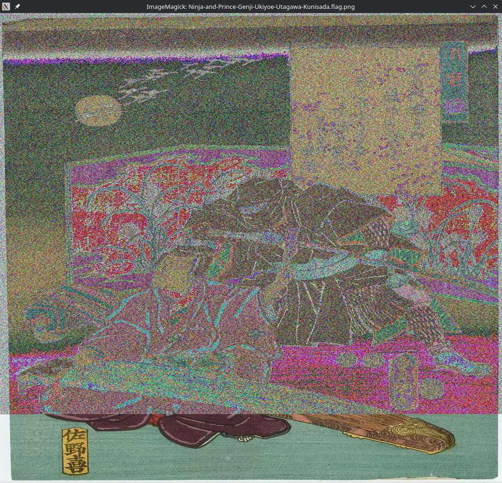

https://georgeom.net/StegOnline/checklist

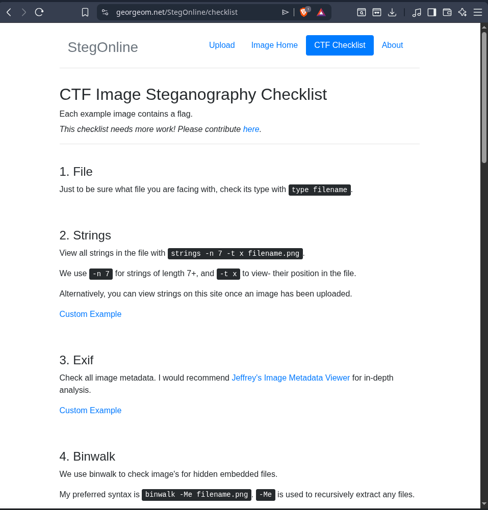

awesome checklist

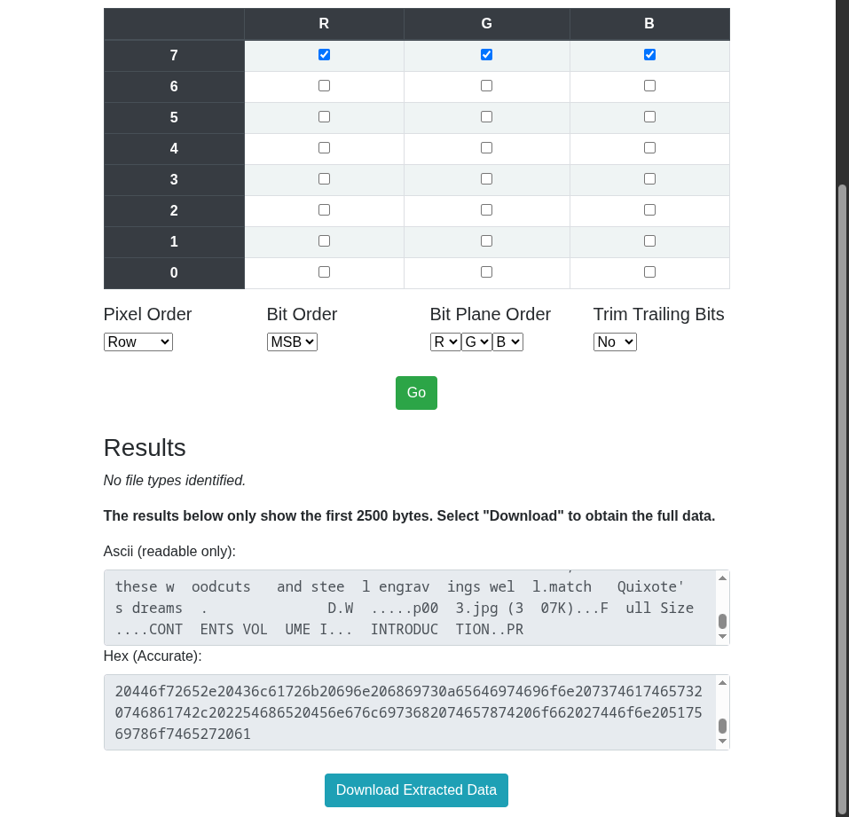

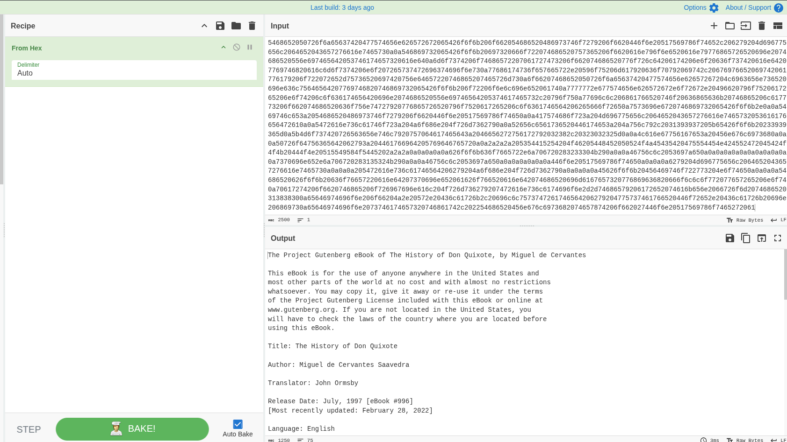

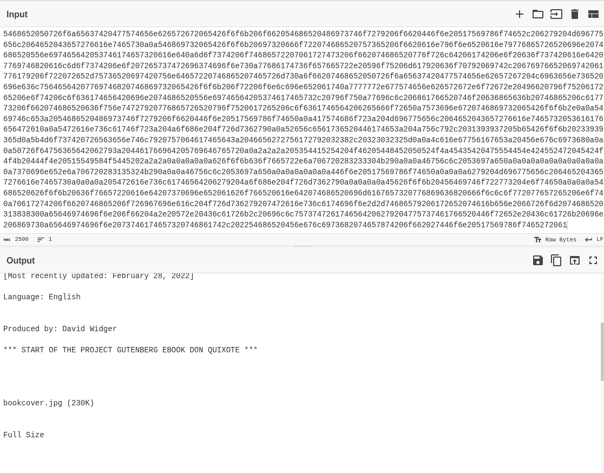

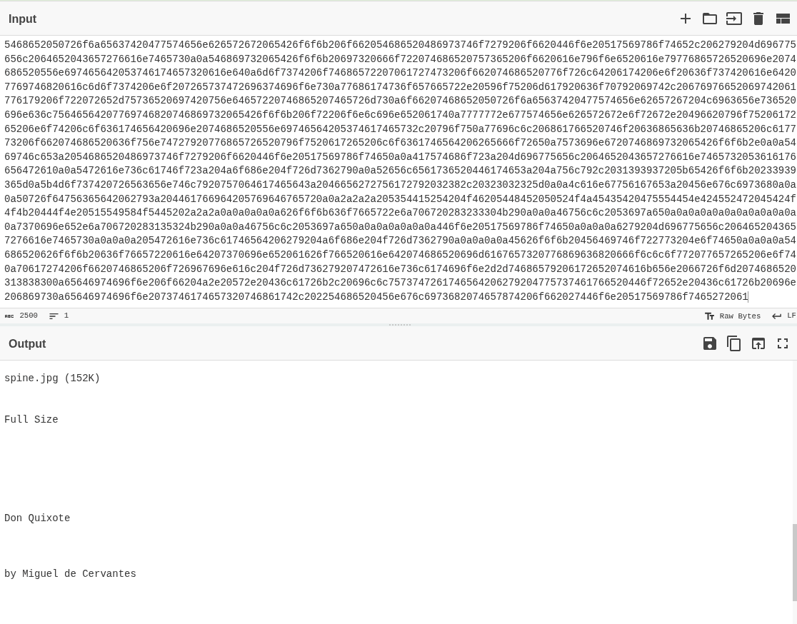

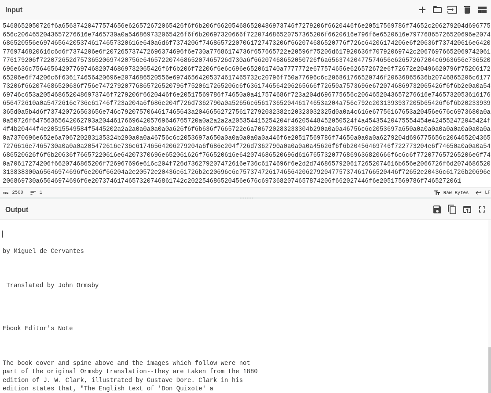

The hex (as shown in the images above): 
```hex
5468652050726f6a65637420477574656e626572672065426f6f6b206f662054686520486973746f7279206f6620446f6e20517569786f74652c206279204d696775656c2064652043657276616e7465730a0a546869732065426f6f6b20697320666f722074686520757365206f6620616e796f6e6520616e79776865726520696e2074686520556e697465642053746174657320616e640a6d6f7374206f74686572207061727473206f662074686520776f726c64206174206e6f20636f737420616e64207769746820616c6d6f7374206e6f207265737472696374696f6e730a77686174736f657665722e20596f75206d617920636f70792069742c20676976652069742061776179206f722072652d75736520697420756e64657220746865207465726d730a6f66207468652050726f6a65637420477574656e62657267204c6963656e736520696e636c75646564207769746820746869732065426f6f6b206f72206f6e6c696e652061740a7777772e677574656e626572672e6f72672e20496620796f7520617265206e6f74206c6f636174656420696e2074686520556e69746564205374617465732c20796f750a77696c6c206861766520746f20636865636b20746865206c617773206f662074686520636f756e74727920776865726520796f7520617265206c6f6361746564206265666f72650a7573696e6720746869732065426f6f6b2e0a0a5469746c653a2054686520486973746f7279206f6620446f6e20517569786f74650a0a417574686f723a204d696775656c2064652043657276616e7465732053616176656472610a0a5472616e736c61746f723a204a6f686e204f726d7362790a0a52656c6561736520446174653a204a756c792c2031393937205b65426f6f6b20233939365d0a5b4d6f737420726563656e746c7920757064617465643a2046656272756172792032382c20323032325d0a0a4c616e67756167653a20456e676c6973680a0a0a50726f64756365642062793a204461766964205769646765720a0a2a2a2a205354415254204f46205448452050524f4a45435420475554454e424552472045424f4f4b20444f4e20515549584f5445202a2a2a0a0a0a0a0a626f6f6b636f7665722e6a706720283233304b290a0a0a46756c6c2053697a650a0a0a0a0a0a0a0a0a0a0a0a7370696e652e6a706720283135324b290a0a0a46756c6c2053697a650a0a0a0a0a0a0a446f6e20517569786f74650a0a0a0a6279204d696775656c2064652043657276616e7465730a0a0a0a205472616e736c61746564206279204a6f686e204f726d7362790a0a0a0a0a45626f6f6b20456469746f722773204e6f74650a0a0a0a54686520626f6f6b20636f76657220616e64207370696e652061626f766520616e642074686520696d6167657320776869636820666f6c6c6f772077657265206e6f740a70617274206f6620746865206f726967696e616c204f726d736279207472616e736c6174696f6e2d2d74686579206172652074616b656e2066726f6d2074686520313838300a65646974696f6e206f66204a2e20572e20436c61726b2c20696c6c7573747261746564206279204775737461766520446f72652e20436c61726b20696e206869730a65646974696f6e2073746174657320746861742c202254686520456e676c6973682074657874206f662027446f6e20517569786f7465272061
```

translates to:
```txt
The Project Gutenberg eBook of The History of Don Quixote, by Miguel de Cervantes

This eBook is for the use of anyone anywhere in the United States and
most other parts of the world at no cost and with almost no restrictions
whatsoever. You may copy it, give it away or re-use it under the terms
of the Project Gutenberg License included with this eBook or online at
www.gutenberg.org. If you are not located in the United States, you
will have to check the laws of the country where you are located before
using this eBook.

Title: The History of Don Quixote

Author: Miguel de Cervantes Saavedra

Translator: John Ormsby

Release Date: July, 1997 [eBook #996]
[Most recently updated: February 28, 2022]

Language: English


Produced by: David Widger

*** START OF THE PROJECT GUTENBERG EBOOK DON QUIXOTE ***


bookcover.jpg (230K)


Full Size


spine.jpg (152K)


Full Size


Don Quixote


by Miguel de Cervantes


 Translated by John Ormsby


Ebook Editor's Note


The book cover and spine above and the images which follow were not
part of the original Ormsby translation--they are taken from the 1880
edition of J. W. Clark, illustrated by Gustave Dore. Clark in his
edition states that, "The English text of 'Don Quixote' a
```

we can see 2 more file names 
`bookcover.jpg` and `spine.jpg`

checked the file size and realized the file is massive (for an image):

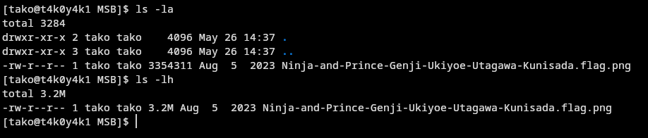
`3.2M` !!!!


thought there is nothing much to see here so I downloaded the file for the complete extracted data: 

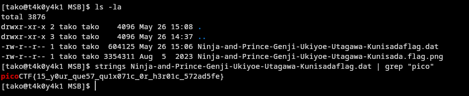

Flag: picoCTF{15_y0ur_que57_qu1x071c_0r_h3r01c_572ad5fe}