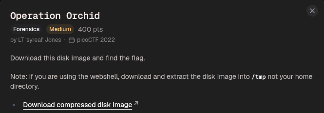
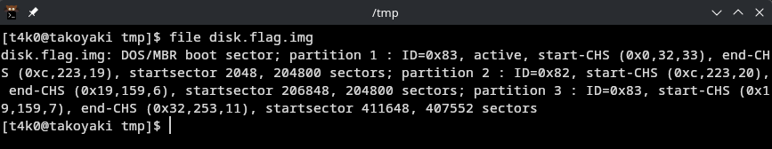
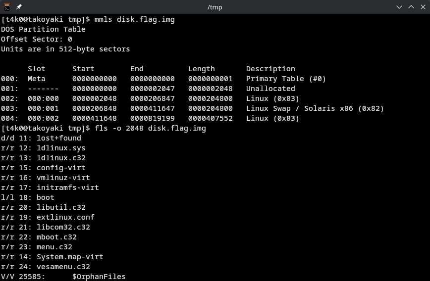
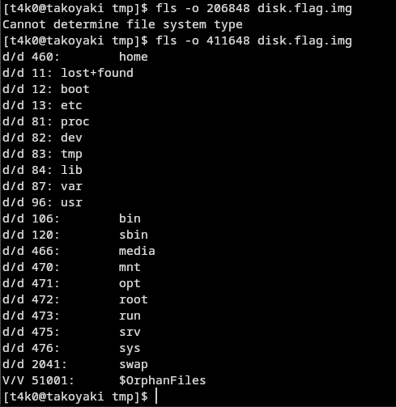
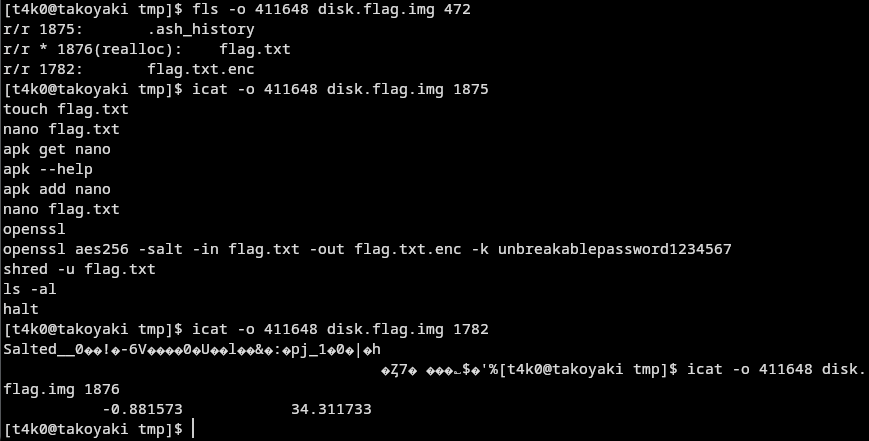
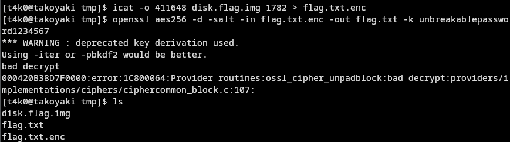
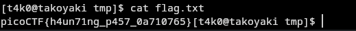

The .ash_history shows exactly how the flag was encrypted:
```
openssl aes256 -salt -in flag.txt -out flag.txt.enc -k unbreakablepassword1234567
```





Flag:
```
picoCTF{h4un71ng_p457_0a710765}
```