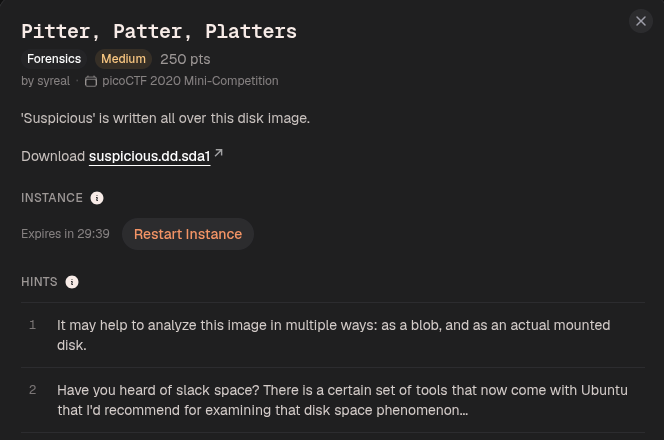
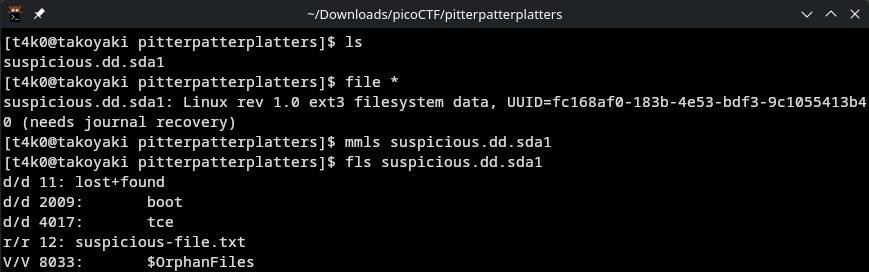
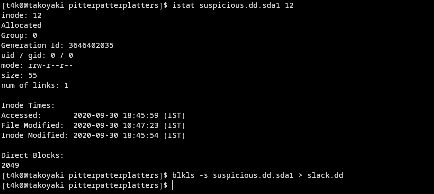
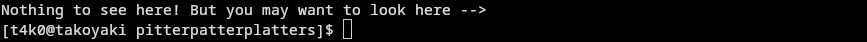
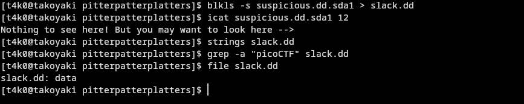
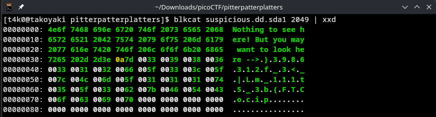
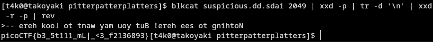

if you read it in reverse, you can get the flag:



using the command:
```
blkcat suspicious.dd.sda1 2049 | xxd -p | tr -d '\n' | xxd -r -p | rev
```

Flag:
```
picoCTF{b3_5t111_mL|_<3_f2136893}
```


