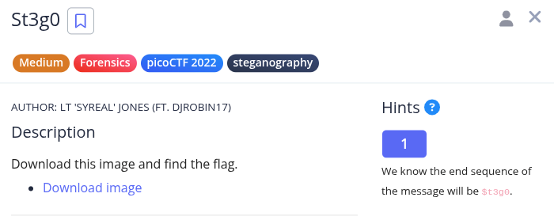
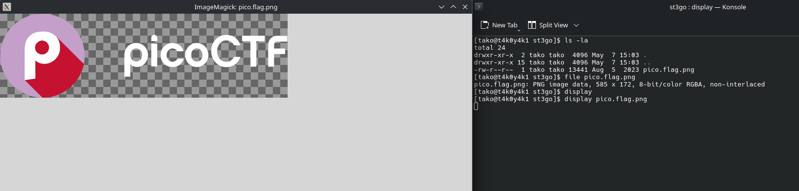
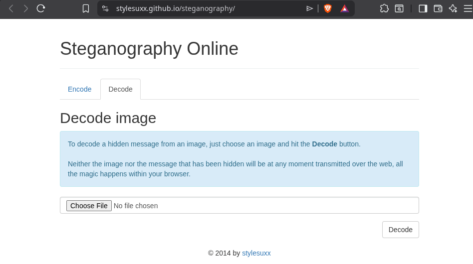
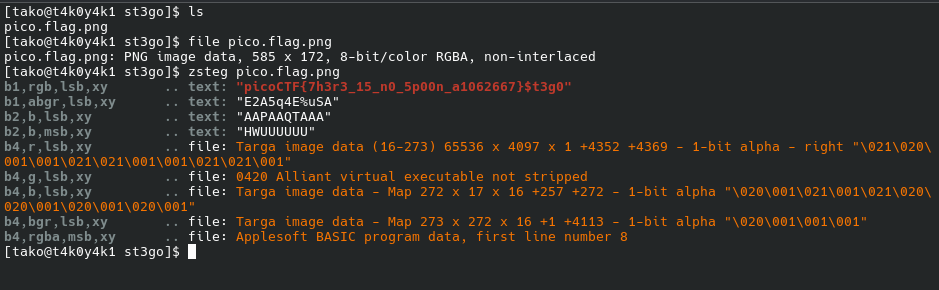

i tried the online tool but then if gave me a raw output


my saviour, almost 90% challenges I have ever solved just needed me to run zsteg.

ZSTEG MY GOAT!!!

### Flag: 
```
picoCTF{7h3r3_15_n0_5p00n_a1062667}
```