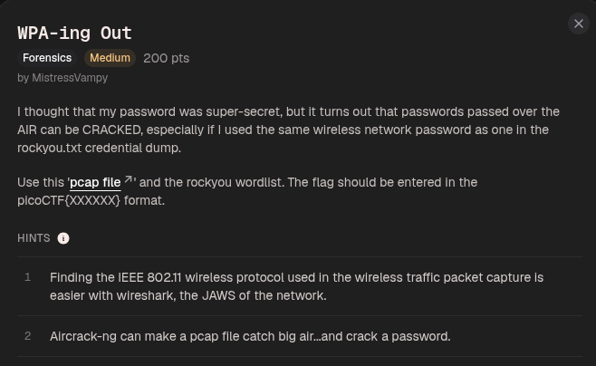
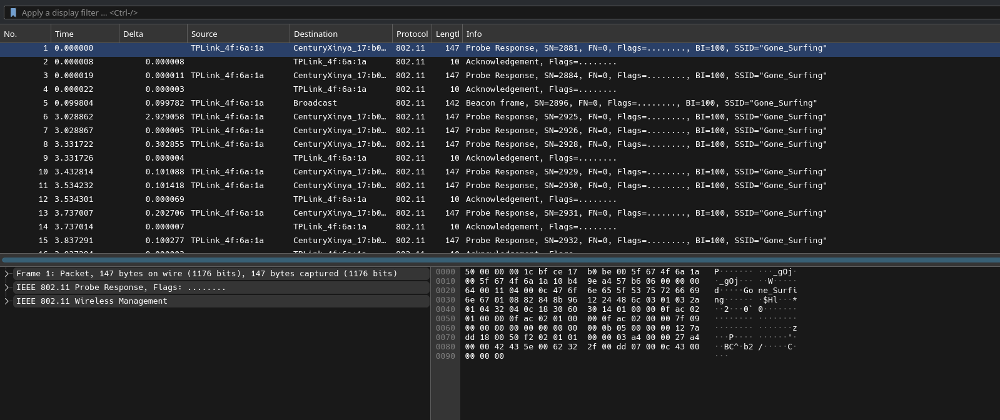
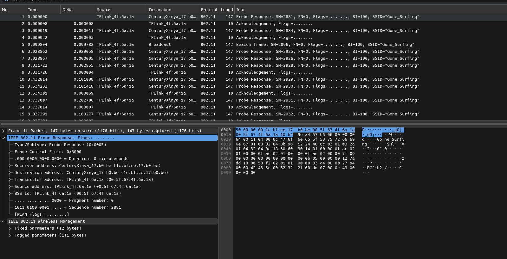
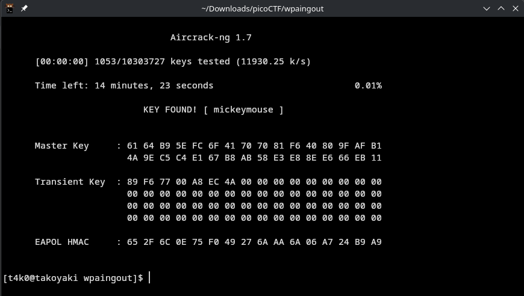

the SSID is `Gone_Surfing`
the BSSID is `00:5f:67:4f:6a:1a`

using the command:
```
aircrack-ng -w /usr/share/dict/rockyou.txt -b 00:5f:67:4f:6a:1a wpa-ing_out.pcap
```


we found the key as:
```
mickeymouse
```

Flag:
```
picoCTF{mickeymouse}
```