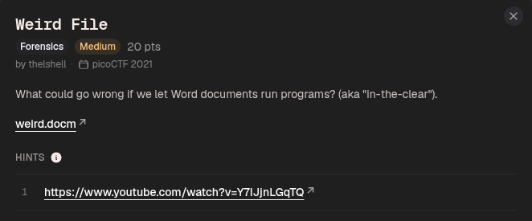
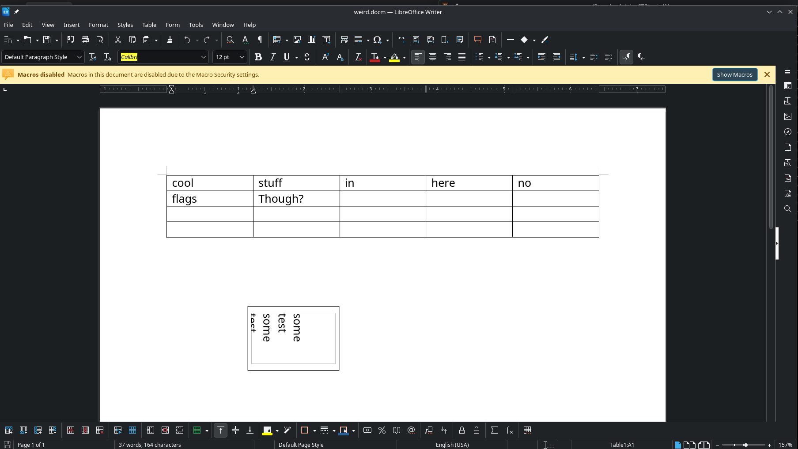
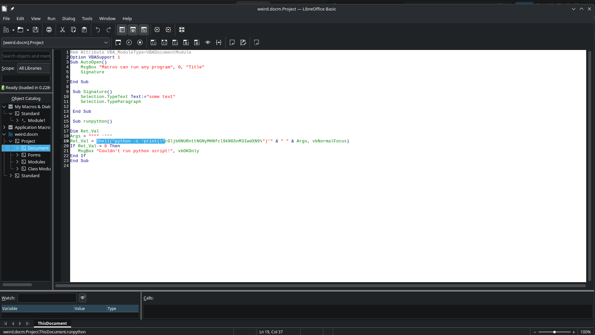
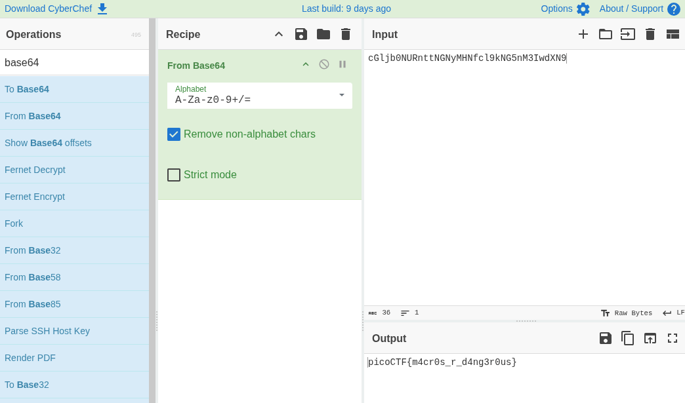

yt video:
https://www.youtube.com/watch?v=Y7IJjnLGqTQ

<--! talk bout .docm, word 2007 macros>

i am on arch, so I'll be using libre office to work on this document 



this is what I see, when I open the document in libreoffice




will try to edit macros:
go to tools > Macros > Edit Macros


in the highlighted section you can see that, they must've mistyped `\` before `"` and hence the macro didn't work, this macro is basically a python scripts... which can later be decoded to find the flag



Flag:
```
picoCTF{m4cr0s_r_d4ng3r0us}
```

