### this challenge was a pain, so it will take some time to write a detailed writeup

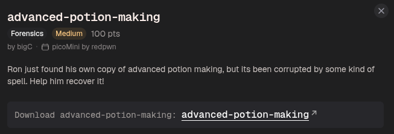

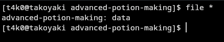

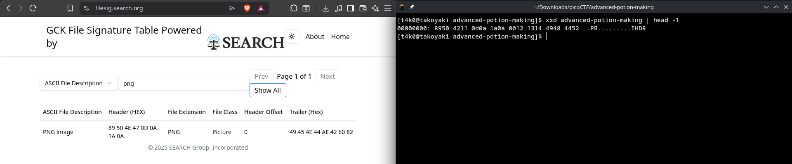

the file signature looks similar, but looks like it's slightly corrupted

we'll have to replace these bytes (highlighted ones) with the correct ones:

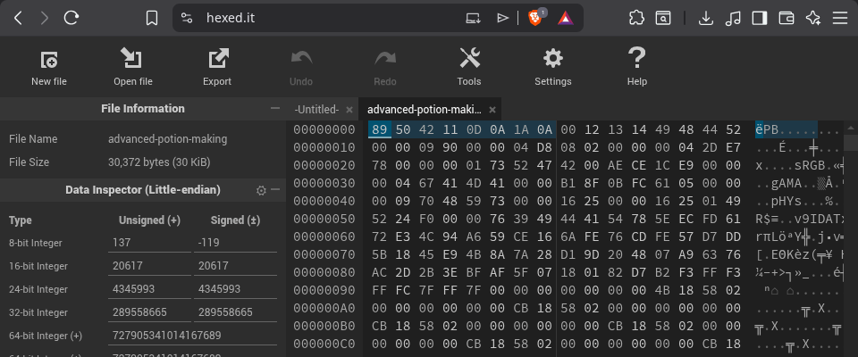

the correct file signature for PNG is:
```
89 50 4E 47 0D 0A 1A 0A
```

so the changed bits look like:
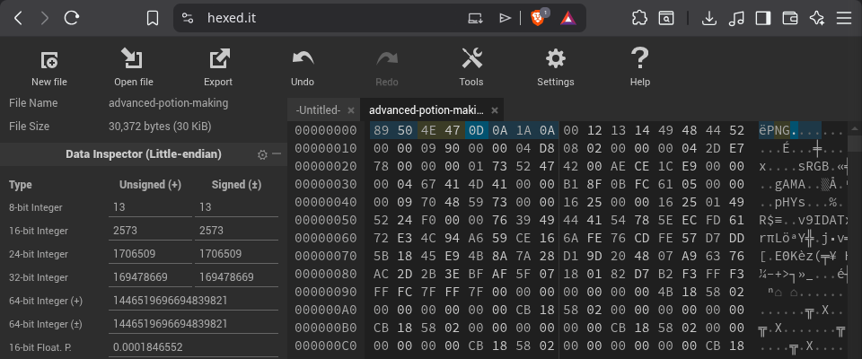

export the file:
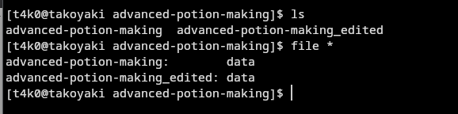


hmm...it still didn't save as a PNG file, so there must be some kinda corrupted data still reamining to be fixed

okay, nvm I checked in my file explorer
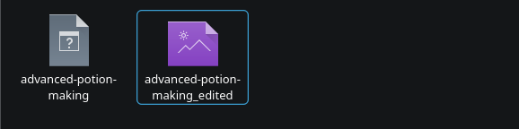

uhhhh, still won't open...
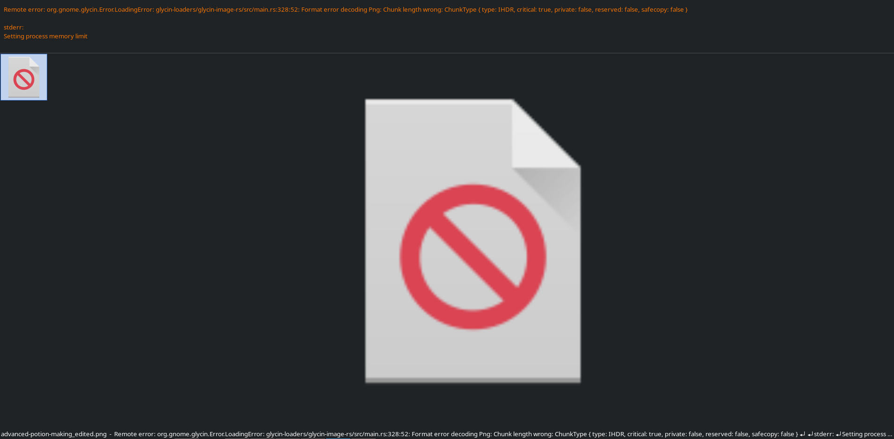

so it seems I need to check and fix the bytes for IHDR:

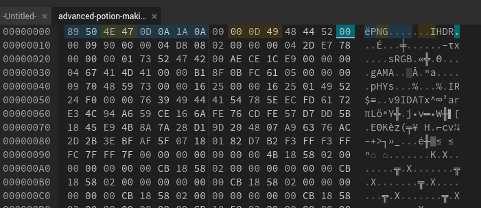

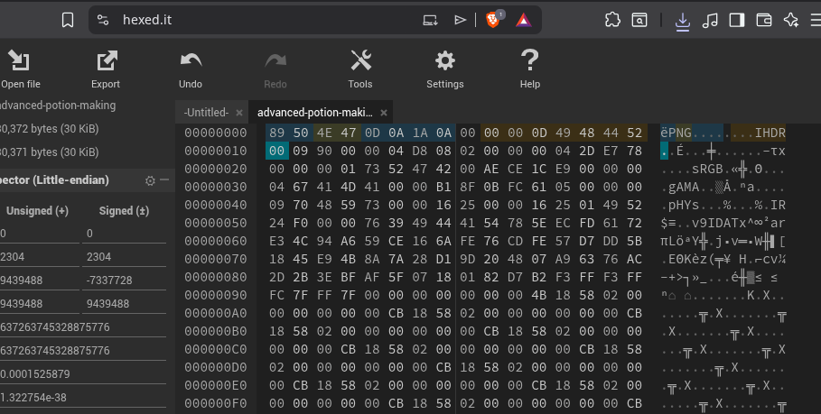

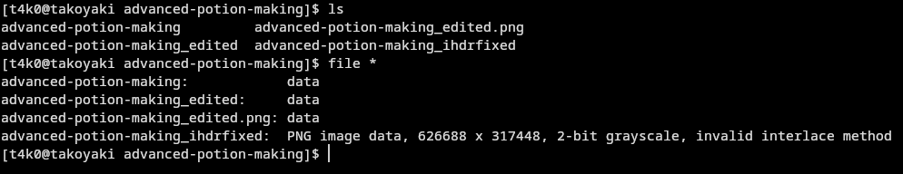
finally T_T

okay but it still says, there is an error

uhh I am just gonna start all over:

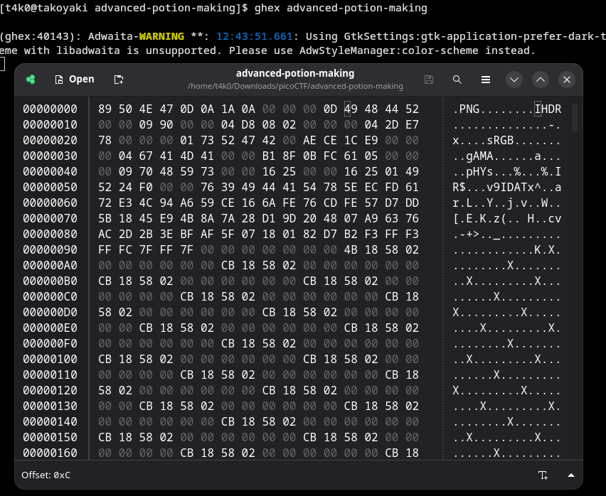

so the completely changed header is (16 bytes):
```
89 50 4E 47 0D 0A 1A 0A 00 00 00 0D 49 48 44 52
```

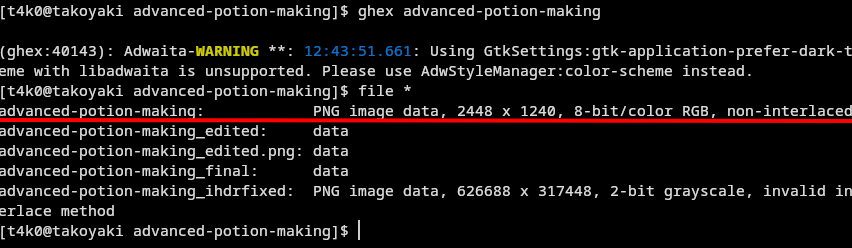

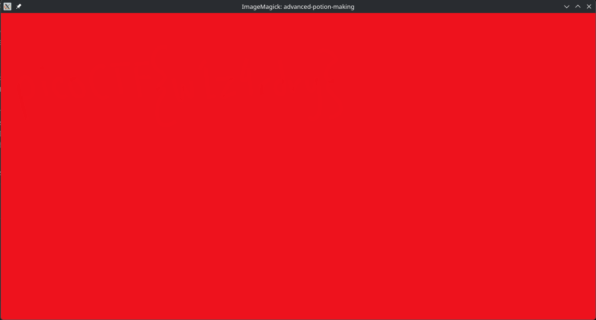

opening the file gives us this, hmm...

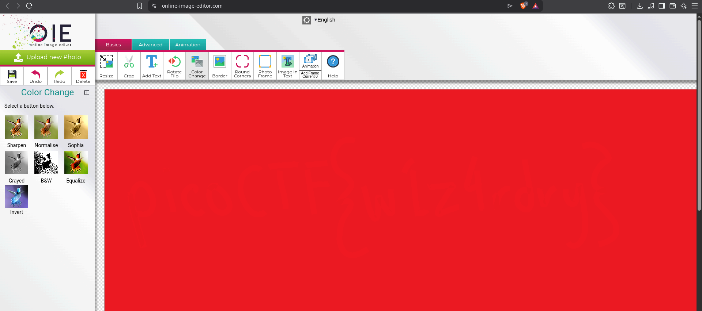

if you look carefully, you can see some light text, let's use some filters:

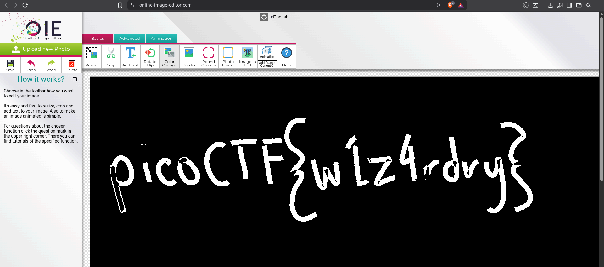

Flag:
```
picoCTF{w1z4rdry}
```