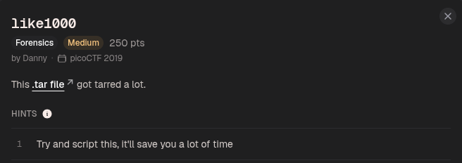
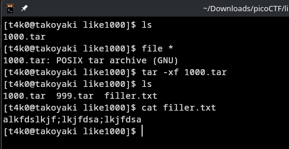
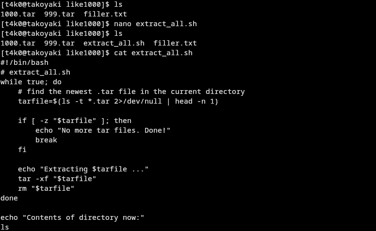
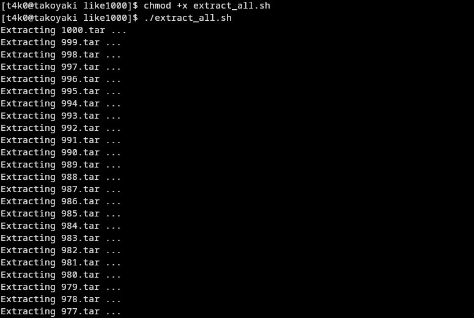
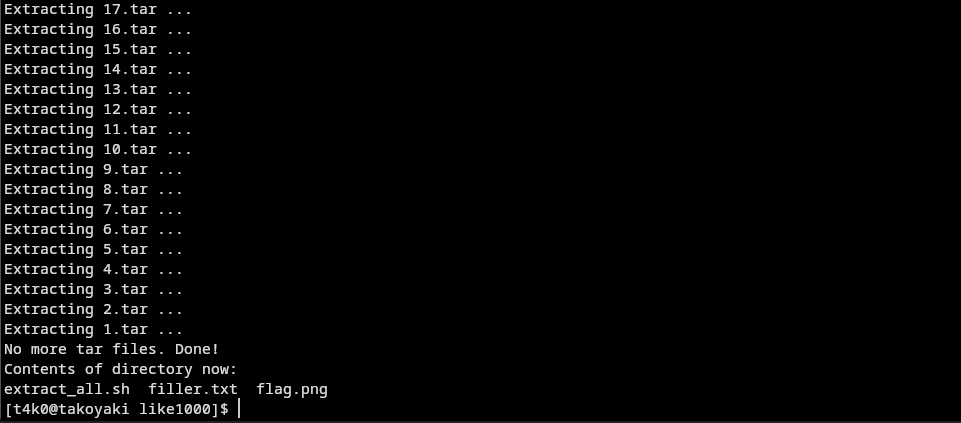
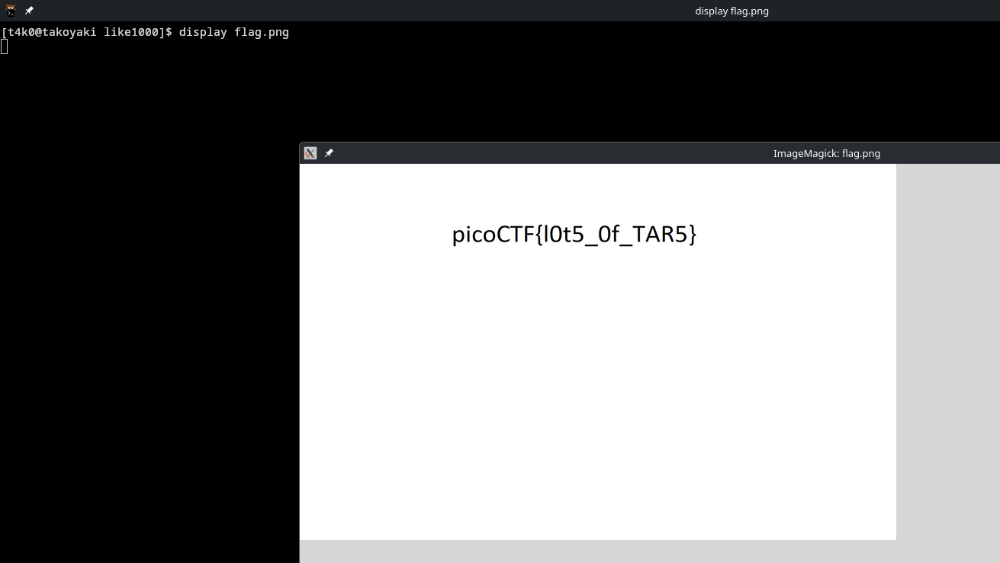

seems like file has been compress to a .tar file, one after the another



the script I used was:
```
#!/bin/bash
# extract_all.sh
while true; do
    # find the newest .tar file in the current directory
    tarfile=$(ls -t *.tar 2>/dev/null | head -n 1)
    
    if [ -z "$tarfile" ]; then
        echo "No more tar files. Done!"
        break
    fi
    
    echo "Extracting $tarfile ..."
    tar -xf "$tarfile"
    rm "$tarfile"
done

echo "Contents of directory now:"
ls
```

then made it executable:
```
chmod +x extract_all.sh
```

and ran it:
```
./extract_all.sh
```
.
.
.






Flag:
```
picoCTF{l0t5_0f_TAR5}
```