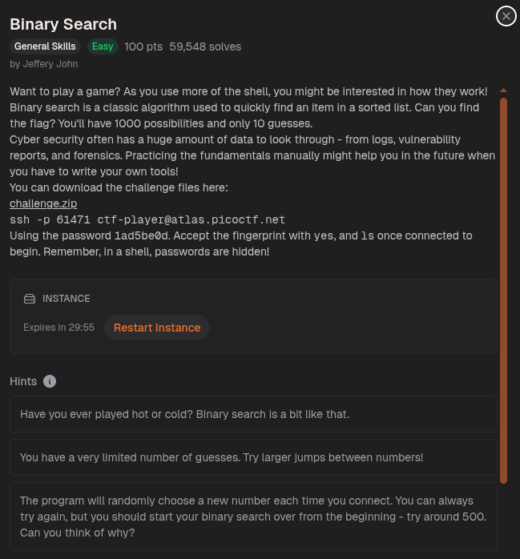
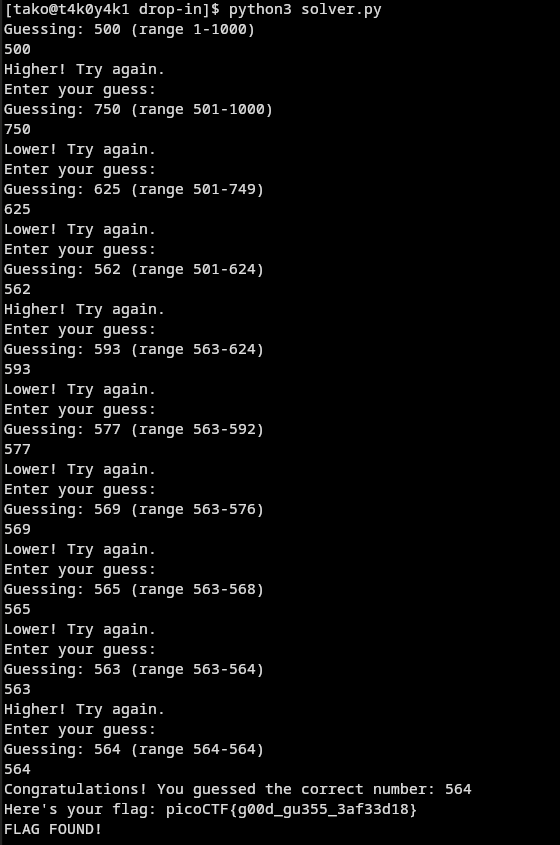

the script I used:

```py
import paramiko
import time

host = "atlas.picoctf.net"
port = 50419
user = "ctf-player"
password = "1ad5be0d"

ssh = paramiko.SSHClient()
ssh.set_missing_host_key_policy(paramiko.AutoAddPolicy())
ssh.connect(host, port=port, username=user, password=password)

shell = ssh.invoke_shell()

def read_until(prompt, timeout=5):
    buf = ""
    start = time.time()
    while True:
        if shell.recv_ready():
            buf += shell.recv(4096).decode()
            if prompt in buf:
                return buf
        if time.time() - start > timeout:
            return buf
        time.sleep(0.1)

# wait for initial prompt
read_until("Enter your guess:")

low, high = 1, 1000

while True:
    mid = (low + high) // 2
    print(f"Guessing: {mid} (range {low}-{high})")
    shell.send(f"{mid}\n")
    
    response = read_until("guess:")
    print(response.strip())
    
    if "Higher" in response:
        low = mid + 1
    elif "Lower" in response:
        high = mid - 1
    elif "Congratulations" in response or "flag" in response.lower():
        print("FLAG FOUND!")
        # read any remaining output
        time.sleep(1)
        print(shell.recv(4096).decode())
        break
```

Flag: picoCTF{g00d_gu355_3af33d18}