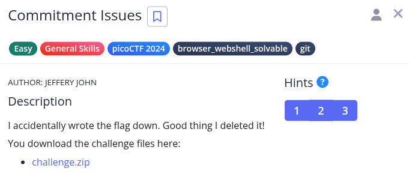
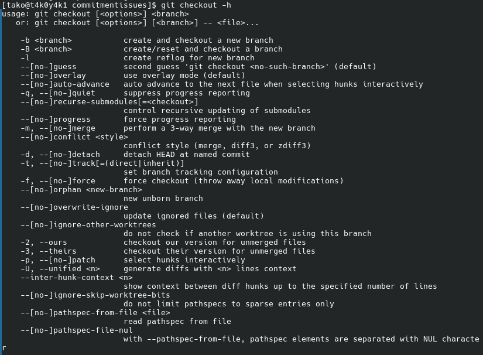
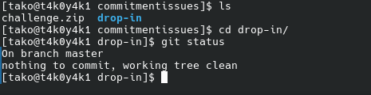
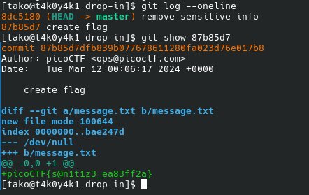

Hint 1: Version control can help you recover files if you change or lose them!
Hint 2: Read the chapter on Git from the picoPrimer here
Hint 3: You can 'checkout' commits to see the files inside them

explain git, checkout concepts







### Flag:
```
picoCTF{s@n1t1z3_ea83ff2a}
```
