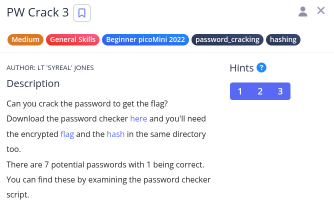
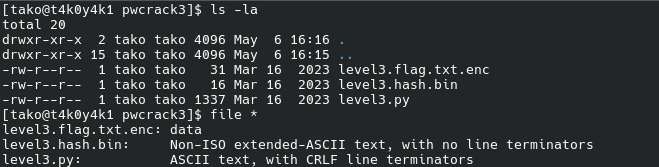
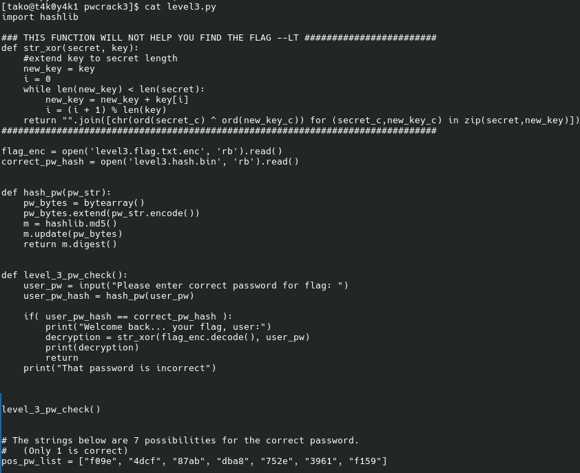
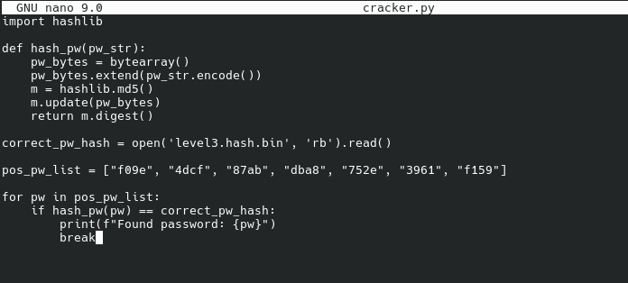
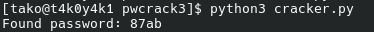
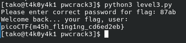

Hint 1: To view the level3.hash.bin file in the webshell, do: $ bvi level3.hash.bin
Hint 2: To exit bvi type :q and press enter.
Hint 3: The str_xor function does not need to be reverse engineered for this challenge.





created my own cracker script:






### Flag: 
```
picoCTF{m45h_fl1ng1ng_cd6ed2eb}
```
