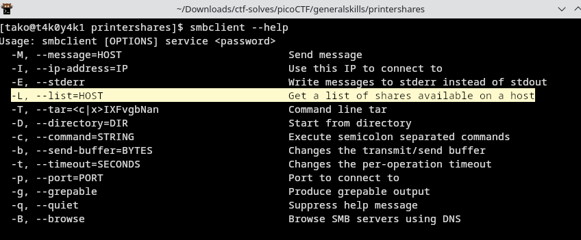
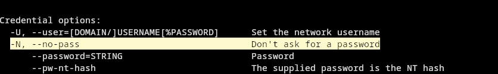
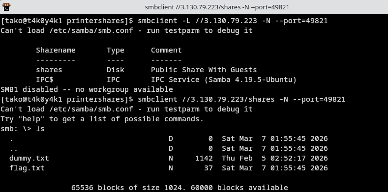
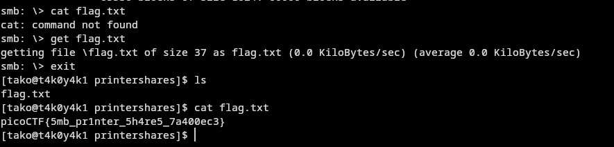

Hint 1: knowing how SMB protocol works would be helpful!
Hint 2: smbclient and smbutil are good tools

note: explain what smbclient and smbutil is and add the diagram we found earlier
note: explain how the smb protocol works
note: explain how and why files are stored on the printer server

make sure to have the full samba package for the smbclient to be able to run properly 

Flag: picoCTF{5mb_pr1nter_5h4re5_7a400ec3}