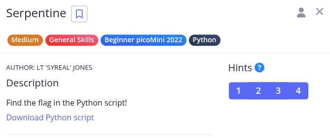
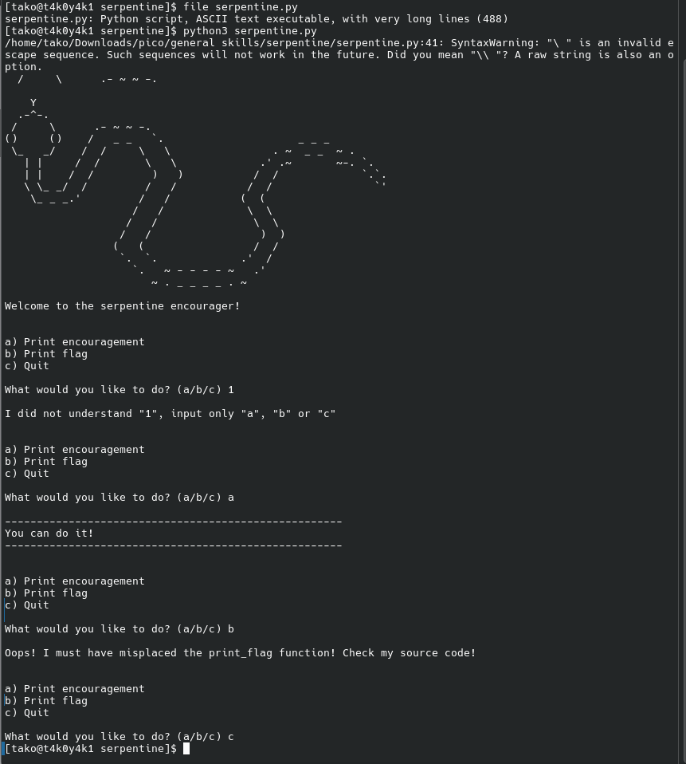
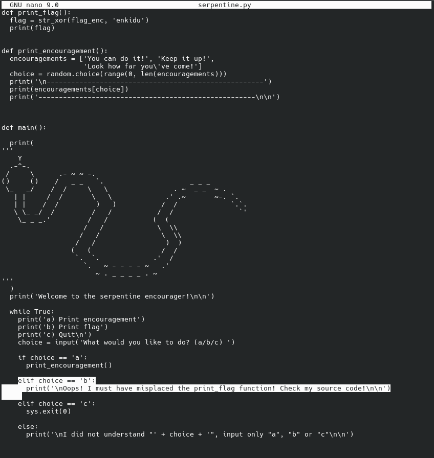
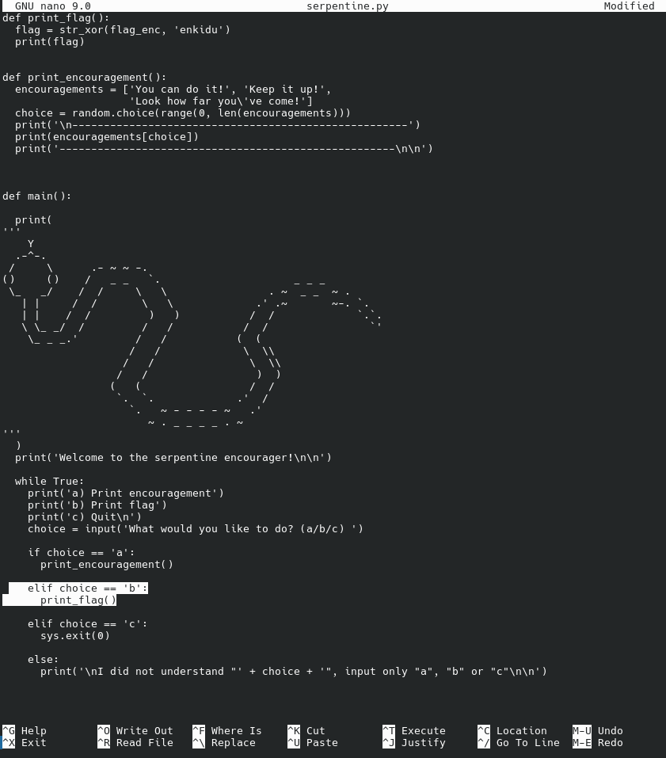
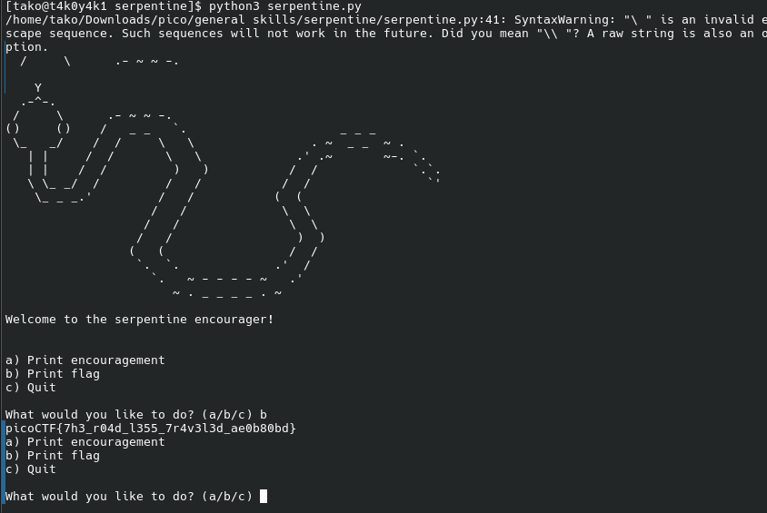

Hint 1: Try running the script and see what happens
Hint 2: In the webshell, try examining the script with a text editor like nano
Hint 3: To exit nano, press Ctrl and x and follow the on-screen prompts.
Hint 4: The str_xor function does not need to be reverse engineered for this challenge.









### Flag: 
```
picoCTF{7h3_r04d_l355_7r4v3l3d_ae0b80bd}
```
