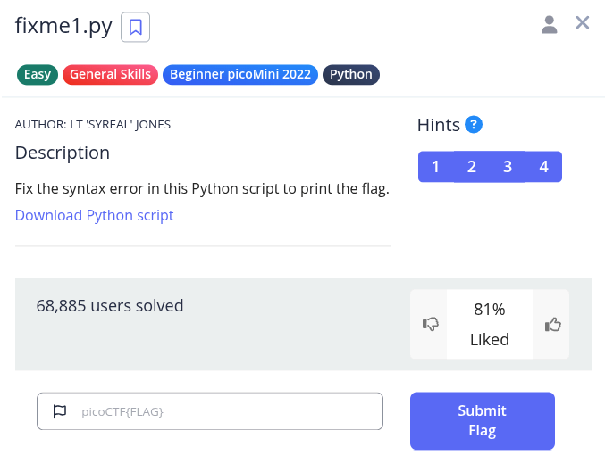
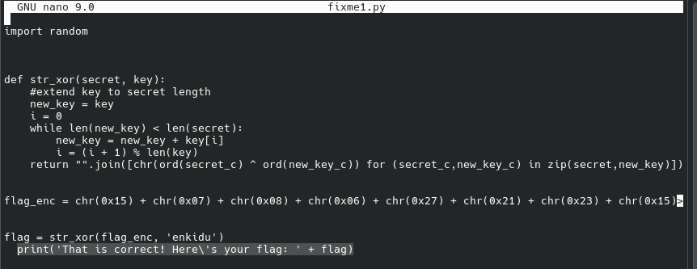
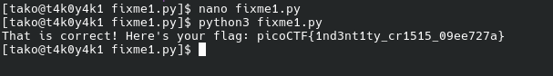

Hint 1: Indentation is very meaningful in Python
Hint 2: To view the file in the webshell, do: $ nano fixme1.py
Hint 3: To exit nano, press Ctrl and x and follow the on-screen prompts.
Hint 4: The str_xor function does not need to be reverse engineered for this challenge.




this is where flag indentation went wrong



### Flag: 
```
picoCTF{1nd3nt1ty_cr1515_09ee727a}
```