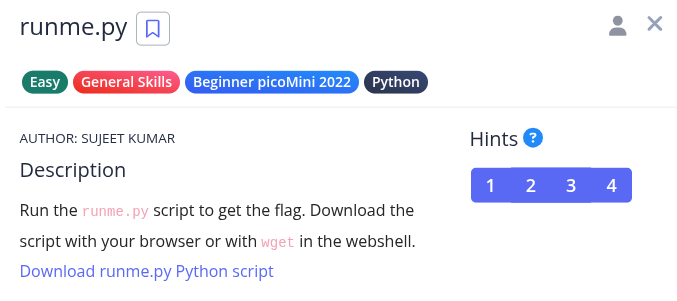
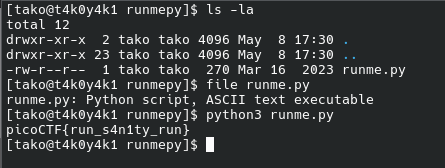

### wip!!!! 

Hint 1: If you have Python on your computer, you can download the script normally and run it. Otherwise, use the wget command in the webshell.
Hint 2: To use wget in the webshell, first right click on the download link and select 'Copy Link' or 'Copy Link Address'
Hint 3: Type everything after the dollar sign in the webshell: $ wget , then paste the link after the space after wget and press enter. This will download the script for you in the webshell so you can run it!
Hint 4: Finally, to run the script, type everything after the dollar sign and then press enter: $ python3 runme.py You should have the flag now!

