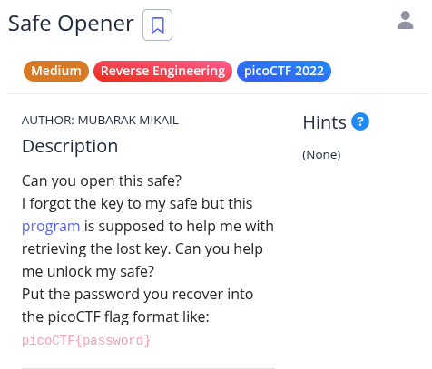
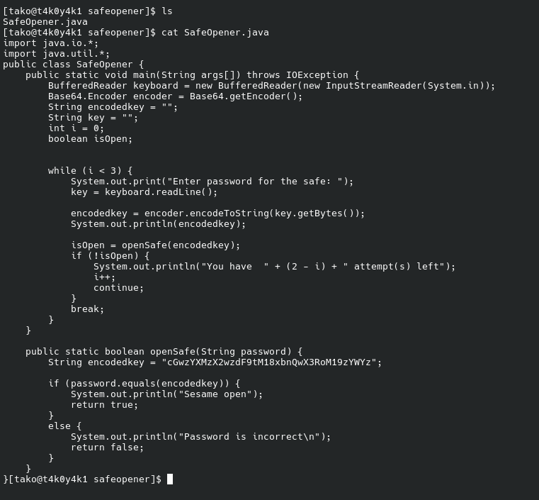
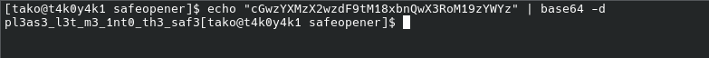

The logic being the Java code:
### 1. The key line is in openSafe():

String encodedkey = "cGwzYXMzX2wzdF9tM18xbnQwX3RoM19zYWYz";

if (password.equals(encodedkey)) { ... }

The program takes the input → Base64 encodes it → compares with encodedkey.

### 2. Understand the logic

Input  →  Base64 encode  →  compare with "cGwzYXMzX2wzdF9tM18xbnQwX3RoM19zYWYz"

So to find the password, just reverse it — Base64 decode the hardcoded string:

"cGwzYXMzX2wzdF9tM18xbnQwX3RoM19zYWYz"  →  Base64 decode  →  password

### 3. Decode it 



### Flag: 
```
picoCTF{pl3as3_l3t_m3_1nt0_th3_saf3}
```