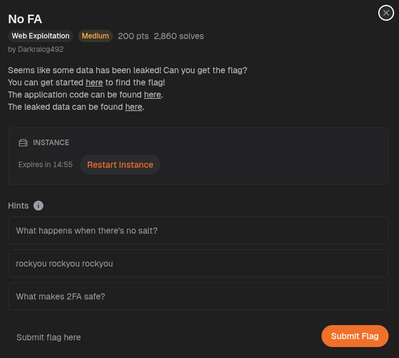

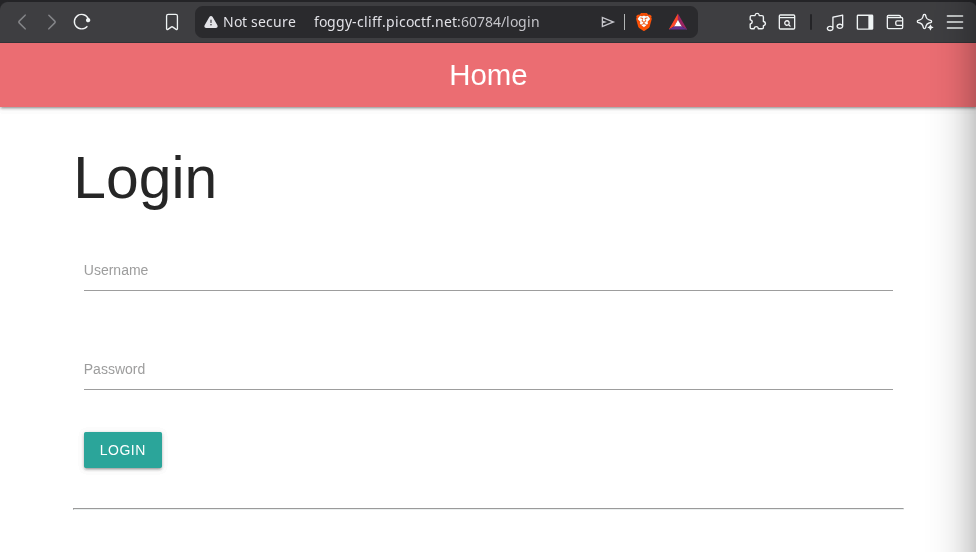

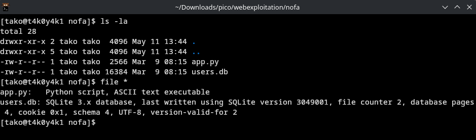

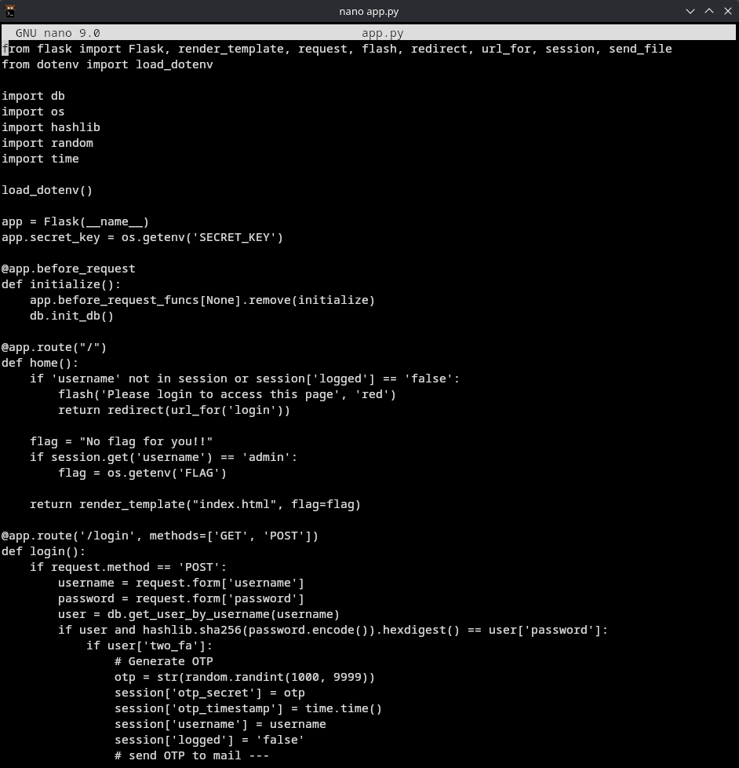

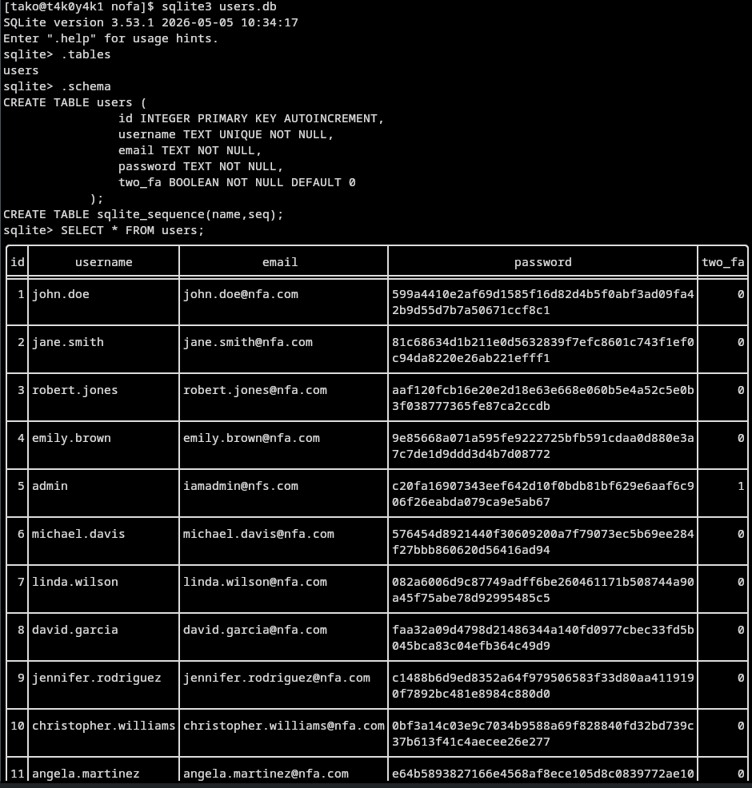

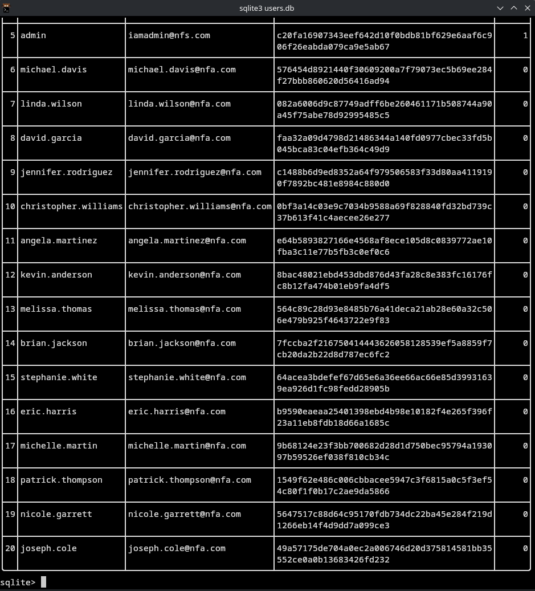

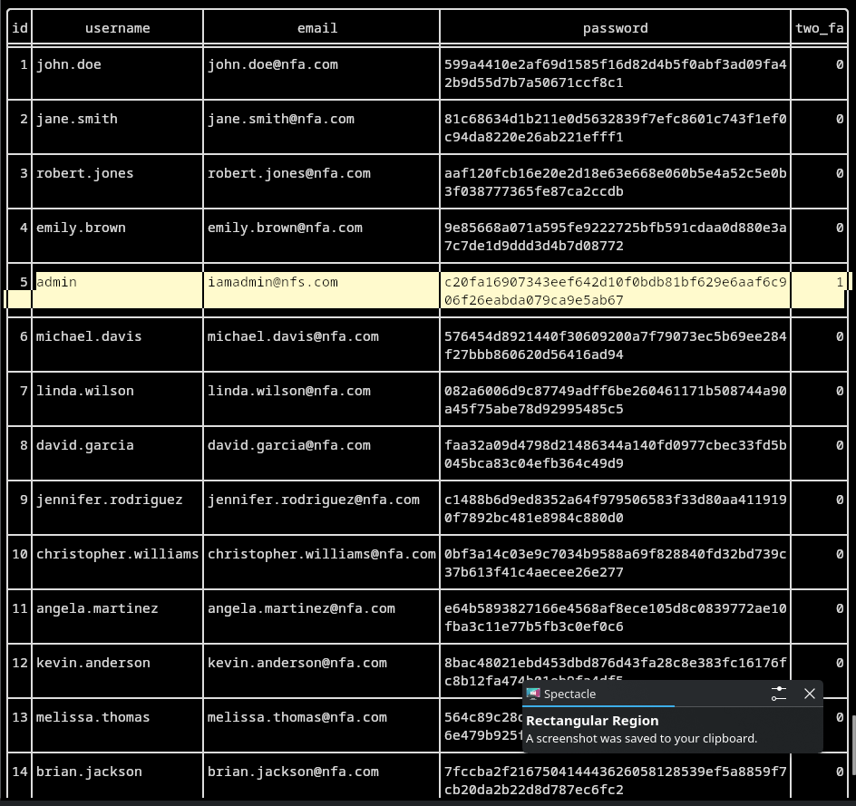

if you try to login with other users info, this is what it shows
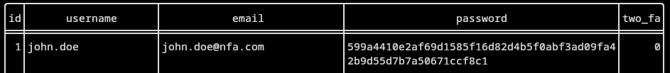
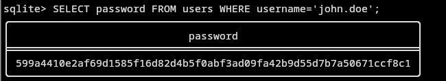
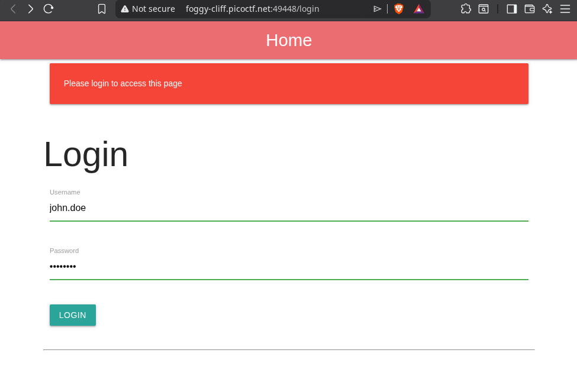
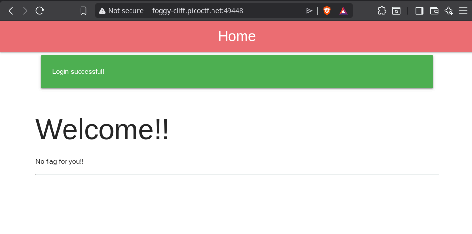

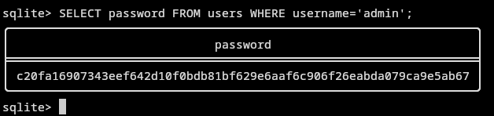

Password: c20fa16907343eef642d10f0bdb81bf629e6aaf6c906f26eabda079ca9e5ab67

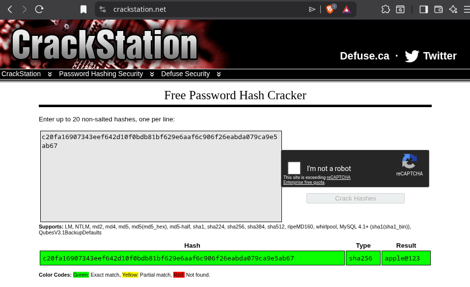


after you try to login with admin:apple@123

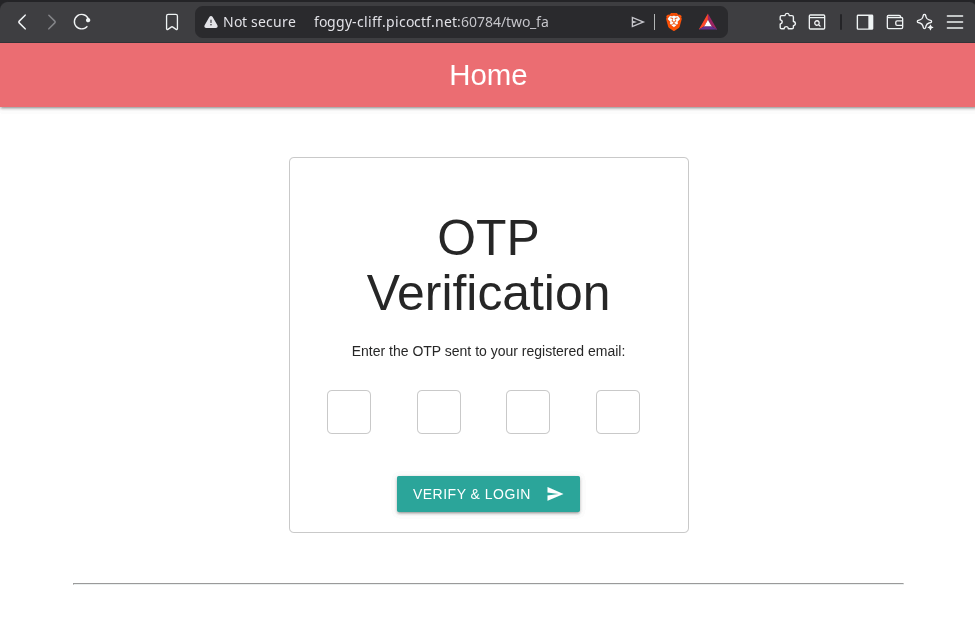


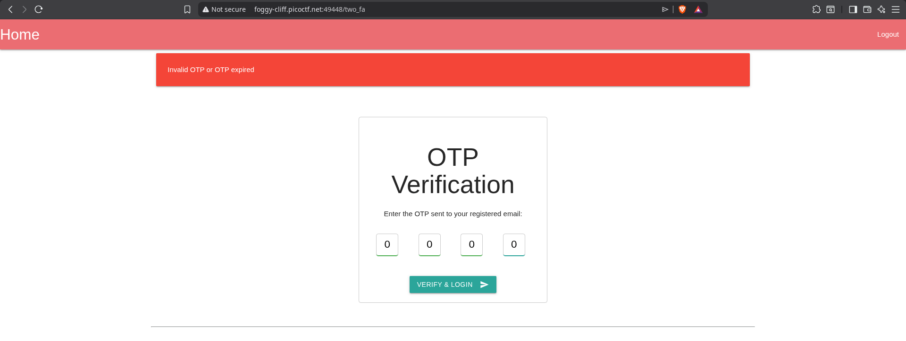


If we inspect the response when we login, there is a jwt token visible, let's try to decode it to see if it gives any valuable information

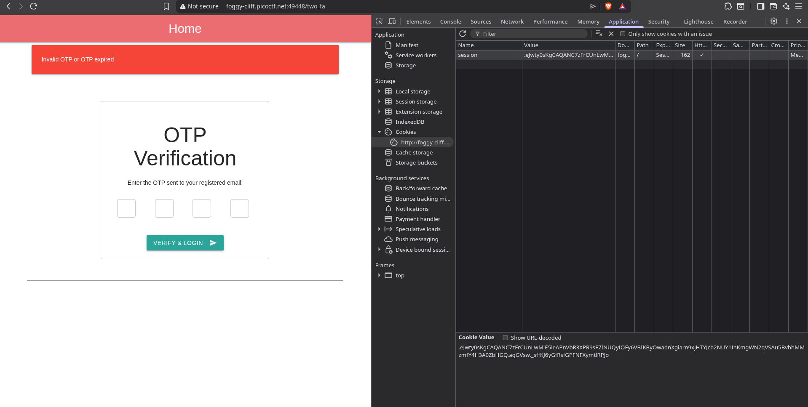

take the session cookie and try to decode it: 

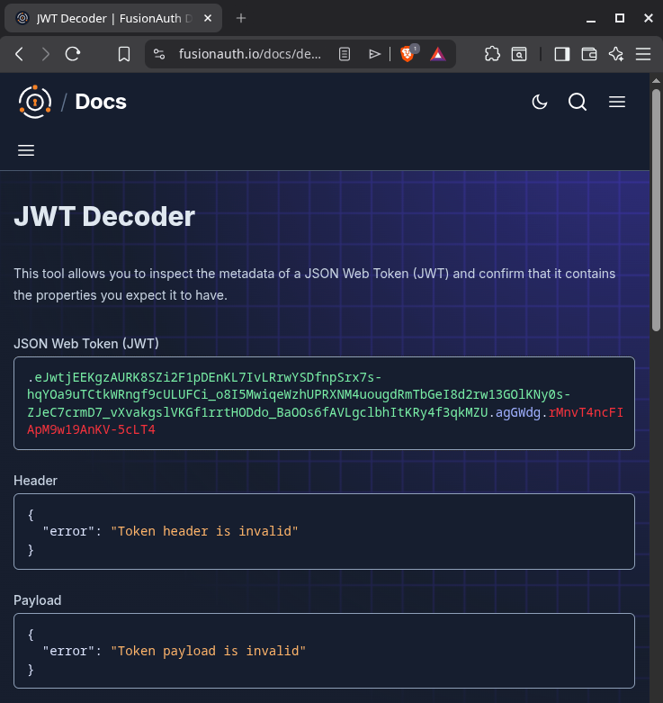

oops turns out this is not a jwt cookie


That's a Flask session cookie, not a JWT — it starts with .eJwt which is Flask's signed session format (base64-encoded JSON + HMAC signature).


we use the cli tool: 
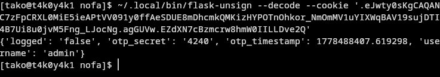

OTP is found to be 4240

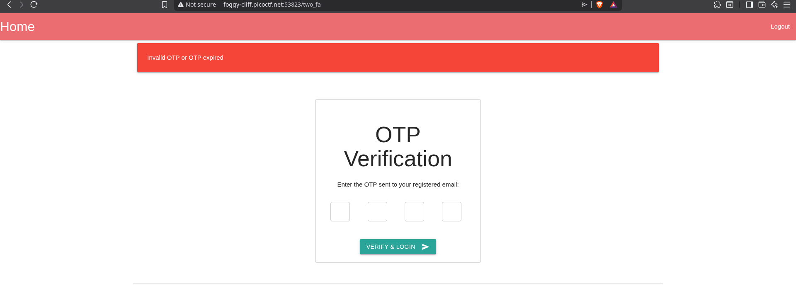

while i was figuring out how to solve it, the session expired

so I will restart instance and try again, this time I have to be fast


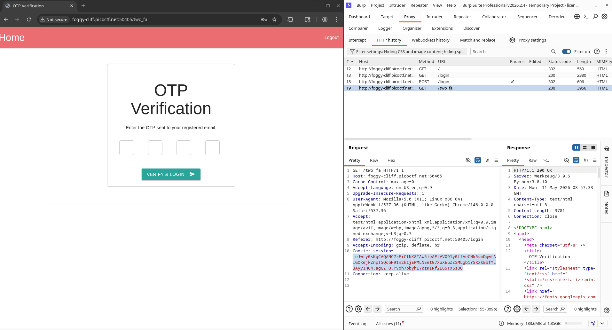

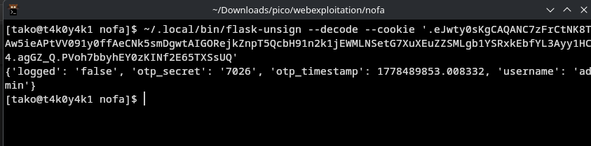

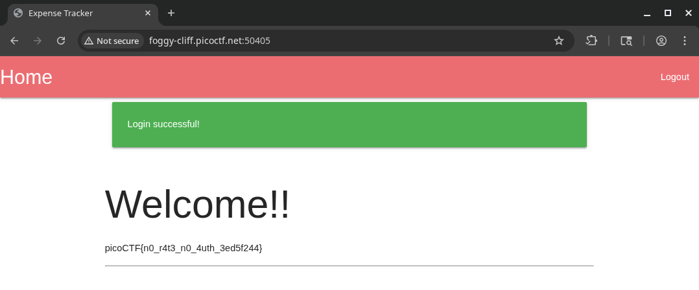

Got the Flag!

###  Flag: 
```
picoCTF{n0_r4t3_n0_4uth_3ed5f244}
```

